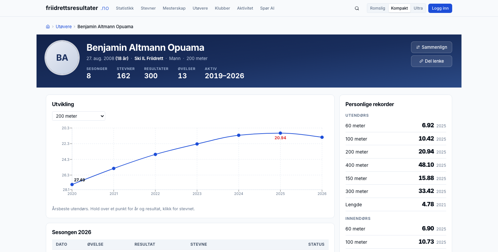
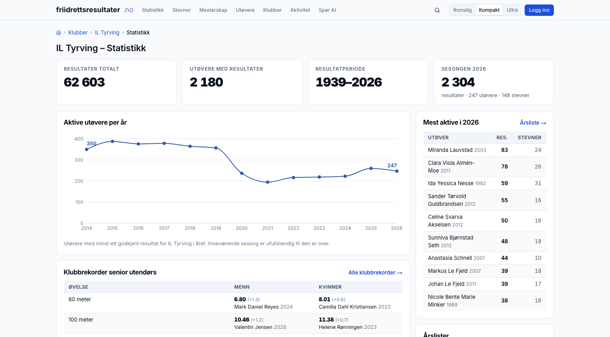
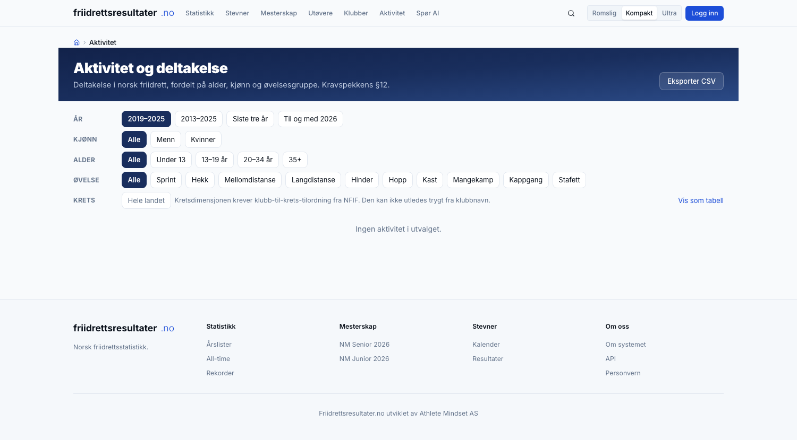

# Ny statistikk- og aktivitetsplattform
## Athlete Mindset AS · september 2026

---

# Hvem vi er

**Athlete Mindset AS** · org.nr. 937 878 818 · del av Fire S Invest AS

Idrettsteknologi og idrettsdata · agentvirksomhet · trenervirksomhet

| | |
|---|---|
| **Atle Guttormsen** | PhD anvendt økonometri · WA-dommer · styreerfaring klubb, krets og forbund |
| **Simen Guttormsen** | PhD-stipendiat kvantitativ finans · Princeton, Duke · olympier |
| **Sondre Guttormsen** | Sport management, UT Austin · gründer Athlete Mindset Inc. · olympier |

Vi driver **friidrettsresultater.no** i dag.

---

# Utgangspunktet

## 1 768 332

resultater i drift, normalisert og søkbare

| | |
|---|---:|
| Fra 2013 og senere | 1 520 363 |
| Alle-tiders-materiale før 2013, tilbake til 1922 | 247 969 |
| Utøvere | 87 727 |
| Stevner | 44 862 |
| Siste stevne inne | 16. september 2026 |

**Migreringen er gjennomført.** Vi skal ferdigstille, ikke bygge fra bunnen.

§2 setter to formål: tilgang for utøvere, klubber, trenere, media og publikum,
**og** innsikt for forbundet i aktivitet, deltakelse og utvikling.
Vi svarer på begge.

---

# Fire ting dere skal kunne stole på

| | | |
|---|---|---|
| **1** | **Alt kommer inn, og alt kvalitetssikres** | Norske stevner, utenlandske stevner og løp utenfor bane. Hentet hver natt av automatiske agenter, kontrollert før det vises. |
| **2** | **Visningen** | Her mener vi at vi er bedre enn andre. Vi kjenner idretten og vet hva som er ønskelig, for utøver, klubb, krets og forbund. |
| **3** | **Rapporter og analyser** | Standardrapporter, skreddersøm, og et system der klubb, krets og utøver lager sine egne. |
| **4** | **Stabilt, raskt og levert fortløpende** | Målt ytelse, automatiske kontroller, og kapasitet til å levere gjennom hele avtaleperioden. |

Resten av presentasjonen går gjennom dem i den rekkefølgen.

---

# 1 · Alt kommer inn

### Tre innsamlingsløp, samme maskineri

| Kilde | Slik hentes det | Status |
|---|---|---|
| **Norske stevner** | Alle resultatlister sendes til samme sted. Formatene varierer noe; det håndterer vi. Fra oktober er plattformen selv førstemottaker. | **I drift. Hentes hver natt.** |
| **Utenlandske stevner** | Egne agenter per kildetype: TFRRS, World Athletics, European Athletics, de nordiske basene, stevnenes egne sider. **Utøverdrevet**: vi følger de norske utøverne, ikke hvert stevne i verden. | Bygges i høst. Innmeldingskanal som sikkerhetsnett. |
| **Løp utenfor bane** | Knyttet til den **offisielle terminlisten**: det er de resultatene som skal inn. Egen inngangsside, så det ikke drukner banestatistikken. | Fase 3, samme maskineri. |

**Hver natt kl. 04.15:** nye stevner hentes, de siste seks ukene avstemmes mot
kilden, og tolv kontroller kjøres. Forsiden viser når det sist skjedde.
Innsamling er en driftsfunksjon, og ligger i driftsavtalen.

---

# 1 · Alt kvalitetssikres

### Hver resultatliste hentes på nytt så lenge arrangøren kan rette den

Kilden endres i ukene etter et stevne: vind legges til, plasseringer rettes,
tider korrigeres. Plattformen henter hvert stevne på nytt i seks uker og
avstemmer rad for rad. Det som er endret, oppdateres. Det som er nytt, legges
inn. **Det som forsvinner fra kilden, slettes aldri hos oss**: det merkes og
legges i arbeidslisten.

### Systemet kontrollerer alt, menneskene ser på unntakene

Tolv automatiske kontroller etter hver import: vindflagg mot øvelse ·
dubletter · samme person to ganger i registeret · samme stevne to ganger ·
tider som ikke er fysisk mulige · og at hver side viser nøyaktig det basen
har. Alle skal være null. Er de ikke det, står det i loggen før noen spør.

### Målt, ikke lovet

Vi kjørte basen mot SRUs NM-regneark for 100 m kvinner: 101 navn, vi fant 97,
**89 var de samme**. Avvikene var navnevarianter og en navneendring. Det er
nettopp det §7 og §9 ber plattformen håndtere, og det er arbeidslisten.

Hvert tall kan følges tilbake til stevnet, kilden og tidspunktet det ble hentet.

---

# 2 · Visningen

Dette er punktet der vi mener vi er bedre enn andre. Ikke fordi teknologien er
annerledes, men fordi vi vet hva utøvere, trenere, klubber, kretser,
statistikkmiljøet, media og forbundet faktisk leter etter.

### Demo · friidrettsresultater.no

1. Forsiden
2. En utøverprofil
3. Klubbstatistikk
4. Aktivitet og deltakelse, §12
5. NM-kvalifisering

Skissene i tilbudet var skisser. **De tre neste lysbildene er sidene slik de er i drift i dag.**

---

# 2 · Utøverprofilen · §9

Utvikling i hovedøvelsen, sesongen med status per resultat, personlige
rekorder ute og inne, status mot NM-krav, klubbhistorikk og NM-medaljer.
Alt på én side, og 87 727 slike.

---

# 2 · Skreddersøm for klubb og krets · §10

Aktive utøvere år for år, klubbrekorder for menn og kvinner side om side, de
mest aktive i sesongen, årslister og all-time-lister. Én side per klubb, 2 482
klubber. **Kretsene får den samme siden** når klubb-til-krets-koblingen er på
plass. Forbundets rapporter til klubb og krets lages på samme grunnlag.

---

# 2 · Aktivitet og deltakelse · §12

Filtre på år, kjønn, alder og øvelsesgruppe. Stevner, starter, unike deltakere,
aldersfordeling og aktive klubber, med eksport til Excel. Dette er §12 i drift,
ikke lovet til 2027.

---

# 2 · Samme base, sju ulike behov

| Hvem | Vil ha |
|---|---|
| **Utøveren** | Egen profil, egne rekorder, egen utvikling over tid |
| **Treneren** | Årslister per aldersklasse, sammenligning, dybde i egen øvelse |
| **Klubben** | Egne utøvere, klubbrekorder, aktivitet år for år, hvem som er kvalifisert |
| **Kretsen** | Det samme som klubben, for sine klubber, og utviklingen mot resten av landet |
| **Statistikkmiljøet** | Alle-tiders-lister, full dybde, eksport til eget arbeid |
| **Media** | Hva som kan skje i helgen, rekordvarsler, ferdig faktagrunnlag |
| **Forbundet** | Aktivitet, rekruttering, frafall, per krets og aldersklasse |

Filtrering på elleve dimensjoner er ønsket i §17. Åtte er i drift i dag.
Region, distanse og kvalitetsnivå kommer i høst.

---

# 3 · Rapporter og analyser

### Tre måter rapporter blir til

| | | |
|---|---|---|
| **Eget initiativ** | Vi ser noe i tallene og lager det: troppanalyse før NM, rekordvarsler, årsrapport. | To mesterskapspakker og én årsrapport i grunnavtalen. Vedlegg C og D i tilbudet er to slike. |
| **Etter avtale** | Klubb, krets eller forbund ber om noe bestemt. | Fire klubber har allerede fått sitt. Vedlegg F. |
| **Selvbetjening** | Utøver, klubb og krets velger en standardrapport og får den på egne tall. | Klubbstatistikken og aktivitetsdashbordet er de to første. |

### Skreddersøm er dager, ikke måneder · en ny klubb er rundt tjue linjer konfigurasjon

| Klubb | Klubbens eget ønske |
|---|---|
| SK Vidar | Alder, yngste først, med markering av klubbskifte |
| IK Tjalve | Stipendgruppe A–D, øvrige etter alder |
| BUL | Alle samlet, yngste først |
| Fana IL | Seksten navngitte først, i klubbens rekkefølge |

---

# 3 · Aktivitet og deltakelse · §12

Kravspekken kaller dette «particularly important». Tallene under er hentet fra
basen i dag, ikke lovet til 2027.

| År | Stevner | Starter | Unike deltakere | 13–19 år |
|---|---:|---:|---:|---:|
| 2019 | 1 960 | 121 847 | 11 111 | 4 406 |
| 2021 | 1 633 | 75 034 | 8 292 | 3 234 |
| 2023 | 1 707 | 103 688 | 8 902 | 3 431 |
| 2025 | 1 704 | 95 475 | 8 534 | 3 144 |

### Men tallene må behandles med skjønn

Teller man klubber med registrerte resultater, faller tallet fra 591 i 2024 til
460 i 2025. Over tjue prosent. **Råtallet overdriver kraftig.** Det som forsvant
var skoler og små lag innom ett stevne. Teller man klubber med reell aktivitet,
minst tjue resultater i året, er det 271 mot 262.

Et dashbord som rapporterer tjue prosent som klubbdød, gir forbundet
feilinformasjon. Det er forskjellen på å telle og å forstå.

---

# 3 · Hva analysene ellers kan brukes til

### Forbundets egne beslutninger

Aktivitet, rekruttering og frafall per krets og aldersklasse. Og:
**konsekvensen av å endre et kvalifiseringskrav kan beregnes før vedtaket
fattes**, ikke observeres to år etter.

### Mesterskap og media

Troppanalyser før NM, EM, VM og OL. Rankingposisjon, formkurver, historisk
sammenligning. Ferdig som nettside og som pressemateriell.

### Forskning

Norske friidrettsdata er allerede grunnlag for fagfellevurderte studier i
*Journal of Science and Medicine in Sport* og *PLOS ONE*, den eldste fra 2015.

---

# 4 · Stabilt, raskt og levert fortløpende

| | |
|---|---|
| **Raskt** | Norges største stevneside, Tyrvinglekene med 3 299 resultater, på 1,2 sekunder. Klubbrekorder på 0,3. NM-kvalifiseringslisten på 1,3. Målt, ikke anslått. |
| **Stabilt** | Nettstedet kjører på Vercel, basen på Supabase. Ingen egen server som kan gå ned på en søndag. Tunge jobber går i basen, utenfor forespørselen. |
| **Kontrollert** | Tolv automatiske kontroller etter hver import, og mot produksjon: sidene mot basen, basen mot seg selv. |
| **Kapasitet** | Tre navngitte personer, ikke en leverandørkø. Innsamling, kontroll og drift er rutiner, ikke prosjekter. |

### Levert siden tilbudet ble sendt 31. august

Ny utøverprofil · aktivitetsdashbord med eksport · klubbstatistikk ·
NM-medaljer 2026 · forsøk, semifinale og finale fra kilden · nattlig
innsamling med kontroller · rekordsider på under ett sekund.
Små, ferdige steg, rullet ut samme dag. Slik jobber vi.

---

# Veien til 1. januar 2027

| Frist | Leveranse |
|---|---|
| **Okt** | **Egen innsamling av norske resultatlister, uavhengig av dagens base** |
| Okt–Nov | Agenter for utenlandske resultater: TFRRS, World Athletics, nordiske baser |
| Nov | Kvalitetsnivå A/B/C med regelmotor og filtrering |
| Nov | Generisk importrammeverk · eksport til Excel og CSV · selvbetjente standardrapporter |
| Des | Flagging: bane TR14.1/TR43.1, World Rankings, blandede heat, utenlandske utøvere, WMA, ikke-ratifisert |
| Des | Dokumentert JSON-API · regions- og kretsstatistikk |
| Des | Masters og aldersklasserekorder · WCAG 2.1 AA · DPIA og databehandleravtale |

Den viktigste milepælen er **innsamlingen**, ikke funksjonaliteten.

---

# Integrasjoner og veien videre

### Vi kobler oss på det som allerede pågår

NFIF arbeider med Buypass om iSonen mot OpenTrack og FriRes, og mot EQ Timing.
Plattformen skal ta imot enden av den dataflyten, ikke definere den på nytt.

Vi trenger stevne, øvelse, klasse, utøver, klubb, resultat, vind og
tidtakingsmetode, i den formen som er minst arbeid for stevnesystemene.

### Etter nyttår

| Fase | Innhold | Periode |
|---|---|---|
| 2 | Integrasjoner · automatisert import · rollestyring | Q1–Q3 2027 |
| 3 | **Løp utenfor bane**: egen inngangsside, knyttet til terminlisten | Q1–Q3 2027 |
| 3 | **Aktivitetsmodul** og dashbord for forbund og kretser | Q2–Q4 2027 |

---

# Det vi trenger fra NFIF

| | Til hva | Når |
|---|---|---|
| Terminlisten, løpende | Avgjør godkjenning, og dermed kvalitetsnivå etter §6. Grunnlaget for løp utenfor bane. | Snarest |
| Lisensregisteret | Lisenskriteriet i nivå A | Snarest |
| Klubb-til-krets-mapping | Kretsstatistikk og kretssider. Kan ikke utledes trygt fra klubbnavn. | Snarest |
| Kontaktpunkt mot arrangører og tidtakere | Egen innsamling av resultatlister | September |
| Melding om underkjente stevner | Oppdatering av kvalitetsnivå og §7-koder | Fra oppstart |

---

# Oppsummert

| | |
|---|---|
| **1** | Alt kommer inn, hentet hver natt av agenter, og alt kvalitetssikres før det vises. |
| **2** | Visningen bygges av folk som kjenner idretten: for utøver, klubb, krets og forbund. |
| **3** | Rapporter og analyser: på eget initiativ, etter avtale, og selvbetjent for klubb, krets og utøver. |
| **4** | Stabilt, raskt, kontrollert, og levert fortløpende av tre navngitte personer. |

### Basen er på plass. Argumentet er hva vi gjør med den.

**Takk. Spørsmål?**
