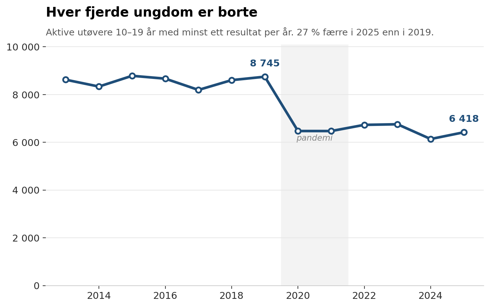
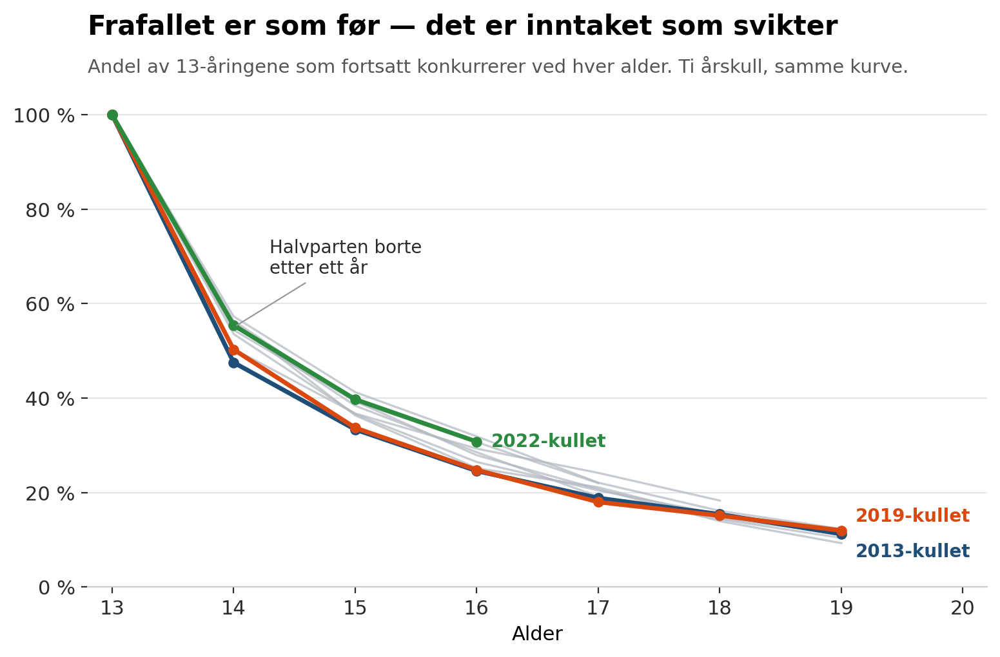
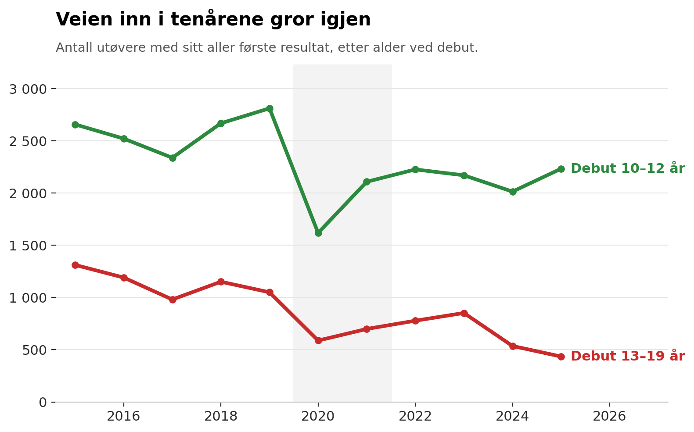
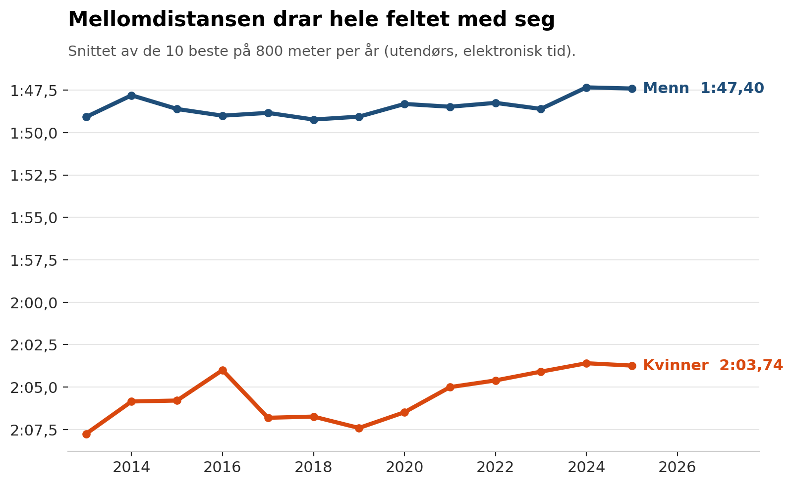
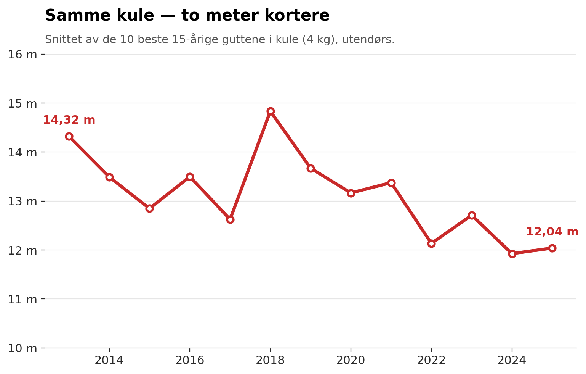
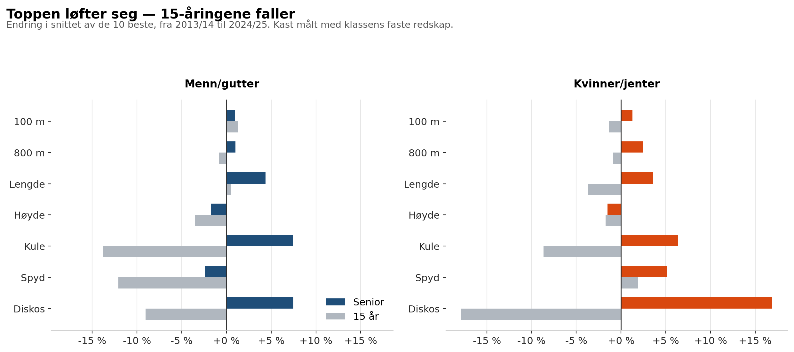

\artikkeltittel{Norsk friidrett 2013–2025}{«All time high» — men mørke skyer i
horisonten}{Atle Guttormsen}{Juli 2026}

\begin{ingress}
Tolv år med resultatdata forteller en historie i tre lag: en seniortopp som aldri
har vært bedre, et frafall som er forbausende stabilt — og et rekrutteringsgrunnlag
som har krympet med en fjerdedel og der nivået i de yngste klassene faller.
\end{ingress}

Norsk friidrett har de siste årene levd i en gullalder på toppen. Men hva skjer
under overflaten? Jeg har analysert samtlige registrerte konkurranseresultater i
norsk friidrett fra 2013 til 2025 — over 1,1 millioner resultater fra rundt
85 000 utøvere — for å svare på tre enkle spørsmål: Har bredden blitt bedre?
Har toppen blitt bedre? Og hvordan står det til i de aldersbestemte klassene?

Svarene er ikke like enkle som spørsmålene. Og det mest interessante funnet er
kanskje det som *ikke* har endret seg.

## Bredden: knekken som ble varig

Antall aktive utøvere — definert som alle med minst ett registrert resultat i
løpet av sesongen — lå stabilt på 10–11 000 i året gjennom hele perioden
2013–2019. Så kom pandemien. I 2020 falt tallet til under 9 000, og der har
det i praksis blitt værende: i 2025 var det fortsatt om lag 20 prosent færre
aktive enn i 2019.

Ser jeg på ungdommen isolert, er bildet enda tydeligere. Aktive utøvere i
alderen 10–19 år gikk fra 8 745 i 2019 til 6 418 i 2025 — en nedgang på 27
prosent. Og nedgangen er nesten utelukkende konsentrert i de yngste årsklassene:
10–12-åringene falt fra rundt 4 400 per år før pandemien til 3 000–3 400 etter.
Seniorgruppen (20–34 år) er derimot stabil, faktisk svakt økende.

Gutter og jenter rammes omtrent likt. Dette er ikke et kjønnsproblem — det er
et rekrutteringsproblem.

*(Underlagsfigurer: fig1 aldersgrupper og fig2b per alderstrinn og kjønn.)*

## Frafallet: forbausende stabilt — og det snur historien på hodet

Den vanlige forklaringen på sviktende bredde er frafall: ungdommen slutter.
Her byr dataene på en overraskelse.

Fordi jeg kan følge hver enkelt utøver over tid, kan jeg måle frafallet direkte.
Jeg tok alle utøvere som konkurrerte som 13-åringer et gitt år — én årskohort —
og sjekket hvor mange som fortsatt konkurrerte ved hver senere alder. Mønsteret
er bemerkelsesverdig stabilt: Om lag 55 prosent av 13-åringene er fortsatt med
som 14-åringer. Rundt en tredjedel er igjen ved 16. Ved 19 år konkurrerer 10–12
prosent fortsatt.

Slik var det i 2013-kohorten. Slik var det i 2019-kohorten. Og slik er det i
kohortene etter pandemien. Ti kohorter, nesten identiske kurver.

Konklusjonen er ubehagelig presis: **Norsk friidrett har ikke fått et større
frafallsproblem. Vi har fått et mindre inntak.** Det konkurrerte 1 220
13-åringer i 2013-kohorten; i 2021- og 2022-kohortene var tallet rundt 820.
Når kullene som kommer inn døren er 30 prosent mindre, og frafallet deretter
spiser nøyaktig samme andel som før, krymper hele pyramiden nedenfra — med
seks–syv års forsinkelse opp til juniorklassene.

## Barneidretten: trakten er trangest i bunnen

Datasettet inneholder også resultater for 10–12-åringene, og de fyller ut
bildet på to viktige måter. (Jeg analyserer bevisst bare *deltakelse* for barn
under 13 — ikke prestasjoner, i tråd med barneidrettsbestemmelsene.)

**Den største lekkasjen skjer før ungdomsklassene i det hele tatt begynner.**
Av barna som konkurrerer som 10-åringer, er omtrent halvparten borte allerede
året etter. Bare rundt én av fire når 13-årsklassen, og ved 15 år er 15–18
prosent igjen. Også dette mønsteret er påfallende stabilt over alle ti
kohortene jeg kan følge — overgangen barneidrett–ungdomsfriidrett har vært
like trang hele perioden.

**Og rekrutteringen i bunnen har faktisk tatt seg opp igjen.** Antall
konkurrerende 10-åringer falt fra ~1 450 (2019) til 905 (2020), men var
tilbake på 1 230 i 2022. Det som *ikke* har tatt seg opp, er debutene senere
i tenårene: antall utøvere som fikk sitt aller første resultat som
14–19-åring er omtrent halvert siden før pandemien. Veien inn i friidretten
via ungdomsskole- og videregåendealder — ofte fra andre idretter — er i ferd
med å gro igjen. Det er en vesentlig del av forklaringen på at
13-årsklassene forblir små selv om 10-åringene er på vei tilbake.

*(Underlagsfigur: fig5b frafall fra 10 år.)*

## Toppen: bedre enn noen gang — og dybden følger med

På toppen er historien en helt annen. Jeg fulgte samtlige standardøvelser —
sprint, mellom- og langdistanse, hekk, hinder, hopp og kast — og målte snittet
av de ti beste årsbestenoteringene per år (utendørs, kun elektronisk tid). I
referanseøvelsene fulgte jeg også resultatet til nummer 25, 50 og 100 på
årslistene, og kastøvelsene og hekk i tillegg per aldersklasse med klassens
faste redskap og hekkhøyde.

Fremgangen er tydelig i de fleste øvelsene:

| Øvelse | Menn 2013 | Menn 2025 | Kvinner 2013 | Kvinner 2025 |
|---|---|---|---|---|
| 100 m | 10,56 | 10,39 | 11,83 | 11,61 |
| 200 m | 21,39 | 20,96 | 24,14 | 23,43 |
| 400 m | 48,09 | 46,76 | 54,49 | 52,55 |
| 800 m | 1:49,1 | 1:47,4 | 2:07,8 | 2:03,7 |
| 1500 m | 3:42,1 | 3:34,9 | 4:22,2 | 4:13,0 |
| 3000 m | 8:10 | 7:52 | 9:41 | 9:12 |
| 5000 m | 14:01 | 13:16 | 16:44 | 15:54 |
| 10 000 m | 30:09 | 29:11 | 36:47 | 33:31 |
| 100/110 m hekk | 15,06 | 14,75 | 13,82 | 13,42 |
| 400 m hekk | 53,39 | 53,60 | 60,63 | 57,57 |
| 3000 m hinder | 9:21 | 9:08 | 11:15 | 10:14 |
| Lengde | 7,28 | 7,57 | 5,97 | 6,25 |
| Høyde | 2,07 | 2,02 | 1,74 | 1,73 |
| Stav | 4,65 | 5,19 | 3,82 | 3,78 |
| Tresteg | 14,92 | 14,94 | 12,32 | 12,40 |
| Kule | 15,44 | 15,64 | 13,44 | 13,30 |
| Diskos | 51,23 | 52,44 | 45,29 | 47,64 |
| Slegge | 57,03 | 61,74 | 54,85 | 56,17 |
| Spyd | 69,11 | 67,67 | 50,97 | 50,58 |

*Topp-10-snitt av årsbeste, utendørs, beste notering uansett alder. Kast, hekk
og hinder er målt med seniorredskap og -høyder (f.eks. kule 7,26 kg for menn og
4 kg for kvinner, hekkhøyde 106,7/84 cm). I de tynneste øvelsene — 3000 m
hinder og 110 m hekk — er det færre enn 25 utøvere på enkelte årslister, og
snittet er da mer følsomt for enkeltutøvere.*

Og dette er ikke bare Ingebrigtsen-effekten eller noen få enkeltutøvere som
drar snittet. Nummer 25 på årslistene har flyttet seg nesten like mye: på
3000 meter menn fra 8:34 til 8:15, på 100 meter kvinner fra 12,23 til 12,05.
Også nummer 50 og nummer 100 har gått riktig vei i løpsøvelsene. Dybden i
senior-Norge er reelt bedre.

En del av fremgangen på mellom- og langdistanse er likevel ikke særnorsk.
Nivået har løftet seg i hele verden siden 2019–2020, først og fremst på
grunn av den nye skoteknologien (karbonplate og responsivt mellomsålemateriale),
og etter hvert også utbredt bruk av bikarbonat som prestasjonsfremmende
tilskudd. Noe av forbedringen på 800 og 3000 meter må derfor tilskrives
utstyr og ernæring snarere enn norsk utviklingsarbeid — men at dybden bak
toppene har fulgt med, tyder på at også treningskulturen har flyttet seg.

Også de fleste kast- og hekkøvelsene går frem. Fordi redskapsvekter og
hekkhøyder har vært uendret per klasse gjennom hele perioden, kan jeg
sammenligne år for år også her: slegge menn har gått fra 57,0 til 61,7 meter,
stav menn fra 4,65 til 5,19, og diskos kvinner fra 45,3 til 47,6. Ser jeg på
seniorklassen (20–34 år) isolert, er kastfremgangen enda tydeligere — diskos
kvinner har der tatt et byks fra 38,4 til 45,9 meter. Sprinthekken er blitt
klart raskere for begge kjønn (menn 15,06 → 14,75 på 110 meter hekk; kvinner
13,82 → 13,42 på 100 meter hekk), og 3000 meter hinder kvinner har gått frem
med et helt minutt.

Men tabellen viser også unntakene. **Høyde** har gått tilbake for begge kjønn,
i både topp-10-snitt og dybde (menn 2,07 → 2,02; kvinner 1,74 → 1,73). **Spyd**
har falt svakt for begge kjønn, og stav og tresteg står stille på kvinnesiden.
Enkelte tekniske øvelsesmiljøer i motgang midt i en generell fremgang er verdt
en egen diskusjon i trener-Norge.

*(Underlagsfigurer: fig3 fem øvelser, fig6 dybde til nr. 100, fig8 kast, fig9 hekk.)*

## Aldersklassene: her lyser varsellampene

Så til det spørsmålet som angår flest av oss som jobber med ungdom: Hva har
skjedd med nivået i de aldersbestemte klassene?

Svaret avhenger av hvilken alder du ser på — og det er her de to historiene
over møtes.

**18/19-åringene holder stand.** Topp-10-snittet for junior-klassene er stabilt
eller svakt bedre gjennom hele perioden: 100 meter gutter 10,94 → 10,77, 800
meter gutter 1:53,6 → 1:52,2, lengde gutter 6,48 → 6,63. De beste juniorene
våre er minst like gode som før — de som har kommet gjennom trakten, holder
høyt nivå.

**15-åringene blir færre og svakere.** I de yngste ungdomsklassene peker pilene
nedover i flere øvelser. Topp-10-snittet for 15-årige gutter på 800 meter har
gått fra 2:00,5 til 2:03,8. I lengde fra 5,96 til 5,73 for gutter og 5,32 til
5,15 for jenter. På 100 meter for jenter fra 12,57 til 12,83. Og bak
snittallene ligger noe vel så viktig: antallet. I 2013 hadde 137 15-årige
gutter en godkjent elektronisk 100-meterstid; i 2025 var det 85. Toppen i de
yngste klassene hviler på et stadig tynnere grunnlag.

**Og i kastøvelsene er 15-åringsfallet enda tydeligere.** Her sammenligner jeg
med identisk redskap gjennom hele perioden, og tallene er ikke til å
misforstå: topp-10-snittet i kule for 15-årige gutter (4 kg) har falt fra
14,32 til 12,04 meter — over to meter. Spyd gutter 15 (600 g) fra 50,4 til
43,7 meter. Diskos jenter 15 (750 g) fra 32,3 til 27,2 meter. Mens
seniorkasterne aldri har vært bedre, har de beste 15-åringene mistet
fem–ti prosent — i enkeltøvelser opp mot femten. (Enkelte lyspunkter finnes:
slegge for jenter 15 har gått frem.)

Dette er et mønster trenere bør merke seg: nivåfallet kommer *nedenfra* og
vandrer oppover med kullene. Juniortoppene i 2025 kommer fra de store kullene
før pandemien. Juniortoppene i 2029 skal komme fra dagens 15-åringer — som
allerede er færre og svakere enn sine forgjengere. Og seniortoppen i 2033
skal komme fra dagens rekrutter.

*(Underlagsfigur: fig4 topp-10-utvikling per aldersklasse.)*

## Hva betyr dette for oss?

Tre punkter til diskusjon:

**1. Problemet sitter i døren inn, ikke i døren ut.** Frafallet er uendret;
rekrutteringen har sviktet. Og døren har to fløyer: Barnerekrutteringen (10–11
år) er på vei tilbake etter pandemien, men tenåringsdebuten er halvert. Skal
13-årsklassene tilbake til gammel størrelse, må vi både holde trykket på
barneidretten *og* gjenåpne veien inn for dem som kommer sent — fra andre
idretter, fra skolemiljøer, fra løpeglade ungdommer uten friidrettsbakgrunn.

**2. Kvalitet av mindre volum er ikke en stabil likevekt.** Norsk friidrett
produserer i dag bedre topper av et smalere grunnlag enn for tolv år siden.
Det kan skyldes bedre treningskultur, sterkere miljøer rundt de beste og
profesjonalisering av trenerrollen — i så fall er det en prestasjon. Men
15-åringstallene antyder at forsyningen nedenfra allerede er i ferd med å
tynnes ut.

**3. Følg med på øvelsesbalansen.** At høyde går tilbake mens løp og lengde
går frem, kan handle om anlegg, kompetanse eller kultur. Datagrunnlaget
finnes nå til å følge dette per øvelse, per aldersklasse og per krets — år
for år.

---

### Faktaboks: Slik er tallene laget

- **Datagrunnlag:** Alle registrerte resultater i norsk friidrett 2013–2025
  (friidrett.live, basert på minfriidrettsstatistikk.info), ca. 1,1 mill.
  resultater.
- **Aktiv utøver:** Minst ett registrert resultat i kalenderåret. Endringer i
  registreringspraksis kan påvirke nivået, men neppe trendbruddet i 2020.
- **Nivåmål:** Snitt av de 10 beste utøvernes årsbeste (én notering per
  utøver), utendørs, kun elektronisk tid, med rimelighetsgrenser per øvelse.
  Nummer 25/50/100 på tilsvarende årsliste brukes som dybdemål.
- **Aldersklasser:** Kalenderår (konkurranseår minus fødselsår), som i norsk
  friidrett for øvrig.
- **Kast og hekk:** Analysert per aldersklasse med klassens standardredskap/
  -høyde (f.eks. kule 4 kg for gutter 15, 7,26 kg for senior menn).
  Redskapsvekter og hekkhøyder har vært uendret per klasse hele perioden
  (verifisert i dataene), så sammenligningen over tid er gyldig innen hver
  klasse. Årslister med færre enn ~10 utøvere (enkelte kast-/hekkeklasser
  tidlig i perioden) tolkes med varsomhet.
- **Frafall:** Kohort = alle med minst ett resultat i året de fylte 13 (evt.
  10). «Fortsatt aktiv» = minst ett resultat i året de fylte 14, 15 osv.
- **Debutalder:** Året for utøverens aller første registrerte resultat
  (analysert fra 2015 for å unngå skjevhet fra datastart).
- **Barn under 13:** Kun deltakelsestall — ingen prestasjons- eller
  rangeringsanalyse, i tråd med barneidrettsbestemmelsene.
