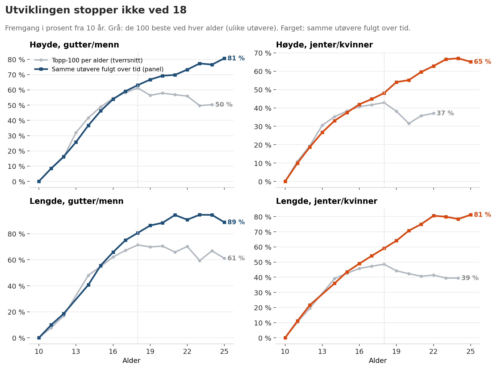
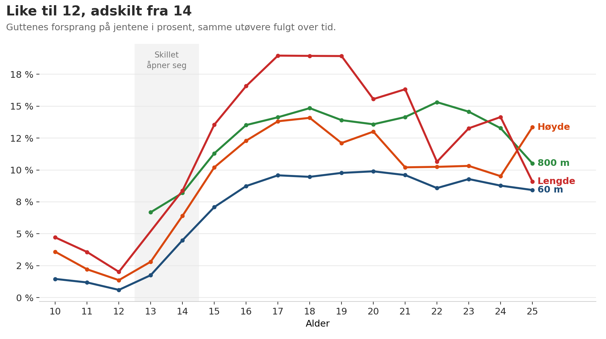
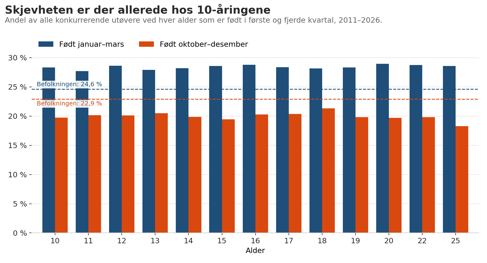
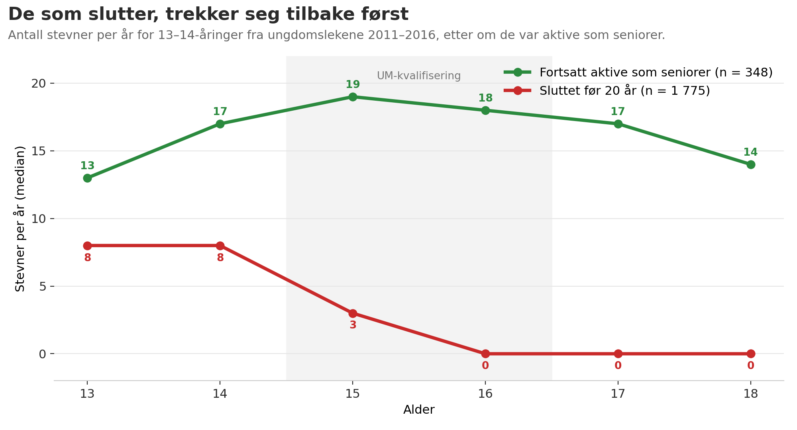
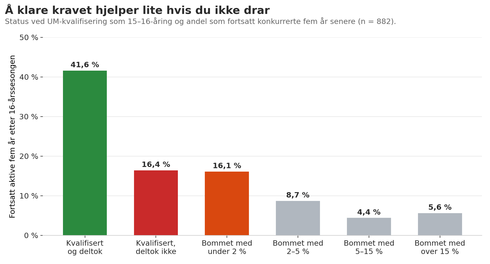

\artikkeltittel{Tallene finnes. Bruk dem.}{Hva en komplett resultatdatabase kan
fortelle norske friidrettstrenere om utvikling, frafall og hvor idretten er på
vei}{Atle Guttormsen}{September 2026}

\begin{ingress}
Friidrett er den mest målte idretten som finnes. Likevel bruker vi tallene
nesten bare til én ting: å rangere. Med en database over samtlige godkjente
resultater siden 2011 kan vi nå svare på tre spørsmål trenere alltid har stilt.
Hva er normal utvikling? Hvem slutter, og når? Og hvilken vei går norsk
friidrett? Svarene er kanskje forskjellige fra hva vi tror.
\end{ingress}

I Fagnytt 1/2023 skrev Hilde Gundersen og Espen Tønnessen en nyttig artikkel
om prestasjonsfremgang hos gutter og jenter fra 11 til 18 år. Grunnlaget var
de hundre beste norske utøverne gjennom tidene på hvert alderstrinn
(Tønnessen mfl., 2015), hvor undertegnede var en av medforfatterne. Kurvene derfra er de beste vi har hatt. Denne artikkelen tar opp tråden, men
med et annet verktøy. Norges Friidrettsforbund har gjennom mange år bygget
opp en database over alle godkjente konkurranseresultater i norsk friidrett,
om lag 1,4 millioner resultater fra 87 000 utøvere. Det er et
statistikkarbeid få andre idretter kan vise maken til. Mitt bidrag har vært
å gjøre disse tallene tilgjengelige for egen forskning, analysere dem i en
serie vitenskapelige arbeider, og prøve ut andre måter å presentere dem på.
Fordelen med en komplett database er ikke først og fremst at den er stor.
Fordelen er at vi kan følge *den samme utøveren* fra første 60-meter som
10-åring til siste sesong, uansett om den kom som 14-åring eller 30-åring.
Det endrer en del på hva vi kan si.

Jeg skal gjennom tre temaer: utvikling, frafall og trender. Til slutt
oppsummerer jeg hva jeg mener funnene bør bety for oss som friidrettstrenere.

## Hva databasen er, og hva den ikke er

Datagrunnlaget er Norges Friidrettsforbunds resultatdatabase, som siden 2011
har fullstendig elektronisk registrering av alle godkjente stevner i Norge og
alle resultater av norske utøvere i utlandet. Det finnes ingen
kvalifiseringskrav for å havne i databasen: den som stiller til start i et
terminfestet stevne, er med. Aldersklasser følger kalenderår, som ellers i
norsk friidrett. Fødselsdato er registrert for 94–100 prosent av utøverne i
ungdomsklassene, redskapsvekter og hekkhøyder ligger i øvelseskodene, og
manuell og elektronisk tid kan skilles.

Det databasen *ikke* inneholder, er vel så viktig å ha klart for seg.
Den har ingen treningsdata, ingen mål på biologisk modning, og den ser bare
friidrett: en utøver som «slutter» i våre tall, kan ha gått til håndball eller
langrenn. Barn under 13 år finnes i databasen, men jeg analyserer ikke
prestasjonsnivå under 13, bare deltakelse, i tråd med
barneidrettsbestemmelsene. Og som alltid med slike data beskriver tallene
sammenhenger, ikke årsaker. Det er trenerens erfaring som må fylle inn
mekanismene.

Forbundets tall er offentlige på minfriidrettsstatistikk.info. På
friidrettsresultater.no har jeg lagt de samme tallene til rette slik at
trenere kan følge enkeltutøvere over år, sammenligne utøvere og se årslister
per aldersklasse tilbake til 2011.

## Del 1: Hva er normal utvikling?

### Topp-100-kurven måler forskjellige mennesker

Utviklingskurver vi har brukt til nå, er laget på samme måte: man tar de
beste utøverne på hvert alderstrinn og tegner en linje gjennom snittet. Det
er et *tverrsnitt*. Men de hundre beste 13-åringene og de hundre beste 20-åringene
er i all hovedsak forskjellige mennesker. Når en tidlig moden 14-åring
forsvinner fra listen og en sen 17-åring kommer inn, endrer snittet seg uten
at noen enkeltutøver har utviklet seg.

I en artikkel som nå er antatt i *Journal of Science and Medicine in Sport*
(Guttormsen, 2026a) sammenlignet jeg tverrsnittskurvene med en
*panelkurve*: gjennomsnittet for utøvere som har minst tre sesonger i samme
øvelse, fulgt fra alder til alder. Øvelsene er de samme som hos Tønnessen mfl.
(2015): 60 meter, 800 meter, høyde og lengde. Figur 1 viser høyde og lengde.

Forskjellen er ikke en detalj. I høyde for gutter topper tverrsnittskurven på
61 prosent fremgang ved 18 år og faller deretter. Mine panelkurver fortsetter til
81 prosent ved 25. I lengde for kvinner er avstanden mellom de to kurvene 48
prosentpoeng ved 25 år. Årsaken er utskifting: fra midten av tenårene er de
som kommer inn på topp-100-listen, i snitt svakere enn de som går ut, og
tverrsnittskurven flater ut eller faller, selv om hver enkelt utøver som
holder på, fortsetter å bli bedre.

For trenere har dette to konsekvenser. Den første er at det ikke finnes noe
utviklingsplatå ved 17–18 år. Den finnes i de gamle kurvene våre, men ikke i utøverne.
Den andre er at topp-100-listene i de yngste klassene er sterkt skjeve mot
tidlig utviklede og tidlig fødte. Blant de hundre beste guttene på 60 meter i
alderen 10–13 år er 48 prosent født i januar, februar eller mars. I
befolkningen er tallet 25. Den som bruker slike lister som mål på «normal»
utvikling for en 13-åring, måler mot en gruppe som er langt fra normal.

### Forventet fremgang, år for år

Tabell 1 gir panelkurvene i tall. Den viser samlet fremgang fra 10 år (13 år
for 800 meter, der 600 meter er standardøvelsen for de yngste) ved utvalgte
aldre. Dette er gjennomsnitt for utøvere som fortsatte å konkurrere, og den
enkelte vil avvike, slik Gundersen og Tønnessen understreket. Men tabellen
gir et bedre referansepunkt enn tverrsnittslistene for et spørsmål trenere
stiller hver høst: er dette normalt?

| Øvelse | Kjønn | 12 år | 14 år | 16 år | 18 år | 20 år | 22 år | 25 år |
|:---------|:-----------|-----:|-----:|-----:|-----:|-----:|-----:|-----:|
| 60 m | Gutter | 8 % | 17 % | 25 % | 27 % | 29 % | 30 % | 30 % |
| 60 m | Jenter | 9 % | 15 % | 19 % | 21 % | 22 % | 24 % | 24 % |
| 800 m | Gutter | – | 7 % | 16 % | 19 % | 21 % | 23 % | 21 % |
| 800 m | Jenter | – | 5 % | 9 % | 12 % | 15 % | 15 % | 18 % |
| Høyde | Gutter | 16 % | 37 % | 54 % | 63 % | 69 % | 73 % | 81 % |
| Høyde | Jenter | 19 % | 33 % | 42 % | 48 % | 55 % | 63 % | 65 % |
| Lengde | Gutter | 18 % | 41 % | 66 % | 81 % | 88 % | 91 % | 89 % |
| Lengde | Jenter | 22 % | 36 % | 49 % | 59 % | 71 % | 81 % | 81 % |

*Tabell 1. Samlet fremgang i prosent fra 10 år (800 m: fra 13 år) for utøvere
med minst tre sesonger i øvelsen, 2011–2025. «Gutter» og «jenter» omfatter
også menn og kvinner i 20-årene. Fremgangen per år er størst
mellom 10 og 14 (4–10 prosent per år avhengig av øvelse), halveres mellom 14
og 16 for jentene og mellom 16 og 18 for guttene, og ligger på 1–3 prosent per
år fra 18 til 21. Etter 21 er den under én prosent per år, men fortsatt
positiv i de fleste øvelsene.*

Legg merke til at jentenes fremgang bremser tidligere enn guttenes, i tråd
med at de kommer tidligere i puberteten, men at den *ikke* stopper. Kvinnene
i lengde går fra 59 prosent ved 18 til 81 prosent ved 22. Den som gir opp en
19-årig jente fordi kurven har flatet ut, gir opp for tidlig.

### Like til 12, adskilt fra 14

Panelet gjør det også mulig å tidfeste når kjønnsforskjellen oppstår, målt
på de samme utøverne (figur 2). Ved 10–12 år er guttenes forsprang 0,6–3,7
prosent, i praksis ingenting på 60 meter. Fra 13 år åpner skillet seg raskt og
stabiliseres ved 17–18 på omtrent 10 prosent i 60 meter, 13 i høyde og 16–19
i lengde. Unntaket er 800 meter, der forskjellen er 5–7 prosent allerede før
puberteten, i tråd med at det finnes kjønnsforskjeller i oksygentransport
også hos barn. Konsekvensen for praksis er at det er lite fysiologisk grunn
til å skille gutter og jenter i trening før 13 år, og god grunn til å gjøre
det etterpå, mest i øvelsene som avhenger av kroppsstørrelse og eksplosiv
kraft.

## Del 2: Hvem slutter, og når?

### Frafallet er stabilt

Den vanlige fortellingen er at frafallet i ungdomsidretten øker. I friidrett
stemmer det ikke. Jeg har fulgt hvert årskull av 13-åringer fra 2013 til
2022 og målt hvor mange som fortsatt konkurrerer ved hver senere alder.
Kurvene er nesten identiske (figur 3): 55 prosent er med ved 14, en tredjedel
ved 16, og 10–12 prosent ved 19. Slik var det i 2013-kullet, og slik er det i
kullene etter pandemien.

Det som har endret seg, er inntaket. I 2013 konkurrerte 1 220 13-åringer; i
2021- og 2022-kullene var tallet rundt 820. Frafallet spiser samme andel som
før av et kull som er 30 prosent mindre. Det betyr at når vi diskuterer
«frafallsproblemet», bør vi være presise. Problemet sitter i døren inn, ikke i
døren ut. Jeg kommer tilbake til dette i del 3.

### Skjevheten er der før de begynner

Den relative alderseffekten, at barn født tidlig på året er overrepresentert
i idretten, er godt dokumentert (Cobley mfl., 2009). Den vanlige forklaringen
er at effekten bygges opp gjennom tenårene: tidlig fødte er større, blir tatt
ut, får mer oppmerksomhet, og forspranget forsterkes runde for runde.

Norske friidrettsdata passer ikke med den forklaringen (Guttormsen, 2026b).
Blant konkurrerende 10-åringer, den yngste alderen vi registrerer, er 28,3
prosent født i første kvartal og 19,7 prosent i fjerde. I befolkningen er
tallene 24,6 og 22,9. Forholdet mellom første og fjerde kvartal er altså 1,44
allerede ved 10 år. Og der blir det. Ved 13 er det 1,36, ved 16 1,42, ved 20
1,47, ved 25 1,56 (figur 4). Ingen forsterkning gjennom puberteten, ingen
oppbygging gjennom uttak. Skjevheten er ferdig etablert før barna kommer inn
i databasen, det vil si i 6–9-årsalderen, og den ligger i hvem som begynner
og hvem som gir seg etter første sesong.

To ting følger av dette. For det første kan ikke trenere i ungdomsklassene
«fikse» den relative alderseffekten ved å endre uttakspraksis; den er
allerede lagt. Det er i barneidretten, i hvem som får lyst til å komme og
hvem som får lyst til å bli, slaget står. For det andre må vi skille mellom
to ting som ofte blandes: *relativ alder* (fødselsmåned) og *biologisk
modning* (pubertetstidspunkt). En 14-åring født i desember kan være tidlig
moden, og en født i januar kan være sen. Fødselsmåneden er en fast, liten
effekt som ligger i deltakelsen; modningen er en stor, midlertidig effekt som
ligger i prestasjonen. Trenerens oppgave i tenårene er å se forbi den siste,
slik Gundersen og Tønnessen også påpekte.

### De trekker seg tilbake før de slutter

Hvis frafallet er stabilt og forutsigbart, kan det da forutsies for den
enkelte? Med utgangspunkt i ungdomslekene for 13–14-åringer (NCC-, PEAB-,
Bendit- og Lerøy-lekene) har jeg fulgt 2 123 utøvere født 1998–2002 i inntil
14 år, til de var seniorer (Guttormsen, 2026c). Spørsmålet var enkelt: hva
ved en 13–14-åring forteller om hun eller han fortsatt konkurrerer ved 20?

Svaret overrasket meg. Prestasjonsnivået ved 13–14, målt i Tyrving-poeng,
sier noe, men lite: alene skiller det bare svakt mellom dem som blir og dem
som slutter. Det som skiller, er *atferd*. Antall stevner utøveren deltok i
som 13- og 14-åring gir alene en treffsikkerhet (AUC) på 0,75, mot 0,61 for
prestasjon. Figur 5 viser hvorfor. De som senere var aktive som seniorer,
gikk i median 13 stevner som 13-åringer og 17 som 14-åringer; de som sluttet
før 20, gikk 8 og 8. Og skillet vokser: ved 15 år er tallene 19 mot 3, ved 16
er medianen for de som skulle slutte, null. Flertallet av dem vi mister, er
med andre ord borte fra stevnene ett til to år før de formelt er borte fra
idretten. De trekker seg tilbake før de slutter.

Dette er den mest praktisk anvendelige observasjonen i hele materialet. En
trener trenger ingen database for å telle starter. Ser du at en 14-åring
som gikk 15 stevner i fjor, går 6 i år, ser du frafallet mens det ennå kan
påvirkes. Nedgangen i seg selv var en selvstendig varsellampe i analysen,
også når vi tok hensyn til hvor mange stevner utøveren startet med.

### Å klare kravet hjelper lite hvis du ikke drar

Den første kvalifiseringsgrensen norske ungdommer møter, er UM-kravet ved
15–16 år. I en egen, foreløpig upublisert analyse av den eldste delen av
samme kohort (1 301 utøvere født 1998–2000) delte jeg utøverne etter status
ved den grensen: kvalifisert og deltok, kvalifisert men deltok ikke, og fire
grupper etter hvor langt under kravet de lå. Figur 6 viser andelen som
fortsatt konkurrerte fem år senere.

Det ventede mønsteret er der: jo lenger under kravet, desto større frafall.
Men se på de to søylene i midten. Utøvere som *klarte* kravet, men ikke dro
på UM, hadde like høyt frafall som dem som bommet med under to prosent, og
høyere etter justering for kjønn, nivå, konkurransevolum og region
(hasardratio 2,05 mot 1,72). Det til tross for at de var klart bedre utøvere.
Prestasjonsnivået i seg selv hadde ingen selvstendig sammenheng med frafall
når atferd var tatt hensyn til.

Jeg tolker dette som et spørsmål om tilhørighet. Den som så vidt bommer på
kravet, men fortsetter å konkurrere, er fortsatt «innenfor». Den som klarer
kravet og lar være å dra, har allerede begynt å gå. Årsaken kan være
motivasjon, skader, treningsmiljø eller andre idretter, og databasen kan
ikke skille dem. Men handlingsregelen for treneren er den samme uansett:
utøvere som kvalifiserer seg, bør dras med. Deltakelse i mesterskap er ikke
en belønning for de beste, det er et av de mest virksomme tiltakene vi har
for å beholde folk.

Blant dem som både kvalifiserte seg og deltok, avgjorde juniorårene resten.
De som fortsatte å konkurrere jevnlig som 17–19-åringer og samtidig forbedret
seg, var i 85 prosent av tilfellene aktive ved 20. De som deltok i færre enn
to juniorsesonger, var det i 5 prosent, uansett hvor gode de hadde vært som
16-åringer.

\needspace{8\baselineskip}

## Del 3: Hvilken vei går det?

### Toppen er bedre enn noen gang

I juli la jeg ut en lengre gjennomgang av nivåutviklingen 2013–2025 på
Trenerforeningens Facebook-side, så jeg nøyer meg her med hovedlinjene. Målt
som snittet av de ti beste årsbestenoteringene, utendørs og med elektronisk
tid, har seniortoppen gått frem i de aller fleste øvelsene. 100 meter menn
fra 10,48 til 10,39, kvinner fra 11,83 til 11,61. 800 meter menn fra 1:48,9
til 1:47,4, kvinner fra 2:07,8 til 2:03,7. 5000 meter menn fra 14:01 til
13:15. Slegge menn fra 57,0 til 61,7 meter, diskos kvinner fra 45,3 til 48,9.
Og dybden følger med: nummer 25, 50 og 100 på årslistene har flyttet seg
nesten like mye. Unntakene er høyde, som har gått tilbake for begge kjønn, og
spyd, som står stille.

En del av fremgangen på mellom- og langdistanse deler vi med resten av
verden. Skoteknologien fra 2020 og etter hvert bikarbonat har flyttet nivået
overalt. I en analyse av amerikanske college-årslister fant vi at
distanseøvelsene løftet seg 0,06–0,12 standardavvik i forhold til
kontrolløvelser etter 2021, og at effekten vokser med distansen (Guttormsen
og Guttormsen, 2026). Trenere som vurderer egne utøveres fremgang på 3000
meter etter 2020, bør trekke fra noe for skoene.

### Femtenåringene er færre og svakere

Under seniortoppen er bildet et annet. Antall aktive 10–19-åringer falt fra
8 715 i 2019 til 6 392 i 2025, en nedgang på 27 prosent, og har ikke tatt seg
opp igjen etter pandemien. Barnerekrutteringen er på vei tilbake, men
tenåringsdebuten, altså utøvere som får sitt første resultat som 14–19-åring,
er omtrent halvert. Veien inn i friidretten fra andre idretter og fra
skolemiljøene er i ferd med å gro igjen.

Og nivået i de yngste ungdomsklassene faller. Topp-10-snittet for 15-årige
gutter på 800 meter har gått fra 2:00,5 til 2:03,8, i lengde fra 5,96 til 5,73
meter. Tydeligst er det i kast, der redskapet er det samme gjennom hele
perioden. Kule for 15-årige gutter (4 kg) har gått fra 14,32 til 12,04 meter
(figur 7). Spyd gutter 15 fra 50,4 til 43,7. Diskos jenter 15 fra 32,3 til
27,2. Mens seniorkasterne aldri har vært bedre, har de beste 15-åringene
mistet fem til femten prosent.

### Kastfallet begynner før 13 år, og det er ikke trenernes feil

Hvor tidlig starter dette? Ungdomslekene for 13–14-åringer har vært arrangert
hvert år i hele datasettets levetid, med samme øvelsesprogram og samme redskap per klasse, og
gir en sjelden mulighet til å følge én aldersgruppe over 14 utgaver. Jeg har
analysert alle 30 000 resultater fra lekene og estimert trenden i hver øvelse
og klasse, både for medianen (bredden) og for beste desil (toppen).

Løp og hekk er stabile. Guttenes topp i sprint og mellomdistanse er blitt
litt bedre, jentenes bredde i sprint litt svakere, men utslagene er tideler
over 14 år. Hopp går svakt tilbake i bredden. Kastene faller markert: spyd 14
til 17 prosent per tiår i alle fire klasser, kule 5 til 8, diskos 5 til 11.
Kontrollert mot sesongbeste for *alle* norske 13- og 14-åringer, ikke bare dem
på lekene, er fallet like stort. Det er altså ikke uttaket til lekene som har
endret seg. Det er kastferdigheten hos norske 13-åringer.

Det viktigste funnet for trenere ligger likevel et annet sted. Fordi to
tredjedeler av 14-åringene også deltok året før, kan jeg måle hvor mye samme
utøver forbedrer seg fra 13 til 14 år. Den forbedringen er *uendret* i alle
øvelser gjennom hele perioden: gutter 4–7 prosent i løp og 5–9 i hopp, jenter
2–3 og 1–3. Utøverne utvikler seg like mye i løpet av 13-årssesongen som
før. Det trenerne i denne aldersgruppen gjør, virker som det alltid har
gjort. Det som har endret seg, er nivået utøverne kommer inn med. Kastfallet
har røtter før 13 år, i barneidretten og i hvem friidretten rekrutterer, ikke
i ungdomstreningen.

## Hva betyr dette for oss som trener?

Fem punkter, i den rekkefølgen jeg mener de er viktigst.

**1. Tell starter, ikke bare tider.** Fallende konkurransevolum er den
tidligste varsellampen vi har for frafall, ett til to år før utøveren er
borte. En 14-åring som går halvparten så mange stevner som i fjor, trenger en
samtale nå, ikke neste vår. Utøvere som er på trening, men nesten ikke deltar på stevner, vil i de aller fleste tilfeller bli helt borte fra konkurransene ganske snart.

**2. Send dem som kvalifiserer seg.** Utøvere som klarer UM-kravet uten å dra,
slutter oftere enn dem som så vidt bommer. Mesterskapsdeltakelse er et
tiltak for å beholde utøvere. Det samme gjelder juniorårene: to sesonger med
jevn konkurransering som 17–19-åring skiller 85 prosent fra 5.

**3. Bruk longitudinelle forventninger når du setter mål.** Utviklingen
fortsetter til midten av 20-årene i alle øvelser og for begge kjønn. Platået
ved 17–18 finnes bare i topp-100-kurvene. En junior som står stille ett år,
er ikke ferdig, og det finnes 20–30 prosentpoeng fremgang igjen i hopp fra 18
til 25.

**4. Skill relativ alder fra modning, og ikke forveksle noen av dem med
talent.** Fødselsmåneden er lagt før 10 år og forsterkes ikke; den kan bare
barneidretten gjøre noe med. Modningen er midlertidig og stor; den må
ungdomstreneren se forbi. Topp-100-listene for 13-åringer er halvfulle av
januarbarn og tidlig modne. De er ikke et mål på hvem som blir best.

**5. Kastene trenger et løft fra 10-årsalderen.** Fallet i kast er det
største enkeltfunnet i materialet, det er nasjonalt, det begynner før 13, og
det skjer samtidig som de aller beste seniorkasterne er bedre enn noen gang. Utviklingstakten
i ungdomsklassene er intakt, så løsningen ligger ikke i mer press på
15-åringene. Den ligger i kastaktivitet, kastkompetanse og rekruttering av
store, sterke barn i klubbene, før de fyller 13.

Alt dette er beskrivende funn fra én database, og de bør leses slik. Men de
er også det nærmeste vi kommer et samlet bilde av norsk friidrett sett
nedenfra, og de peker samme vei: det vi gjør med dem vi har, virker. Det er
i hvem vi får inn, og hvem vi klarer å holde på, at tallene ber oss se etter.

I kommende numre vil jeg gå nærmere inn på enkeltfunnene, blant annet
kastfallet, utviklingen i ungdomslekene 2012–2026 og forutsigelse av frafall.
Klubber og kretser som ønsker egne uttrekk fra friidrettsresultater.no, er
velkomne til å ta kontakt.

---

### Faktaboks: Slik er tallene laget

- **Datagrunnlag:** Norges Friidrettsforbunds resultatdatabase, komplett
  elektronisk fra 2011 (minfriidrettsstatistikk.info). Om lag 1,4 mill.
  resultater fra 87 000 utøvere per august 2026. Analysene er gjort på et
  uttrekk av disse tallene; tilrettelagt på friidrettsresultater.no.
- **Utviklingskurver (del 1):** Sesongbeste per utøver og øvelse, 2011–2025,
  utøvere 10–25 år. Panel: utøvere med minst tre sesonger i øvelsen. Tverrsnitt:
  de 100 beste gjennom tidene ved hver alder, som hos Tønnessen mfl. (2015).
  60 meter inkluderer innendørs; lengde bare med lovlig vind. Alder =
  konkurranseår minus fødselsår.
- **Frafall (del 2):** Kohort = alle med minst ett resultat i året de fylte
  13. «Fortsatt aktiv» = minst ett resultat i året de fylte 14, 15 osv.
  Ungdomslekene-kohortene: 13–14-åringer ved NCC-, PEAB-, Bendit- og
  Lerøy-lekene 2011–2016, fulgt til 2025. «Aktiv senior» = minst to resultater
  i et kalenderår ved 20 år eller eldre.
- **Relativ alder:** Fødselskvartal for alle utøvere med registrert
  fødselsdato, sammenlignet med månedlige fødselstall fra SSB 1998–2016.
- **Trender (del 3):** Snitt av de ti beste årsbestenoteringene per år,
  utendørs, elektronisk tid, én notering per utøver. Kast per aldersklasse med
  klassens standardredskap, uendret hele perioden. Ungdomslekene: ett beste
  resultat per utøver, øvelse og år; trend ved kvantilregresjon på kalenderår.
- **Barn under 13:** Kun deltakelsestall, ingen nivåanalyse.

### Referanser

Cobley, S., Baker, J., Wattie, N. og McKenna, J. (2009). Annual age-grouping
and athlete development: A meta-analytical review of relative age effects in
sport. *Sports Medicine*, 39(3), 235–256.

Gundersen, H. og Tønnessen, E. (2023). Prestasjonsfremgang og
prestasjonsforskjeller mellom gutter og jenter i løps- og hoppøvelser i
friidrett. Hva skyldes det? *Fagnytt*, 1/2023, 4–8.

Guttormsen, A. G. (2026a). Within-athlete performance development in youth
track and field: A population-level longitudinal study. *Journal of Science
and Medicine in Sport*, antatt for publisering.

Guttormsen, A. G. (2026b). Dropped out before they ever competed: A
population-wide registry analysis of the relative age effect in Norwegian
track and field from age 10 to 25. Manuskript under vurdering, *Sports
Medicine – Open*.

Guttormsen, A. G. (2026c). Pulling back before dropout: Behavioral
disengagement precedes youth-sport exit by years in a 14-year register study.
Manuskript under vurdering.

Guttormsen, A. G. og Guttormsen, S. (2026). Super shoes and track
performance: Evidence from collegiate leaderboards. Manuskript under
vurdering.

Güllich, A., Barth, M., Macnamara, B. N. og Hambrick, D. Z. (2023). Quantifying
the extent to which successful juniors and successful seniors are two disparate
populations: A systematic review and synthesis of findings. *Sports Medicine*,
53(6), 1201–1217.

Tønnessen, E., Svendsen, I. S., Olsen, I. C., Guttormsen, A. og Haugen, T.
(2015). Performance development in adolescent track and field athletes
according to age, sex and sport discipline. *PLoS ONE*, 10(6), e0129014.
