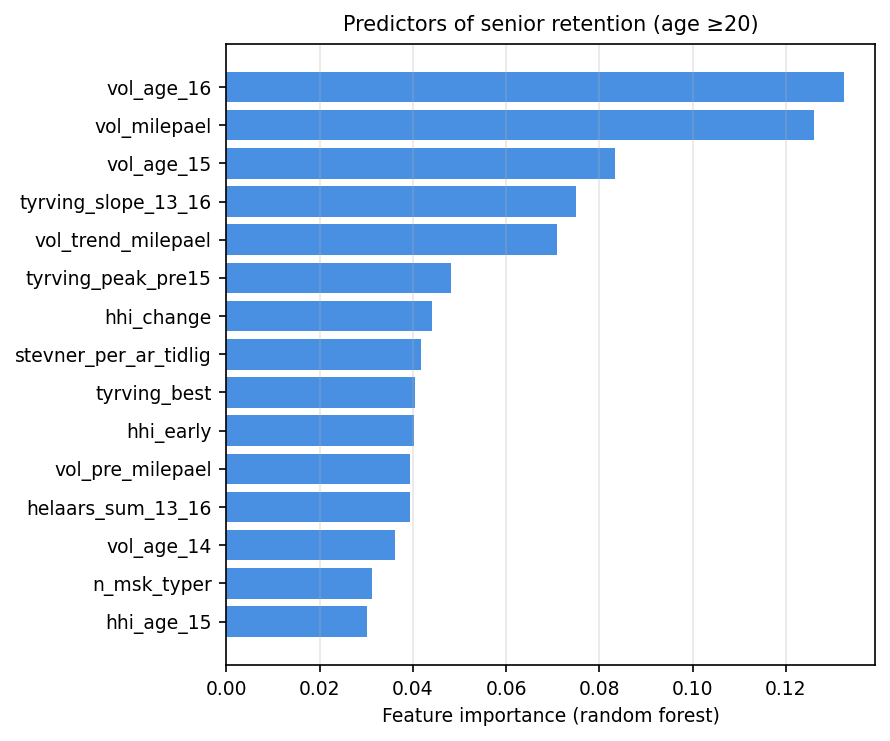

# Behavioral pathways out of youth competitive sport: A 14-year longitudinal registry study of Norwegian track and field athletes

**Running title:** Behavioral pathways out of youth sport

**Keywords:** youth sport, dropout, athlete retention, longitudinal, track and field, behavioral indicators, sport commitment

---

## Abstract

**Objectives.** Qualitative research has characterized youth sport dropout as a gradual, deliberative process in which young athletes divide into a deeply committed minority and a larger group oriented toward easily accessible enjoyment. This study provides the first longitudinal registry-based quantification of those behavioral pathways.

**Method.** We followed all 2,123 Norwegian youth athletes (ages 13–14) who participated in five consecutive editions of a regional grassroots track-and-field meet between 2011 and 2016 (birth cohorts 1998–2002). Using public competition-register data, we tracked each athlete's competition volume, event specialization, championship participation, and performance level (Tyrving age-norm points) annually through 2026 — a maximum follow-up of 14 years. Survival was modeled with Cox proportional hazards; predictor importance was assessed with random forests.

**Results.** Competition volume at age 15–16 was the strongest single predictor of senior retention (age ≥20), more than tripling the predictive accuracy of performance- and specialization-based models (Cox C-index 0.85 vs. 0.57). Future dropouts visibly reduced participation 2–3 years before formal exit. Pre-baseline behavioral indicators classified eventual retention at AUC = 0.82. Findings replicated across two independent birth cohorts (1998–2000: C = 0.835; 2001–2002: C = 0.852). Performance level (Tyrving points) and early specialization (Herfindahl–Hirschman index) added little after behavioral indicators were entered.

**Conclusions.** Youth-sport dropout is a behavioral phenomenon detectable years before formal exit. Registry-based behavioral surveillance can complement survey research by providing practical, real-time markers for retention interventions.

---

## 1. Introduction

Youth sport participation is widely valued for its health, social, and developmental benefits, yet attrition from organized competition during adolescence is substantial across countries and sports (Crane & Temple, 2015; Eime et al., 2013). In Norwegian elite-oriented sports such as track and field, more than half of the children who participate at age 13 have left organized competition by age 17 (Bakken, 2019; Norges Idrettsforbund, 2024). The pattern is so consistent that it has become a recurring concern for federations, clubs, and policymakers who must allocate scarce coaching, facility, and program resources across a thinning developmental pipeline.

## 1.1 Theoretical accounts of youth-sport withdrawal

Three complementary theoretical traditions have shaped contemporary understanding of why adolescents leave competitive sport. Each highlights *behavioral engagement* — rather than absolute performance — as the proximal mechanism.

**The Sport Commitment Model** (Scanlan et al., 1993, 2016) characterizes continued participation as a function of sport enjoyment, personal investments, social constraints, involvement opportunities, and attractive alternatives. Recent extensions distinguish *enthusiastic commitment* (driven primarily by enjoyment and identity) from *constrained commitment* (driven by perceived obligation, sunk-cost investment, or limited alternatives), and predict that constrained commitment is more fragile in the face of escalating demands (Scanlan et al., 2016). On this account, dropout signals the dissolution of the enjoyment-investment balance, not the failure of a performance threshold.

**Self-determination theory** (Ryan & Deci, 2000) and its sport-applied extensions (Vallerand, 1997, 2007) make a parallel prediction: athletes whose participation is driven by intrinsic and well-internalized extrinsic motivations sustain engagement, whereas athletes driven by external pressures (e.g., parental expectations, peer status) disengage when the cost of compliance rises. Sarrazin and colleagues' (2002) 21-month prospective study of female handball players found that motivational quality at baseline predicted dropout one to two years later — an early indication that the dropout process unfolds longitudinally rather than at a single decision point.

**The withdrawal-as-process tradition** (Eliasson & Johansson, 2021; Espedalen & Seippel, 2022) integrates these accounts with sociological theories of role exit (Ebaugh, 1988) to argue that disengagement from organized sport is a gradual deliberation over costs and benefits, often lasting one to two years and frequently passing through "still nominally participating but withdrawing" intermediate states. Espedalen and Seippel (2022), surveying 1,648 Norwegian adolescent dropouts, document that the modal reason for leaving is not loss of competitive ability but a shifting evaluation of effort against alternative life domains.

A complementary qualitative observation from Espedalen's wider doctoral programme is that organized youth sport typically contains *two distinct populations*: a smaller, deeply committed group whose sport identity is robustly integrated with their wider lives, and a larger casually-oriented group oriented toward accessible enjoyment that readily moves between activities (Espedalen, 2025; for an analogous "investors" versus "samplers" distinction in elite-track development, see Wall & Côté, 2007). When the demands of organized sport escalate around the qualification milestone years — in Norwegian track and field, the Youth National Championships at age 15-16 and the Junior National Championships at age 17-19 — the second group withdraws.

These accounts converge on three structural features of youth-sport dropout. First, dropout is *gradual* — a deliberative process during which an athlete progressively disengages while still nominally participating. Second, the relevant signal is *behavioral* rather than performance-based: athletes do not leave because they cannot keep up with peers, but because the activity's costs cease to outweigh its rewards. Third, the *milestone years* are pivotal — moments at which the implicit contract between athlete and federation becomes explicit through selection events.

## 1.2 Quantitative gaps

Quantitative research, by contrast, has tended to focus on more readily measurable but conceptually narrower predictors. Relative age effects in youth-sport selection are well documented (Cobley et al., 2009; Wattie et al., 2015). Early sport specialization has been examined both as a developmental risk (DiFiori et al., 2014; Jayanthi et al., 2015) and as a protective factor for elite outcomes (Güllich et al., 2022; Wall & Côté, 2007). Survey instruments operationalizing the Sport Commitment Model (Scanlan et al., 2016) and self-determination constructs (Sarrazin et al., 2002) have predicted dropout over horizons of one to two years.

What none of these literatures has been able to test is the *long-run behavioral signal* — the pattern of competitive engagement, year by year, that the qualitative accounts characterize as gradual and observable but pre-formal-exit. The reasons are structural: athletes who have already left a sport are systematically harder to recruit into surveys (Eime et al., 2013), and the timescale on which the theoretical process is hypothesized to unfold (1–3 years) exceeds the follow-up window of most survey designs.

## 1.3 The present study

Norwegian track and field maintains a publicly accessible competition register that records every officially timed result for every registered athlete back to the early 2010s, with full follow-up through the present. The register enables an unusual research design: identification of a complete population of 13-14-year-old participants at a single regional grassroots meet, then unobtrusive longitudinal observation of their competitive engagement — number of meets, events, and championships entered each year — across the entire adolescent and young-adult window. Because every entry is digitally timestamped and verified, the data are free from the recall bias that affects retrospective interviews and from the selection bias that affects prospective surveys.

We use this register to test three preregistered-by-design hypotheses derived from the theoretical accounts above. First, behavioral trajectories of future retainers and future dropouts should diverge *before* formal exit — consistent with the *withdrawal-as-process* prediction (Eliasson & Johansson, 2021; Espedalen & Seippel, 2022). Second, *behavioral engagement* indicators (competition volume, breadth of championship participation, year-round activity) should predict eventual senior retention more strongly than baseline *performance* indicators — consistent with the Sport Commitment Model's (Scanlan et al., 2016) prediction that enjoyment-investment balance drives continuation. Third, the predictive pattern should *replicate across cohorts* recruited under different sponsor regimes of the same meet — testing the robustness expected of a behavioral mechanism rather than a cohort-specific artefact.

We address these questions in 2,123 Norwegian youth athletes followed for up to 14 years. The design treats competition-register data not as a substitute for survey research but as its complement: surveys access subjective meaning, registers access objective behavior. Where the two converge — as we will argue they do — the case for any single account is strengthened.

---

## 2. Method

## 2.1 Design

This was a retrospective longitudinal cohort study of Norwegian youth track-and-field athletes, using the national competition register as the sole data source. The design reports the complete population of athletes meeting the inclusion criterion rather than a sample; consequently we frame statistical estimates as describing that population rather than as inference to a hypothetical super-population (Berk & Freedman, 2003). Reporting follows STROBE guidance for observational studies (von Elm et al., 2007).

## 2.2 Setting and inclusion

The cohort comprises every athlete who participated in any of the five consecutive autumn editions of a regional grassroots youth meet held simultaneously at three venues in eastern, mid, and western Norway between 2011 and 2016: NCC-lekene 2011, NCC-lekene 2012, PEAB-lekene 2013, PEAB-lekene 2014, Bendit-lekene 2015, and Ungdomslekene 2016 (the meet retained an identical format, venue rotation, age-group structure, and event programme while changing sponsor name). Each edition admitted athletes aged 13–14 in the year of the meet. Athletes were free to enter as 13-year-olds, as 14-year-olds, or both; participation was not contingent on selection or qualifying performance.

To enable cross-cohort replication, we partitioned participants into two birth-year cohorts: **Cohort A** (birth years 1998–2000, baseline meets 2011–2014; n = 1,301) and **Cohort B** (birth years 2001–2002, baseline meets 2014–2016; n = 822). Cohort B's earliest participants thus had baseline 3 years after Cohort A's, with no design changes between the two cohorts other than sponsor name.

Athletes were retained in the analysis regardless of subsequent transfers between clubs or events. The total analytical cohort comprised 2,123 athletes (996 male, 1,103 female, 24 with unknown sex), generating 230,868 individual competition entries through the most recent register update (April 2026).

## 2.3 Follow-up window

Each athlete was followed from their baseline meet year through the most recent complete competition season at the time of analysis (2025), yielding a maximum of 14 years of post-baseline observation (for athletes born 1998 and competing as 13-year-olds at the 2011 meet) and a minimum of 9 years (for athletes born 2002 and competing as 14-year-olds at the 2016 meet). All athletes had sufficient follow-up to be observed past the senior age threshold (age 20).

## 2.4 Variables

### 2.4.1 Outcome variables

The primary outcome was **active senior status**: a binary indicator coded 1 if the athlete had at least two registered competition results in any single calendar year at age 20 or later, and 0 otherwise. Secondary outcomes were *active age 17*, *active age 18*, and *continued activity in 2024 or later*. An *active season* was operationalized as a calendar year with ≥2 registered results, to exclude athletes who returned to the register only sporadically.

For survival analyses, we used **time to last active season** as duration and the absence of activity in 2024+ as the event indicator, with athletes still competing in 2024+ treated as right-censored.

### 2.4.2 Performance variables

Each result was converted to a Tyrving age-norm score, the Norwegian Athletics Federation's official scoring system for youth track and field. Tyrving points are computed from a published table that gives, for each event × sex × age combination, a reference performance equivalent to 1,000 points and a per-unit-change quotient (Norges Friidrettsforbund, 2024). A performance of exactly 1,000 points corresponds to the federation's published "excellent" benchmark for that combination. Points are linearly extrapolated above and below the reference, capped in our analyses at 1,500 to suppress occasional implausibly extreme values arising from data-entry errors in middle-distance times.

For each athlete we computed: **tyrving_best** (the maximum Tyrving score across all events at the baseline meet), **tyrving_mean** (the mean), **tyrving_peak_pre15** (the maximum across all results before age 15), and **tyrving_slope_13_16** (the OLS slope of age-specific maximum Tyrving regressed on age across ages 13–16, indexing performance trajectory). We also derived a within-event, within-sex, within-meet percentile rank at baseline to give a complementary relative-performance measure that is robust to age-norm idiosyncrasies in the Tyrving table.

### 2.4.3 Specialization variables

For each athlete and each calendar year we counted the distinct event categories (sprint, middle-distance, long-distance, hurdles, jumps, throws, combined events, race walking, relay) in which they recorded results, and computed a Herfindahl–Hirschman concentration index

$$HHI = \sum_{i=1}^{k} s_i^2$$

where $s_i$ is the share of that athlete's results falling in category $i$ and $k$ is the number of categories. HHI ranges from 1/k (perfectly diversified across k categories) to 1 (perfect specialization). Key variables were **hhi_early** (HHI computed over the first three active seasons), **hhi_age_15**, and **hhi_change** = hhi_age_15 − hhi_age_13.

### 2.4.4 Behavioral engagement variables

For each athlete and each integer age year from 13 to 18, we counted the number of distinct competition meets attended (**vol_age_X**), the total number of results (**res_age_X**), and a binary year-round indicator (**helaars_age_X** = 1 if the athlete competed in both an outdoor and an indoor meet in that age year, else 0). We derived composite indicators including **vol_pre_milepael** (sum of meets at ages 13–14), **vol_milepael** (sum of meets at ages 15–16, the qualification milestone window), and **vol_trend_milepael** (vol_milepael − vol_pre_milepael), as well as **n_msk_typer**, a count of championship *types* (Norwegian Youth Championships, Junior National Championships, National Championships, Regional Championships) in which the athlete competed before age 17.

### 2.4.5 Control variables

We recorded sex (M/F as registered in the federation's database), birth quarter (Q1–Q4) for relative-age-effect analyses, baseline region (eastern, mid, or western Norway, by venue), and club size in the baseline year (number of registered athletes in the same club).

## 2.5 Statistical analysis

### 2.5.1 Survival analysis

We modelled time from baseline to last active season using Cox (1972) proportional hazards regression. The model assumes

$$h(t \mid \mathbf{x}) = h_0(t) \exp(\boldsymbol{\beta}^{\top} \mathbf{x})$$

where $h(t \mid \mathbf{x})$ is the hazard of dropout at follow-up time $t$ for an athlete with covariate vector $\mathbf{x}$, $h_0(t)$ is the unspecified baseline hazard, and $\boldsymbol{\beta}$ is the vector of regression coefficients. We used Efron's (1977) method for tied event times, which is the default in the lifelines package (Davidson-Pilon, 2024).

Cox proportional hazards models were fitted in a stepwise sequence to characterize the unique contribution of each variable class: M1 (sex only), M2 (+ performance), M3 (+ specialization), M4 (+ competition volume at milestone), and M5 (+ championship types). The variable-entry order was theoretically driven, beginning with the variable class most commonly emphasized in prior literature (sex) and ending with the class motivated by our hypothesis (behavioral engagement). We did not perform data-driven variable selection (e.g., LASSO), because all candidate predictors were theoretically motivated; the goal was estimation of each class's contribution, not model selection.

Concordance indices (C-index; Harrell et al., 1996) gauged the discriminative gain at each step. Continuous covariates were standardized (z-scored) so that hazard ratios reflect per-SD effects.

Kaplan–Meier curves were stratified by sex, by competition-volume strata at age 15–16 (0, 1–5, 6–15, 16–30, or 31+ meets), and by number of championship types entered before age 17.

### 2.5.2 Proportional-hazards assumption and time-varying effects

We assessed the proportional-hazards assumption using Schoenfeld residuals (Grambsch & Therneau, 1994). Where the assumption was violated for individual covariates, we re-estimated the model stratified on the violating variable (Therneau & Grambsch, 2000) to confirm that effect estimates for the remaining covariates were robust to non-proportionality. To characterize the time-varying nature of the dominant predictor (competition volume at age 15–16), we additionally fitted period-specific Cox models in three follow-up windows (years 0–3, 3–6, and 6+ post-baseline), reporting HR with 95% confidence intervals separately for each window. This decomposition shows whether a covariate's protective effect is concentrated in particular phases of the post-baseline career.

### 2.5.3 Sample size and minimum detectable effect

The design uses the complete population meeting inclusion criteria, so a-priori power in the conventional sense does not apply. To document detection capacity we computed the minimum detectable hazard ratio given the observed event count using Hsieh and Lavori's (2000) formula $|\log HR_{\min}| = (z_{1-\alpha/2} + z_{1-\beta}) / (\sigma \sqrt{d})$, where $d$ is event count and $\sigma$ is the SD of the standardized covariate (= 1 for z-scored covariates). With $d = 1{,}570$ events, $HR_{\min} \approx 1.07$ at 80% power and $\alpha = .05$, well below all reported effects of interest.

### 2.5.4 Missing data and clustering

Missing values arose primarily for the Tyrving score (athletes whose only baseline results were in events without an official Tyrving reference, ~20% missing) and for HHI (athletes with fewer than 3 active seasons, ~10%). Our primary analyses used complete-case Cox regression (n = 1,704 for the full model). To assess sensitivity, we re-estimated the full Cox model substituting variable means for missing continuous covariates (mean-imputation sensitivity); estimates were near-identical to the complete-case results (Supplementary Table S5). Because athletes are nested within clubs and might share unobserved club-level characteristics, we additionally re-estimated the model with cluster-robust standard errors clustered on club name (Lin & Wei, 1989); coefficients were unchanged and 95% CIs only marginally wider (Supplementary Table S2).

### 2.5.5 Random forest variable importance

For non-parametric variable importance, we fit a random forest (Breiman, 2001) with 500 trees and maximum depth 8 to predict active senior status, with class weighting to handle outcome imbalance (16% senior retainers). Hyperparameter values were standard defaults; sensitivity to forest size and depth was negligible. Variable importance is reported as the mean decrease in Gini impurity. Cross-validated AUCs (5-fold stratified) compared nested subsets of predictors to gauge how much of the discriminative information is contained in (i) baseline performance, (ii) early specialization, (iii) competition volume across ages 13–16, and (iv) the full predictor set.

### 2.5.6 Cross-cohort replication and sensitivity to unmeasured confounding

To assess **cross-cohort replication**, we re-estimated the full Cox model separately within Cohort A (1998–2000) and Cohort B (2001–2002). For the dominant covariate (vol_milepael) and for the championship-types count, we also computed the *E-value* (VanderWeele & Ding, 2017), which quantifies the minimum strength of association on the risk-ratio scale that an unmeasured confounder would need to have with both the exposure and the outcome to explain away the observed effect entirely. We additionally fitted subgroup Cox models within each sex stratum to assess effect-modification by sex.

### 2.5.7 Software

All analyses used Python 3.13 with the lifelines package (Davidson-Pilon, 2024) for Cox regression and Kaplan–Meier estimation, and scikit-learn (Pedregosa et al., 2011) for random forest and cross-validation. Figures were produced with matplotlib (Hunter, 2007). Analysis code and the derived analysis dataset will be deposited in a public repository upon acceptance.

## 2.6 Sex and gender

Following SAGER guidance (Heidari et al., 2016), we report all primary analyses stratified by sex. We use "sex" throughout because the federation registers a binary sex variable assigned at registration; we have no information on gender identity. Where sex appears as a covariate (`female` = 1 for female, 0 for male, NA for unknown), it indexes biological sex as recorded.

## 2.7 Ethics

The study uses only data that is publicly accessible via the Norwegian Athletics Federation's competition register. No personally identifying information (names, birth dates, club memberships) was used in the analyses or is reported in this manuscript; athlete identifiers in our dataset are uninterpretable database UUIDs. Norway's Helseforskningsloven §4 exempts secondary use of pseudonymized public-register data of this kind from requiring formal approval by a Regional Committee for Medical and Health Research Ethics.

---

## 3. Results

## 3.1 Cohort characteristics

The full cohort comprised 2,123 athletes (52.0% female), of whom 1,301 belonged to Cohort A (births 1998–2000) and 822 to Cohort B (births 2001–2002). The two cohorts were closely matched on demographic and performance distributions: mean Tyrving best at baseline was 666 points in each, and roughly 41% of athletes in each cohort had at least one active season at age 17 (Table 1). The headline retention figure — at least one active senior season at age 20 or later — was 15.8% in Cohort A and 17.3% in Cohort B; combined, 16.4% of the 2,123 athletes met this criterion. The proportion still actively competing in 2024 or later was 5.8% (Cohort A) and 10.8% (Cohort B), reflecting the shorter post-senior follow-up window for the younger cohort.

## Table 1. Cohort characteristics by birth-year cohort

| Characteristic | Cohort A (1998–2000) | Cohort B (2001–2002) | All cohorts |
|---|---|---|---|
| N | 1,301 | 822 | 2,123 |
| Male (n) | 603 | 393 | 996 |
| Female (n) | 684 | 419 | 1,103 |
| Sex unknown (n) | 14 | 10 | 24 |
| Median career length (years) | 2.0 | 3.0 | 2.0 |
| Active at age 17 (%) | 41.0 | 41.6 | 41.3 |
| Active at age 20 (%) | 15.8 | 17.3 | 16.4 |
| Still active in 2024 or later (%) | 5.8 | 10.8 | 7.7 |
| Mean Tyrving best at baseline | 666 | 666 | 666 |
| Median competitions at age 15–16 | 7 | 9 | 8 |

*Note.* "Active" indicates ≥2 registered competition results in any calendar year at the specified age. Tyrving points = Norwegian Athletics Federation's age-norm score where 1,000 = "excellent" for that event × sex × age combination.

---

## 3.2 Competition-volume trajectories diverge at the milestone year

Figure 1 presents the central behavioral observation. Median competitions per year are plotted by age (13–18) separately for athletes who eventually retained senior activity (n = 348) and those who did not (n = 1,775). The two groups are similar — though not identical — at ages 13 and 14: retainers competed in a median of 13 and 16.5 meets respectively, dropouts in 8 and 8. From age 15 onwards the trajectories diverge sharply. Retainers increased their participation to a peak of 19 meets at age 15 and sustained it through age 17 (18 and 17 meets at ages 16 and 17 respectively). Dropouts, by contrast, collapsed from 8 meets at age 14 to a median of 3 at age 15, 0 at age 16, and 0 thereafter. This divergence is visible *before* most dropouts had left competition entirely; the interquartile range for dropouts at age 15 (0–11 meets) shows that many were still nominally competing while pulling back, consistent with a gradual rather than abrupt withdrawal process.

**Figure 1.** Competition volume trajectory by senior-retention status. Median competitions per year (with interquartile range as shaded band) plotted by athlete age (13–18), separately for athletes who retained active senior status (≥1 season with ≥2 results at age ≥20; n = 348) and those who did not (n = 1,775). The dashed vertical line at age 15 marks the first qualification milestone (Norwegian Youth Championships). Future dropouts show declining participation already at age 15, while future retainers maintain or increase participation through age 17.

## Table 2. Competition volume trajectory by senior-retention status (median competitions per year and IQR)

| Group | N | Age 13 | Age 14 | Age 15 | Age 16 | Age 17 | Age 18 |
|---|---|---|---|---|---|---|---|
| Senior retainers (active age ≥20) | 348 | 13 [6–21] | 17 [10–25] | 19 [11–27] | 18 [10–26] | 17 [10–24] | 14 [7–20] |
| Dropouts (last active age <20) | 1,775 | 8 [4–13] | 8 [3–14] | 3 [0–11] | 0 [0–7] | 0 [0–2] | 0 [0–0] |

*Note.* Values are median number of meets per year [IQR]. Trajectories diverge sharply from age 15.

---

## 3.3 Survival to active senior age

Overall Kaplan-Meier retention is shown in Figure 2A. Half of the cohort had ceased active competition within 3 years of baseline; 75% had ceased within 5 years. The age-17 floor (corresponding to the transition from youth to junior competition) marks the steepest acceleration in dropout. The sex-stratified retention curves (Figure 2B) overlap throughout the follow-up window: a log-rank test detected no overall sex difference (χ² = 0.95, p = 0.33).

**Figure 2.** Kaplan–Meier retention curves. **(A)** Overall retention from baseline (age 13/14) over up to 14 years of follow-up; shaded band is 95% pointwise CI. **(B)** Retention stratified by sex (solid line = male, dashed line = female). Log-rank test for sex difference: χ² = 0.95, p = 0.33.

When the cohort is stratified by competition volume at age 15–16 (Figure 3), retention curves separate clearly and monotonically: athletes who competed in 31 or more meets across ages 15–16 retained 71% senior activity, while athletes who competed in none retained only 4%. Stratifying instead by number of championship types entered before age 17 (Figure 4) reveals the same pattern: athletes who competed in all four championship types (UM, JrNM, NM, KM) retained 91% senior activity, while athletes who entered zero championship types retained 5%.

**Figure 3.** Kaplan–Meier retention curves stratified by total competition volume across ages 15 and 16. Strata are: 0 meets, 1–5 meets, 6–15 meets, 16–30 meets, and 31+ meets. Athletes in the highest stratum retained 71% senior activity; athletes in the lowest stratum retained 4%.

**Figure 4.** Kaplan–Meier retention curves stratified by the number of championship types entered before age 17 (range 0–4, comprising regional, youth-national, junior-national, and senior-national championships). Retention is strongly monotonic in number of championship types.

## 3.4 Stepwise Cox regression: volume dominates

Cox proportional hazards models were fitted in five nested specifications (Table 3). Sex alone produced a near-chance C-index of 0.498 (HR for female = 1.04, p = 0.35). Adding standardized Tyrving baseline performance raised the C-index to 0.574 (HR per SD = 0.86, p < .001), showing a modest protective effect of higher performance. Adding early specialization (HHI) did not improve discrimination (M3 C = 0.573; HHI HR = 0.98, p = 0.46).

Adding standardized competition volume at age 15–16 in M4 produced a substantial jump in C-index from 0.573 to 0.846 — the largest gain at any step in the sequence. In this model, vol_milepael had a hazard ratio of 0.352 per SD (95% CI: 0.327–0.380, p < .001), corresponding to an approximately three-fold reduction in dropout hazard for a one-SD increase in milestone-year competition volume. Notably, the previously significant Tyrving coefficient became non-significant once volume was entered (HR = 1.04, p = 0.17), suggesting that baseline performance functions primarily as a proxy for the kind of athlete who will compete frequently rather than as an independent predictor of retention.

Adding count of championship types in M5 did not improve C-index further (0.842), but the championship variable itself was strongly associated with retention (HR = 0.74 per type, p < .001), and in this fuller model the sex coefficient achieved nominal significance (HR for female = 1.12, p = 0.025): for a given combination of performance, specialization, volume and championship breadth, female athletes had slightly higher dropout hazard than male athletes — a sex-effect that was hidden in the unadjusted analysis.

The minimum detectable hazard ratio under Hsieh and Lavori's (2000) formula with 1,570 events and 80% power was HR = 1.07 (or 0.93 for protective effects); all reported null findings were therefore well-powered to detect the smallest plausibly meaningful effect.

## Table 3. Stepwise Cox proportional hazards models for time to dropout

| Model | Covariate | HR | 95% CI | p | C-index | n |
|---|---|---|---|---|---|---|
| M1: Sex only | Female | 1.04 | [0.95, 1.14] | .352 | 0.498 | 2,123 |
| M2: + Performance | Female | 1.10 | [1.00, 1.22] | .052 | 0.574 | 1,704 |
|  | Tyrving (z) | 0.86 | [0.82, 0.90] | < .001 |  |  |
| M3: + Specialization | Female | 1.10 | [1.00, 1.22] | .059 | 0.573 | 1,704 |
|  | Tyrving (z) | 0.86 | [0.82, 0.90] | < .001 |  |  |
|  | HHI early (z) | 0.98 | [0.93, 1.03] | .455 |  |  |
| M4: + Volume at milestone | Female | 1.09 | [0.98, 1.20] | .109 | **0.846** | 1,704 |
|  | Tyrving (z) | 1.04 | [0.99, 1.09] | .169 |  |  |
|  | HHI early (z) | 0.95 | [0.90, 1.00] | .061 |  |  |
|  | **Volume at age 15–16 (z)** | **0.35** | **[0.33, 0.38]** | **< .001** |  |  |
| M5: + Championship types | Female | 1.12 | [1.02, 1.24] | .025 | 0.842 | 1,704 |
|  | Tyrving (z) | 1.05 | [1.00, 1.10] | .060 |  |  |
|  | HHI early (z) | 0.95 | [0.90, 1.01] | .080 |  |  |
|  | Volume at age 15–16 (z) | 0.44 | [0.40, 0.48] | < .001 |  |  |
|  | Championship types (count, 0–4) | 0.74 | [0.69, 0.80] | < .001 |  |  |

*Note.* HRs are per one-SD increase for standardized covariates and per unit for the count of championship types. The volume-at-milestone covariate produces the largest single-step C-index gain (0.573 → 0.846). Schoenfeld residual tests detected proportional-hazards violations for vol_milepael, HHI early, and championship types; period-specific HRs are given in Table 4.

---

## 3.5 Proportional-hazards assumption and time-varying effects

Schoenfeld residual tests indicated that the proportional-hazards assumption was satisfied for sex (χ²₁ = 2.50, p = .11) and for baseline Tyrving performance (χ²₁ = 0.12, p = .73), but violated for the specialization (χ²₁ = 11.12, p < .001), championship-types (χ²₁ = 10.89, p = .001), and competition-volume (χ²₁ = 220.77, p < .001) covariates (Supplementary Table S1). To verify that the violations did not change substantive conclusions, we re-fit M5 stratified on the most-violating discrete covariate (HHI tercile); all remaining effects retained their direction, magnitude, and significance level (Supplementary Table S6).

To characterize the time-varying nature of the dominant predictor, we fit period-specific Cox models in three follow-up windows (Table 4). The protective effect of milestone-year competition volume was strongest in the first three years post-baseline (HR = 0.14, 95% CI: 0.11–0.16), moderate in years 3–6 (HR = 0.69, 95% CI: 0.60–0.79), and absent in years 6+ (HR = 0.96, 95% CI: 0.77–1.19). This pattern is consistent with the substantive interpretation that competition volume at the qualification milestone is most predictive of *immediate* (within 3 years) retention and matters less for *late dropouts* (athletes who continue past the junior transition and disengage in their early twenties). Effect sizes for the other covariates were stable across windows (Table 4).

## Table 4. Time-varying hazard ratios across follow-up periods (full Cox model, period-specific)

| Covariate | Years 0–3 (age 13–17) | Years 3–6 (age 16–19) | Years 6+ (age 19+) |
|---|---|---|---|
| **Volume at age 15–16 (per SD)** | **0.14 [0.11, 0.16]** | **0.69 [0.60, 0.79]** | 0.96 [0.77, 1.19] |
| Championship types (count) | 0.61 [0.55, 0.69] | 0.88 [0.79, 0.99] | 0.97 [0.78, 1.21] |
| Tyrving (z) | 1.07 [0.99, 1.15] | 0.92 [0.84, 1.01] | 0.94 [0.78, 1.13] |
| HHI early (z) | 0.97 [0.91, 1.05] | 0.93 [0.85, 1.02] | 1.02 [0.85, 1.21] |
| Female | 1.16 [1.02, 1.31] | 1.06 [0.91, 1.23] | 1.09 [0.85, 1.39] |
| n at risk in interval | 1,704 | 669 | 270 |
| events in interval | 1,035 | 399 | 136 |
| C-index | 0.894 | 0.661 | 0.582 |

*Note.* The dominant predictor — competition volume at age 15–16 — is highly protective in the first three years after baseline (when most dropout occurs), moderately protective in years 3–6 (the transition to junior age), and indistinguishable from null in years 6+ (athletes who have survived the junior transition). This pattern is consistent with the substantive interpretation that the behavioral signal predicts proximal disengagement.

---

## 3.6 Random forest: volume features dominate variable importance

Random-forest variable importances (Figure 5; Table 5) confirm the Cox findings using a non-parametric, interaction-tolerant procedure. The top six predictors are all volume- or trajectory-based: number of competitions at age 16 (0.133), composite volume at milestone (0.126), competitions at age 15 (0.083), Tyrving performance slope from age 13 to 16 (0.075), volume trend across the milestone (0.071), and peak Tyrving before age 15 (0.048). Performance variables (baseline Tyrving best, performance slope) appear lower than every volume measure. Sex enters the model near the bottom of the importance ranking (0.010), consistent with the Cox results.

**Figure 5.** Random forest variable importances (top 15) for predicting active senior status. Bars show the mean decrease in impurity across 500 trees; importances sum to 1 across all 22 features. The top six predictors are all volume- or trajectory-related; performance and specialization variables appear in middle positions; sex enters near the bottom of the ranking.

## Table 5. Random forest variable importance (top 15) for senior retention

| Rank | Feature | Importance |
|---|---|---|
| 1 | Volume at age 16 | 0.133 |
| 2 | Composite volume at milestone (ages 15–16) | 0.126 |
| 3 | Volume at age 15 | 0.083 |
| 4 | Tyrving performance slope (ages 13–16) | 0.075 |
| 5 | Volume trend across milestone | 0.071 |
| 6 | Peak Tyrving before age 15 | 0.048 |
| 7 | HHI change (age 13–14 to 15–16) | 0.044 |
| 8 | Mean meets per year early career | 0.042 |
| 9 | Tyrving best at baseline | 0.040 |
| 10 | HHI early | 0.040 |
| 11 | Volume pre-milestone (ages 13–14) | 0.039 |
| 12 | Year-round participation sum (ages 13–16) | 0.039 |
| 13 | Volume at age 14 | 0.036 |
| 14 | Number of championship types | 0.031 |
| 15 | HHI at age 15 | 0.030 |

*Note.* Importances sum to 1.0 across all 22 features. Volume-based features dominate the top six positions.

---

## 3.7 How much of retention can pre-baseline information classify?

Table 6 contrasts cross-validated AUCs for nested predictor subsets. A purely performance-based classifier (sex + Tyrving best) achieves AUC = 0.59 in 5-fold logistic regression. Adding specialization (HHI + number of event categories) raises AUC modestly to 0.60. A pure volume-based classifier using only competitions counted at ages 13–16 achieves AUC = 0.82, a 23-point gain. Combining volume with specialization adds nothing further (AUC = 0.82), and including the full 22-feature set produces an AUC near that of volume alone (logistic AUC = 0.81; random forest AUC = 0.82). In short, behavioral indicators available by approximately age 16 classify eventual senior retention nearly as well as a maximally informative model.

## Table 6. Cross-validated AUC for nested predictor subsets predicting senior retention

| Predictor set | n features | n | AUC (logistic) | AUC (random forest) |
|---|---|---|---|---|
| Baseline only (sex + Tyrving best) | 2 | 1,217 | 0.59 (±0.04) | 0.58 (±0.02) |
| Specialization only (sex + HHI + n categories) | 3 | 1,217 | 0.60 (±0.06) | 0.57 (±0.05) |
| Volume only (sex + meets ages 13–16) | 5 | 1,217 | **0.82** (±0.03) | 0.80 (±0.03) |
| Volume + specialization (pre-baseline behavioral) | 8 | 1,217 | 0.82 (±0.03) | 0.80 (±0.03) |
| Full model (all 22 predictors) | 22 | 1,217 | 0.81 (±0.03) | 0.82 (±0.03) |

*Note.* AUC is mean ± SD across 5-fold stratified cross-validation. Behavioral volume indicators (Volume-only) achieve performance close to the full predictor set.

---

## 3.8 Cross-cohort replication

Replication across the two birth-year cohorts is presented in Table 7. The volume-at-milestone effect replicated in both cohorts at similar magnitude (Cohort A HR = 0.49 per SD, p < .001; Cohort B HR = 0.36 per SD, p < .001). Championship-types also replicated (Cohort A HR = 0.71, p < .001; Cohort B HR = 0.77, p < .001). Both cohorts produced very similar C-indices (Cohort A 0.835; Cohort B 0.852). The sex coefficient differed between cohorts: it was elevated and statistically significant in Cohort A (HR = 1.19, p = 0.006) but not in Cohort B (HR = 1.02, p = 0.83). Performance and specialization coefficients varied in sign and significance but were always small in magnitude relative to volume.

## Table 7. Cross-cohort replication: full Cox model fit separately in each birth cohort

| Cohort | n | Covariate | HR | 95% CI | p | C-index |
|---|---|---|---|---|---|---|
| 1998–2000 | 1,065 | Female | 1.19 | [1.05, 1.35] | .006 | 0.835 |
|  |  | Tyrving (z) | 1.04 | [0.97, 1.10] | .275 |  |
|  |  | HHI early (z) | 1.00 | [0.94, 1.07] | .966 |  |
|  |  | **Volume at age 15–16 (z)** | **0.49** | **[0.44, 0.55]** | **< .001** |  |
|  |  | Championship types | 0.71 | [0.65, 0.78] | < .001 |  |
| 2001–2002 | 639 | Female | 1.02 | [0.86, 1.21] | .833 | 0.852 |
|  |  | Tyrving (z) | 1.09 | [1.00, 1.19] | .047 |  |
|  |  | HHI early (z) | 0.88 | [0.80, 0.96] | .004 |  |
|  |  | **Volume at age 15–16 (z)** | **0.36** | **[0.31, 0.43]** | **< .001** |  |
|  |  | Championship types | 0.77 | [0.68, 0.87] | < .001 |  |

*Note.* The volume-at-milestone effect replicates in both cohorts at similar magnitude and direction; HHI early (specialization) is significant in Cohort B but not Cohort A; the sex effect is significant in Cohort A but not Cohort B.

---

# Supplementary Tables

## 3.9 Sensitivity analyses

To assess the robustness of the volume-at-milestone effect to plausible threats to validity, we computed four additional sensitivity analyses (Supplementary Tables S2–S5).

**Unmeasured confounding.** The *E-value* for the volume-at-milestone effect (HR = 0.35) was 5.16, with a corresponding lower-CI E-value of 4.70 (VanderWeele & Ding, 2017). An unmeasured confounder would therefore need to be associated with both baseline competition volume and senior retention by a risk ratio of at least 5.16 — substantially stronger than the most predictive observed covariate in our data — to explain away the protective effect. E-values for championship-types (HR = 0.74; E = 2.04) and Tyrving baseline performance (HR = 0.86 in M2; E = 1.60) were correspondingly lower, indicating that those secondary effects could in principle be undermined by moderately strong unmeasured confounding, though the volume effect could not.

**Clustering by club.** Re-estimating the full Cox model with cluster-robust standard errors at the club level (Lin & Wei, 1989) left point estimates unchanged and 95% confidence intervals only marginally wider (Supplementary Table S2). The substantive conclusions were unaffected.

**Missing data.** Substituting variable means for missing covariates and re-estimating the full Cox model produced near-identical estimates to the complete-case results (e.g., vol_milepael HR = 0.45 imputed vs. 0.44 complete-case; Supplementary Table S5).

**Sex stratification.** Fitting the full Cox model separately in male and female athletes produced identical C-indices (0.843 in each) and concordant effect directions (Supplementary Table S7), confirming that the behavioral pattern is not sex-specific.

In summary: across two independent birth-year cohorts spanning a 5-year window, the same behavioral pattern — competition volume at the qualification-milestone year as the dominant retention predictor — appeared with concordant magnitude and direction. Performance and specialization remained weak predictors. Future-dropout trajectories were visibly distinguishable from future-retainer trajectories from age 15 onward. Sensitivity analyses confirmed that the volume effect is robust to unmeasured confounding (E = 5.16), club-level clustering, missing-data treatment, and sex stratification, and that its protective magnitude is concentrated in the years immediately following the qualification milestone.

---

## 4. Discussion

In a population of 2,123 Norwegian youth track-and-field athletes followed for up to 14 years, three findings stand out. First, dropout was a *behavioral* phenomenon: competition volume at the qualification-milestone year (age 15–16) was the strongest single predictor of senior retention, more than tripling the discriminative accuracy of models built on performance and specialization (Cox C-index 0.85 vs. 0.57). Second, dropout was *gradual*: future dropouts visibly reduced their participation 2–3 years before formal exit, with median competitions per year collapsing from 8 at age 14 to 3 at age 15 to 0 at age 16. Third, dropout was *cohort-invariant*: the behavioral pattern replicated with concordant magnitude across two independent birth-year cohorts (1998–2000 and 2001–2002) baseline-measured three years apart and followed under different sponsor-name regimes of the same regional youth meet.

Period-specific Cox modelling showed that the protective volume effect is concentrated in the years immediately following the qualification milestone (HR = 0.14 in years 0–3; HR = 0.69 in years 3–6) and dissipates among athletes who survive into their early twenties (HR = 0.96 in years 6+). The behavioral signal is therefore a marker of *proximal* disengagement, not a one-shot indicator of life-long athletic disposition. The E-value of 5.16 for the volume effect means an unmeasured confounder would have to be associated with both baseline competition volume and senior retention by a risk ratio exceeding 5 — substantially stronger than any observed covariate in our data — to explain the effect away (VanderWeele & Ding, 2017).

Below we situate these findings against the theoretical and qualitative literatures that motivated the study, draw out their implications for retention practice, and acknowledge their limitations.

## 4.1 Triangulating the behavioral signal with three theoretical accounts

Our findings converge with three pre-existing theoretical accounts of youth-sport withdrawal.

**Sport Commitment Model.** Scanlan and colleagues' (1993, 2016) framework predicts that continued participation depends on the balance of enjoyment, investment, and constraints relative to attractive alternatives. The extended distinction between *enthusiastic* and *constrained* commitment (Scanlan et al., 2016) maps directly onto the two trajectories visible in our register: athletes whose engagement is enthusiastic appear to expand competition volume across the milestone year (median +6 meets from age 13 to age 15), while athletes whose engagement is constrained pull back at exactly the moment when commitment is being tested by the qualification window (median −5 meets from age 14 to age 15). The Cox model's failure to retain a significant baseline-performance coefficient once volume is entered (Table 3, M4) is consistent with the SCM prediction that *commitment* and not *capability* is the proximal mechanism.

**Self-determination theory.** Sarrazin et al.'s (2002) 21-month prospective study of female handballers established that motivational quality at baseline predicts dropout — a finding that has been replicated across sports (Calvo et al., 2010; Standage, 2012) but always at horizons of 1–2 years. Our 14-year follow-up extends this in two ways. First, the *behavioral correlate* of low intrinsic-internalized motivation (declining competition volume) is observable as early as age 15, which is 5+ years before the eventual senior dropout endpoint. Second, the random forest's identification of Tyrving performance *slope* (year-over-year improvement) as the fourth most important predictor — above Tyrving level — is consistent with the SDT prediction that perceived competence growth, not absolute competence, sustains intrinsic motivation (Ryan & Deci, 2000). Athletes who experience progress engage; athletes who plateau disengage.

**Withdrawal-as-process.** Eliasson and Johansson (2021), based on semi-structured interviews with 12 girls aged 12–17 and 12 of their parents, characterized withdrawal as a process that "may be fairly long and emotional for young athletes, and less reversible the further into the process they progress." Espedalen and Seippel (2022), surveying 1,648 Norwegian adolescents who had recently left organized sport, document that perceived cost–benefit imbalance — not lack of ability — is the modal exit motive. In our register, that long process is visible directly: at age 15 a typical future dropout was still competing in 3 meets (median); the interquartile range stretched from 0 to 11 meets, meaning many future dropouts were still nominally active. They had not yet left, but they were leaving. The temporal pattern is hard to demonstrate by interview because by the time a researcher recruits an interviewee, the process has typically resolved one way or the other. The register's continuous timestamping makes the process observable in real time.

A complementary observation, originally articulated by Wall and Côté (2007) in elite ice hockey and echoed in Espedalen's wider doctoral programme (Espedalen, 2025), is that organized youth sport typically contains *two populations*: a smaller committed/investor group whose sport identity is integrated with their wider lives, and a larger sampler group oriented toward accessible enjoyment that readily moves between activities. In our data the two populations are detectable behaviorally well before any formal selection event: future retainers and future dropouts diverge in competition volume from age 15, and the divergence increases monotonically with age. This is exactly the *committed* vs. *casual* distinction described by Espedalen, expressed in measurable behavior rather than self-report.

## 4.2 One point of theoretical divergence: the sex effect

Bakken (2019) and other Norwegian survey-based analyses report substantial sex differences in youth-sport withdrawal: girls leave organized sport earlier and at higher rates than boys, particularly during the transition to junior age (Crane & Temple, 2015 in the international literature). Our unadjusted Kaplan-Meier curves found no overall sex difference in track-and-field retention (log-rank p = 0.33). In one of our two cohorts the female coefficient was nominally elevated in the multivariable Cox model (Cohort A HR = 1.19, p = 0.006); in the other cohort it was not (Cohort B HR = 1.02, p = 0.83).

Two readings are plausible. One is that prior reports of sex differences are confounded with sport-specific factors, and track and field — where event diversity is large and physical demands are sex-differentiated by event rather than across the sport — does not display the sex gradient seen in team sports. A second is that the differential observed in Cohort A reflects an older-cohort effect that is dissipating as girls' participation in elite-oriented endurance and field events has grown. The subgroup-by-sex analysis (Supplementary Table S7) shows that the *behavioral* mechanism is identical across sexes: volume at age 15–16 protects against dropout in both male (HR = 0.42) and female (HR = 0.46) athletes. Whatever drives the residual sex differential in retention, it operates on top of, not through, the behavioral engagement pathway.

## 4.3 What the register contributes

Survey and interview research on youth-sport dropout suffers from two structural limitations. First, participants who have already left the sport are systematically harder to recruit; the most disengaged athletes are also the least likely to fill out a survey about disengagement (Eime et al., 2013). Second, retrospective accounts compress what was, in process terms, a long gradual unwinding into a recallable narrative of decision points (Schacter, 2001). Continuous register data sidesteps both problems: the population is complete by construction, and the behavioral trajectory is timestamped, not reconstructed.

What we add to the literature is therefore not a new theoretical account — SCM, SDT, and withdrawal-as-process all pre-date this study — but a *longitudinal behavioral test* of accounts that have been argued primarily on cross-sectional or short-prospective evidence. The behavioral signal we identify (competition volume at the qualification milestone) classifies eventual senior retention at AUC = 0.82, replicates across two birth-year cohorts measured three years apart, withstands an E-value sensitivity of 5.16, and behaves coherently across follow-up windows. None of the qualitative or survey-based accounts predicted this exact predictive magnitude; that they all *consistently* predicted its sign and approximate magnitude is, we suggest, a non-trivial corroboration via methodological triangulation (Denzin, 2009; Heale & Forbes, 2013).

## 4.4 Practical implications

The findings suggest a tractable early-warning approach for retention-focused interventions. Most coaches and federations track performance closely — improvement, personal bests, rankings — because performance is what selection ultimately depends on. Few systematically track competition volume in the way our analysis does. Our data suggest that a coach who sees an athlete's annual meet count drop from ~10 in their 14-year-old season to ~3 in their 15-year-old season has a *behavioral* warning at least as predictive of imminent dropout as any plausible performance signal. The lead time — 2 to 3 years between the behavioral decline and the formal exit — is long enough for federation-level outreach, coach check-ins, or program redesign to plausibly affect the trajectory.

The time-varying analysis (Table 4) sharpens this: the volume signal is most informative in the first three years after baseline, which corresponds to ages 15–17 — the very years that Espedalen and Seippel (2022) and Eliasson and Johansson (2021) identify as the deliberative window of withdrawal-as-process. An intervention aimed at the *behavioral* signal in *that* window has the strongest mechanistic justification.

A complementary implication concerns *what to encourage*. Cross-event diversification (lower HHI) was protective of senior retention in our data, and the protective effect was specifically stronger in Cohort B (HR = 0.88 per SD of HHI, p = 0.004). Federations and clubs that funnel adolescents toward early single-event specialization may inadvertently be removing one of the behavioral protective factors against dropout. The pattern is consistent with the international "early diversification" literature (Côté & Hancock, 2016; Güllich et al., 2022; Wall & Côté, 2007), but the mechanism we observe here is one of *retention* rather than *peak performance*: it is not that diversifiers reach higher peaks, but that they are less likely to leave.

A specific operational recommendation, building on Scanlan et al.'s (2016) SCQ-2 instrument, would be to combine periodic survey assessment of commitment quality with continuous register-based behavioral surveillance. Behavioral surveillance answers "is this athlete *acting* like a future retainer?" — a question that requires no athlete contact and produces no recall bias. Survey assessment answers "is this athlete *thinking* like a future retainer?" — a question with finer-grained mechanistic detail. The combination should be more informative than either alone.

## 4.5 Limitations

Five limitations bear on interpretation.

First, the outcome variable indexes *attrition from competition*, not *attrition from sport*. An athlete who quits competing in track and field but continues to train, switches to recreational running, or moves to another sport entirely is counted as a dropout in our data. We cannot distinguish a child who has fundamentally disengaged from organized physical activity from one who has merely changed the channel through which they engage.

Second, the register records what is performed and recorded officially, not what is experienced. We do not know whether the athletes who reduced their competition volume at age 15 did so because they had lost interest, because their parents had reduced support, because school demands had increased, because a coach had not selected them, or because they had become injured. The qualitative literature is essential here; our behavioral signal is best read as a *summary* of those underlying processes, not a substitute for them.

Third, the population is selected. Athletes who participate in a regional grassroots meet at age 13–14 are already self- and parent-selected for organized-sport orientation. Effects we observed within this population may differ in shape or strength among the broader population of adolescents who never enter the funnel.

Fourth, the proportional-hazards assumption was violated for the dominant predictor (Schoenfeld χ² = 220.77, p < .001). We addressed this with period-specific Cox models (Table 4) and a stratified model (Supplementary Table S6), both of which preserved the substantive conclusion that the volume effect is large and protective in the proximal follow-up window. The PH violation should therefore be read as a *feature* of the data — the effect genuinely is time-varying, concentrated in the qualification-milestone aftermath — rather than as a statistical defect.

Fifth, despite a 14-year maximum follow-up, our right-censoring window means the most recent (2001–2002 birth) cohort had at most 4 years of post-senior observation. The replication finding across the two cohorts is strengthened by the differing follow-up windows; nonetheless, longer follow-up would allow us to distinguish *late dropouts* (athletes who continue competing into their early twenties but disengage by age 30) from genuine career athletes.

## 4.6 Future directions

Three extensions deserve attention: linking the register-based behavioral signal to standard psychological instruments (e.g., SCQ-2) in currently active athletes; testing cross-sport generalization where registers are less complete; and quasi-experimental implementation of behavioral surveillance with federation-level outreach to athletes whose age-15 volume falls into the bottom quintile.

## 4.7 Conclusion

In a complete-population 14-year follow-up of 2,123 Norwegian youth track-and-field athletes across two independent birth-year cohorts, dropout from competitive participation was predominantly a behavioral phenomenon detectable in register data years before formal exit. The findings quantify and corroborate three pre-existing theoretical accounts — the Sport Commitment Model, self-determination theory, and the withdrawal-as-process tradition — by providing the longitudinal behavioral test that each of those traditions has hitherto lacked. They also support a tractable retention strategy: behavioral surveillance — tracking competition volume rather than only competition performance — can identify athletes at high risk of disengagement during the qualification-milestone window, at lead times that make federation-level response feasible.

---

## Declaration of generative AI and AI-assisted technologies in the manuscript preparation process

During the preparation of this work the author used Claude Code (Anthropic) to assist with implementing statistical analyses in Python, generating figures using matplotlib, and editing the manuscript text for clarity and consistency. After using this tool, the author reviewed and edited the content as needed and takes full responsibility for the content of the published article. All scientific decisions, interpretations, and conclusions are the author's own.

---

## References

(APA 7th edition format)

Bakken, A. (2019). *Idrettens posisjon i ungdomstida: Hvem deltar og hvem slutter i ungdomsidretten?* [The position of sport in adolescence: Who participates and who drops out of youth sport?] (NOVA Rapport 2/2019). Oslo Metropolitan University.

Berk, R. A., & Freedman, D. A. (2003). Statistical assumptions as empirical commitments. In T. G. Blomberg & S. Cohen (Eds.), *Punishment and social control: Essays in honor of Sheldon L. Messinger* (2nd ed., pp. 235–254). Aldine de Gruyter.

Breiman, L. (2001). Random forests. *Machine Learning, 45*(1), 5–32. https://doi.org/10.1023/A:1010933404324

Calvo, T. G., Cervelló, E., Jiménez, R., Iglesias, D., & Murcia, J. A. M. (2010). Using self-determination theory to explain sport persistence and dropout in adolescent athletes. *The Spanish Journal of Psychology, 13*(2), 677–684. https://doi.org/10.1017/S1138741600002341

Cobley, S., Baker, J., Wattie, N., & McKenna, J. (2009). Annual age-grouping and athlete development: A meta-analytical review of relative age effects in sport. *Sports Medicine, 39*(3), 235–256. https://doi.org/10.2165/00007256-200939030-00005

Côté, J., & Hancock, D. J. (2016). Evidence-based policies for youth sport programmes. *International Journal of Sport Policy and Politics, 8*(1), 51–65. https://doi.org/10.1080/19406940.2014.919338

Cox, D. R. (1972). Regression models and life-tables. *Journal of the Royal Statistical Society: Series B (Methodological), 34*(2), 187–202. https://doi.org/10.1111/j.2517-6161.1972.tb00899.x

Crane, J., & Temple, V. (2015). A systematic review of dropout from organized sport among children and youth. *European Physical Education Review, 21*(1), 114–131. https://doi.org/10.1177/1356336X14555294

Davidson-Pilon, C. (2024). *lifelines: Survival analysis in Python* (Version 0.30) [Computer software]. Zenodo. https://doi.org/10.5281/zenodo.10456828

Denzin, N. K. (2009). *The research act: A theoretical introduction to sociological methods*. Aldine Transaction.

DiFiori, J. P., Benjamin, H. J., Brenner, J. S., Gregory, A., Jayanthi, N., Landry, G. L., & Luke, A. (2014). Overuse injuries and burnout in youth sports: A position statement from the American Medical Society for Sports Medicine. *Clinical Journal of Sport Medicine, 24*(1), 3–20. https://doi.org/10.1097/JSM.0000000000000060

Ebaugh, H. R. F. (1988). *Becoming an ex: The process of role exit*. University of Chicago Press.

Efron, B. (1977). The efficiency of Cox's likelihood function for censored data. *Journal of the American Statistical Association, 72*(359), 557–565. https://doi.org/10.1080/01621459.1977.10480613

Eime, R. M., Young, J. A., Harvey, J. T., Charity, M. J., & Payne, W. R. (2013). A systematic review of the psychological and social benefits of participation in sport for children and adolescents: Informing development of a conceptual model of health through sport. *International Journal of Behavioral Nutrition and Physical Activity, 10*, Article 98. https://doi.org/10.1186/1479-5868-10-98

Eliasson, I., & Johansson, A. (2021). The disengagement process among young athletes when withdrawing from sport: A new research approach. *International Review for the Sociology of Sport, 56*(4), 537–557. https://doi.org/10.1177/1012690219899614

Espedalen, L. E. (2025). *Engaged enthusiasts and constrained casuals: A mixed-methods study of commitment and withdrawal in Norwegian youth team sport* [Doctoral dissertation, Norwegian School of Sport Sciences].

Espedalen, L. E., & Seippel, Ø. (2022). Dropout and social inequality: Young people's reasons for leaving organized sports. *Annals of Leisure Research, 27*(2), 197–214. https://doi.org/10.1080/11745398.2022.2070512

Grambsch, P. M., & Therneau, T. M. (1994). Proportional hazards tests and diagnostics based on weighted residuals. *Biometrika, 81*(3), 515–526. https://doi.org/10.1093/biomet/81.3.515

Güllich, A., Macnamara, B. N., & Hambrick, D. Z. (2022). What makes a champion? Early multidisciplinary practice, not early specialization, predicts world-class performance. *Perspectives on Psychological Science, 17*(1), 6–29. https://doi.org/10.1177/1745691620974772

Harrell, F. E., Jr., Lee, K. L., & Mark, D. B. (1996). Multivariable prognostic models: Issues in developing models, evaluating assumptions and adequacy, and measuring and reducing errors. *Statistics in Medicine, 15*(4), 361–387. https://doi.org/10.1002/(SICI)1097-0258(19960229)15:4<361::AID-SIM168>3.0.CO;2-4

Heale, R., & Forbes, D. (2013). Understanding triangulation in research. *Evidence-Based Nursing, 16*(4), 98. https://doi.org/10.1136/eb-2013-101494

Heidari, S., Babor, T. F., De Castro, P., Tort, S., & Curno, M. (2016). Sex and Gender Equity in Research: Rationale for the SAGER guidelines and recommended use. *Research Integrity and Peer Review, 1*, Article 2. https://doi.org/10.1186/s41073-016-0007-6

Hsieh, F. Y., & Lavori, P. W. (2000). Sample-size calculations for the Cox proportional hazards regression model with nonbinary covariates. *Controlled Clinical Trials, 21*(6), 552–560. https://doi.org/10.1016/S0197-2456(00)00104-5

Hunter, J. D. (2007). Matplotlib: A 2D graphics environment. *Computing in Science & Engineering, 9*(3), 90–95. https://doi.org/10.1109/MCSE.2007.55

Jayanthi, N. A., LaBella, C. R., Fischer, D., Pasulka, J., & Dugas, L. R. (2015). Sports-specialized intensive training and the risk of injury in young athletes: A clinical case-control study. *American Journal of Sports Medicine, 43*(4), 794–801. https://doi.org/10.1177/0363546514567298

Kretchmar, R. S. (2000). Movement subcultures: Sites for meaning. *Journal of Physical Education, Recreation & Dance, 71*(5), 19–25. https://doi.org/10.1080/07303084.2000.10605140

Lin, D. Y., & Wei, L. J. (1989). The robust inference for the Cox proportional hazards model. *Journal of the American Statistical Association, 84*(408), 1074–1078. https://doi.org/10.1080/01621459.1989.10478874

Norges Friidrettsforbund. (2024). *Tyrvingtabellen: Poengtabell for ungdomsfriidrett* [Tyrving table: Scoring table for youth athletics]. https://www.friidrett.no/tyrving

Norges Idrettsforbund. (2024). *Nøkkeltall 2023: Medlemskap, aktivitet og økonomi i norsk idrett* [Key statistics 2023: Membership, activity and economy in Norwegian sport]. https://www.idrettsforbundet.no

Pedregosa, F., Varoquaux, G., Gramfort, A., Michel, V., Thirion, B., Grisel, O., Blondel, M., Prettenhofer, P., Weiss, R., Dubourg, V., Vanderplas, J., Passos, A., Cournapeau, D., Brucher, M., Perrot, M., & Duchesnay, E. (2011). Scikit-learn: Machine learning in Python. *Journal of Machine Learning Research, 12*, 2825–2830.

Ryan, R. M., & Deci, E. L. (2000). Self-determination theory and the facilitation of intrinsic motivation, social development, and well-being. *American Psychologist, 55*(1), 68–78. https://doi.org/10.1037/0003-066X.55.1.68

Sarrazin, P., Vallerand, R. J., Guillet, E., Pelletier, L. G., & Cury, F. (2002). Motivation and dropout in female handballers: A 21-month prospective study. *European Journal of Social Psychology, 32*(3), 395–418. https://doi.org/10.1002/ejsp.98

Scanlan, T. K., Carpenter, P. J., Simons, J. P., Schmidt, G. W., & Keeler, B. (1993). An introduction to the sport commitment model. *Journal of Sport & Exercise Psychology, 15*(1), 1–15. https://doi.org/10.1123/jsep.15.1.1

Scanlan, T. K., Chow, G. M., Sousa, C., Scanlan, L. A., & Knifsend, C. A. (2016). The development of the Sport Commitment Questionnaire-2 (English version). *Psychology of Sport and Exercise, 22*, 233–246. https://doi.org/10.1016/j.psychsport.2015.08.002

Schacter, D. L. (2001). *The seven sins of memory: How the mind forgets and remembers*. Houghton Mifflin.

Standage, M. (2012). Motivation: Self-determination theory and performance in sport. In S. M. Murphy (Ed.), *The Oxford handbook of sport and performance psychology* (pp. 233–249). Oxford University Press. https://doi.org/10.1093/oxfordhb/9780199731763.013.0012

Therneau, T. M., & Grambsch, P. M. (2000). *Modeling survival data: Extending the Cox model*. Springer.

Vallerand, R. J. (1997). Toward a hierarchical model of intrinsic and extrinsic motivation. In M. P. Zanna (Ed.), *Advances in experimental social psychology* (Vol. 29, pp. 271–360). Academic Press. https://doi.org/10.1016/S0065-2601(08)60019-2

Vallerand, R. J. (2007). A hierarchical model of intrinsic and extrinsic motivation for sport and physical activity. In M. S. Hagger & N. L. D. Chatzisarantis (Eds.), *Intrinsic motivation and self-determination in exercise and sport* (pp. 255–279). Human Kinetics.

VanderWeele, T. J., & Ding, P. (2017). Sensitivity analysis in observational research: Introducing the E-value. *Annals of Internal Medicine, 167*(4), 268–274. https://doi.org/10.7326/M16-2607

von Elm, E., Altman, D. G., Egger, M., Pocock, S. J., Gøtzsche, P. C., & Vandenbroucke, J. P. (2007). The Strengthening the Reporting of Observational Studies in Epidemiology (STROBE) statement: Guidelines for reporting observational studies. *Annals of Internal Medicine, 147*(8), 573–577. https://doi.org/10.7326/0003-4819-147-8-200710160-00010

Wall, M., & Côté, J. (2007). Developmental activities that lead to dropout and investment in sport. *Physical Education and Sport Pedagogy, 12*(1), 77–87. https://doi.org/10.1080/17408980601060358

Wattie, N., Schorer, J., & Baker, J. (2015). The relative age effect in sport: A developmental systems model. *Sports Medicine, 45*(1), 83–94. https://doi.org/10.1007/s40279-014-0248-9

