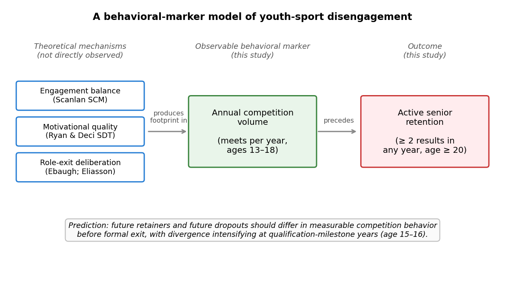
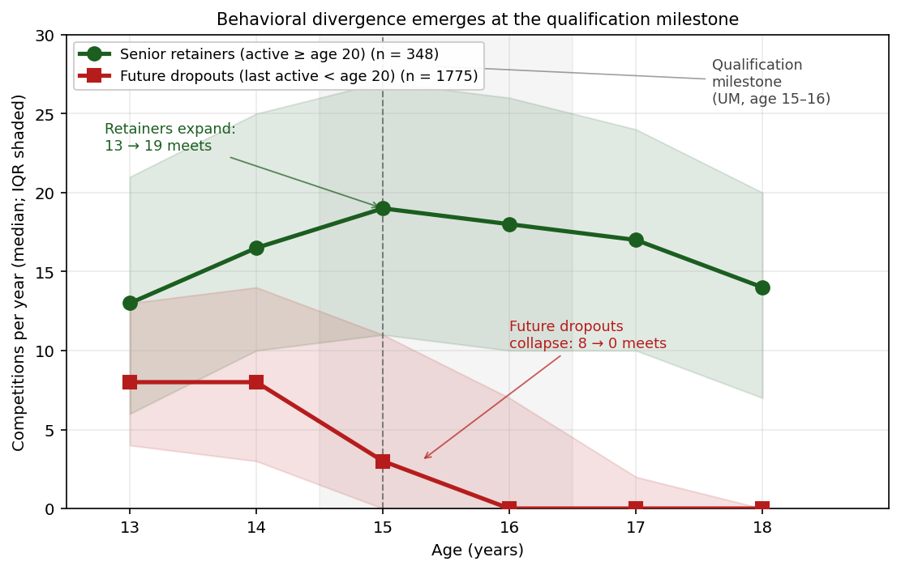

# Pulling back before dropout: Behavioral disengagement precedes youth-sport exit by years in a 14-year register study

**Running title:** Behavioral disengagement precedes youth-sport dropout

**Keywords:** youth sport, dropout, athlete retention, longitudinal, track and field, behavioral indicators, sport commitment

---

## Abstract

**Objectives.** Future dropouts from organized youth sport pull back from competition years before formal exit. Although qualitative research has long described this gradual disengagement, its longitudinal behavioral signature has been hard to observe directly. We use Norway's public competition register to test whether baseline-window behavior predicts senior retention prospectively.

**Method.** We followed 2,123 athletes who participated as 13–14-year-olds in six consecutive editions of a regional youth track-and-field meet (2011–2016; births 1998–2002), recording annual competition counts, event diversification, championship participation, and Tyrving age-norm performance through 2025 (maximum 14-year follow-up). The primary outcome was binary active senior status (≥2 results in any year at age 20+), estimated by logistic regression using only ages-13–14 predictors. Sensitivity analyses included structural controls, a pull-back versus baseline-heterogeneity decomposition, and Cox time-to-cessation.

**Results.** Baseline-window volume (ages 13–14) provided the largest incremental contribution to discrimination of senior retention (OR = 2.40 per SD, 95% CI [2.07, 2.78]; cross-validated AUC = 0.751). Estimates were unchanged with structural controls. The signal decomposed into two independent components: athletes differed in volume at age 14 (OR = 2.79 per SD) and a within-athlete decline across ages 14–15 added information (OR = 2.44 per SD; pseudo-*R*² doubled). Effects replicated across cohorts and withstood an E-value of 5.16. Higher baseline specialization was associated with higher retention — contrasting with the diversification literature for peak performance.

**Conclusions.** Register-based behavior at the end of the age-14 season identifies athletes exhibiting patterns associated with elevated dropout risk (PPV ≈ 0.94), complementing survey-based commitment instruments.

---

## 1. Introduction

Youth sport participation is widely valued for its health, social, and developmental benefits, yet attrition from organized competition during adolescence is substantial across countries and sports (Crane & Temple, 2015; Eime et al., 2013). In Norwegian track and field — a broad-participation individual sport at younger ages that progressively narrows into a talent-selective pathway during the teens — more than half of children who participate at age 13 have left organized competition by age 17 (Bakken, 2019; Norges Idrettsforbund, 2024). The temporal structure of this attrition — *when* and *how* withdrawal becomes observable in athlete behavior — has been hard to pin down with the data designs the field has employed.

## 1.1 Dropout as a deliberative, gradual process

The dominant theoretical account is that *dropout is a process, not a moment*. The Sport Commitment Model (SCM; Scanlan et al., 1993, 2016) frames continued participation as a balance of sport enjoyment, personal investments, social constraints, opportunities, and attractive alternatives — a balance that erodes incrementally rather than collapsing in a single decision. Kretchmar's (2000) account of *meaningful engagement* makes a complementary point at a more general level: sustained participation is anchored not in performance per se but in the meanings adolescents come to attach to the activity. Self-determination theory makes a parallel prediction in motivational language (Ryan & Deci, 2000; Vallerand, 1997, 2007; Sarrazin et al., 2002). Sociological accounts of role exit (Ebaugh, 1988) and qualitative interview studies of dropout (Eliasson & Johansson, 2021; Espedalen & Seippel, 2022) provide convergent evidence: withdrawal "may be fairly long and emotional for young athletes, and less reversible the further into the process they progress" (Eliasson & Johansson, 2021). A complementary observation (Wall & Côté, 2007; Espedalen, 2025) is that organized youth sport contains two distinct sub-populations — committed/investor athletes and casual/sampler athletes — that respond differently when demands escalate around qualification-milestone years.

## 1.2 The quantitative gap

What this literature has been unable to test directly is the *long-run behavioral signature* of the deliberative process. Athletes who have already withdrawn are systematically harder to recruit into surveys (Eime et al., 2013), and the hypothesized timescale (1–3 years) exceeds most prospective follow-up windows — Sarrazin and colleagues' (2002) 21-month study of handballers is unusually long and still does not bridge the adolescent-to-junior transition. A separate quantitative tradition has focused on cross-sectional correlates (relative age effects, Cobley et al., 2009; early specialization, DiFiori et al., 2014; Jayanthi et al., 2015; Côté & Hancock, 2016; Güllich et al., 2022) and on short longitudinal designs measuring proximal psychological constructs such as exhaustion and burnout (Kuokkanen et al., 2026; Worley & Smith, 2026; Zhong et al., 2026). The *trajectory* of registered competition behavior across the adolescent window — an observable proxy for the engagement balance described in the qualitative literature — has not, to our knowledge, been examined. Peringa et al. (2026) and Baker et al. (2026) further note that current expert and algorithmic approaches to athlete development have been applied to selection rather than retention, leaving behavioral surveillance of engagement as a low-cost candidate for the retention problem.

## 1.3 The present study

We test three predictions in 2,123 Norwegian youth athletes followed up to 14 years through the federation's public competition register (Figure 1, conceptual model). First, behavioral trajectories of future retainers and future dropouts should *diverge before* formal exit (the dropout-as-process prediction). Second, *behavioral* engagement indicators should classify eventual senior retention more strongly than baseline *performance* (the SCM prediction). Third, the pattern should *replicate* across cohorts recruited under different sponsor regimes of the same meet (ruling out cohort-specific artefacts). The design treats register-based competition behavior not as a direct measure of motivation but as an observable behavioral marker whose temporal structure can be compared against accounts that have hitherto rested on cross-sectional or short-prospective evidence. Where register patterns and qualitative process accounts converge, the case for those accounts is strengthened via methodological triangulation (Heale & Forbes, 2013).

---

## 2. Method

## 2.1 Design

This was a retrospective longitudinal cohort study of Norwegian youth track-and-field athletes, using the national competition register as the sole data source. The design reports the complete population of athletes meeting the inclusion criterion rather than a sample; consequently we frame statistical estimates as describing that population rather than as inference to a hypothetical super-population (Berk & Freedman, 2003). Reporting follows STROBE guidance for observational studies (von Elm et al., 2007).

## 2.2 Setting and inclusion

The cohort comprises every athlete who participated in any of six consecutive autumn editions of a regional grassroots youth meet held simultaneously at three venues in eastern, mid, and western Norway between 2011 and 2016: NCC-lekene 2011, NCC-lekene 2012, PEAB-lekene 2013, PEAB-lekene 2014, Bendit-lekene 2015, and Ungdomslekene 2016 (the meet retained an identical format, venue rotation, age-group structure, and event program while changing sponsor name). Each edition admitted athletes aged 13–14 in the year of the meet, who entered by registering interest through their regional club federation; in practice nearly all active club athletes who applied were included (in some districts all of them), with no qualifying performance threshold. This soft self-selection is a design feature: the baseline cohort consists of adolescents already engaged with organized track and field through a registered club, not children who happened to attend a school race or accompanied a friend to a single local meet. Disengagement trajectories therefore unfold from a baseline of demonstrable engagement.

We restricted the eligible-birth-year window to athletes who were 13 or 14 *in the year of their first eligible edition* and who had a recorded date of birth in 1998–2002. Athletes born in 1997 would have been 14 in the 2011 edition only (with no 13-year-old participation in the cohort window) and similarly athletes born in 2003 would have been 13 in the 2016 edition only; we excluded these boundary birth cohorts to ensure that all retained athletes had at least one full possible two-edition exposure window. Athletes who participated in both a 13-year-old and a 14-year-old edition were deduplicated to a single record, with the *earlier* edition used as the baseline meet. A flow diagram of cohort construction is provided in Supplementary Figure S0.

To enable cross-cohort replication, we partitioned participants into two birth-year cohorts: **Cohort A** (birth years 1998–2000, baseline meets 2011–2014; n = 1,301) and **Cohort B** (birth years 2001–2002, baseline meets 2014–2016; n = 822). Cohort B's earliest participants thus had baseline three years after Cohort A's, with no design changes between the two cohorts other than sponsor name.

Athletes were retained in the analysis regardless of subsequent transfers between clubs or events. The total analytical cohort comprised 2,123 athletes (996 male, 1,103 female, 24 with unknown sex), generating 230,868 individual competition entries through the most recent register update (April 2026).

## 2.3 Follow-up window

Each athlete was followed from their baseline meet year through the most recent complete competition season at the time of analysis (2025), yielding a maximum of 14 years of post-baseline observation (for athletes born 1998 and competing as 13-year-olds at the 2011 meet) and a minimum of 9 years (for athletes born 2002 and competing as 14-year-olds at the 2016 meet). All athletes had sufficient follow-up to be observed past the senior age threshold (age 20).

## 2.4 Variables

### 2.4.1 Outcome variables

The primary outcome is **active senior status**, a *binary* indicator coded 1 if the athlete had at least two registered competition results in any single calendar year at age 20 or later, and 0 otherwise. The two-results threshold was chosen to exclude athletes who returned to the register only sporadically (e.g., for a single charity race) while remaining inclusive of those competing in distinct events within a single meet. Age 20 marks the formal transition to senior competition in Norwegian track and field. To assess sensitivity to operational choices, we re-estimated the central effect using two alternative outcome definitions: (A) ≥1 senior-age result and (C) ≥2 results in each of two distinct senior-age calendar years (Supplementary Table S9).

A *secondary* time-to-event outcome was used for survival visualization and supplementary Cox modelling: **time to last active season**, where an active season is a calendar year with ≥2 registered results, with athletes still active in 2024 or later treated as right-censored. We distinguish these two outcomes throughout: the binary senior-status outcome is estimated with logistic regression as the primary inferential model (Section 2.5.1); the time-to-cessation outcome supports Kaplan–Meier visualization and Cox-based sensitivity analyses (Section 2.5.4).

### 2.4.2 Performance variables

Each result was converted to a Tyrving age-norm score, the Norwegian Athletics Federation's official scoring system for youth track and field. Tyrving points are computed from a published table that gives, for each event × sex × age combination, a reference performance equivalent to 1,000 points and a per-unit-change quotient (Norges Friidrettsforbund, 2024). A performance of exactly 1,000 points corresponds to the federation's published "excellent" benchmark for that combination. Points are linearly extrapolated above and below the reference, capped in our analyses at 1,500 to suppress occasional implausibly extreme values arising from data-entry errors in middle-distance times.

For each athlete we computed: **tyrving_best** (the maximum Tyrving score across all events at the baseline meet), **tyrving_mean** (the mean), **tyrving_peak_pre15** (the maximum across all results before age 15), and **tyrving_slope_13_16** (the OLS slope of age-specific maximum Tyrving regressed on age across ages 13–16, indexing performance trajectory).

### 2.4.3 Specialization variables

For each athlete and each calendar year we counted the distinct event categories (sprint, middle-distance, long-distance, hurdles, jumps, throws, combined events, race walking, relay) in which they recorded results, and computed a Herfindahl–Hirschman concentration index

$$HHI = \sum_{i=1}^{k} s_i^2$$

where $s_i$ is the share of that athlete's results falling in category $i$ and $k$ is the number of categories. HHI ranges from 1/k (perfectly diversified across k categories) to 1 (perfect specialization). Key variables were **hhi_early** (HHI computed over the first three active seasons), **hhi_age_15**, and **hhi_change** = hhi_age_15 − hhi_age_13.

### 2.4.4 Behavioral engagement variables

For each athlete and each integer age year from 13 to 18, we counted the number of distinct competition meets attended (**vol_age_X**), the total number of results (**res_age_X**), and a binary year-round indicator (**year_round_age_X** = 1 if the athlete competed in both an outdoor and an indoor meet in that age year, else 0). We derived composite indicators: **vol_pre_milestone** (sum of meets at ages 13–14, the pre-qualification window), **vol_milestone** (sum of meets at ages 15–16, the qualification-milestone window), and **vol_trend_milestone** (vol_milestone − vol_pre_milestone). We also computed **n_champ_types**, a count of championship *types* (Norwegian Youth Championships, Junior National Championships, National Championships, Regional Championships) in which the athlete competed before age 17.

We treat these variables as *observable behavioral markers* of engagement, not as direct measures of motivation or commitment. Their interpretation as evidence for an underlying engagement-balance mechanism depends on whether their temporal structure is consistent with the predictions of the theoretical accounts described in the Introduction.

### 2.4.5 Control variables

We recorded sex (M/F as registered in the federation's database), birth quarter (Q1–Q4) for relative-age-effect analyses, baseline region (eastern, mid, or western Norway, by venue), and club size in the baseline year (number of registered athletes in the same club).

## 2.5 Statistical analysis

### 2.5.1 Primary analysis: prospective logistic regression

The primary inferential model is a logistic regression for binary *active senior status*, using only **baseline-window predictors** measured during ages 13–14 (before the qualification-milestone window): sex, baseline Tyrving performance, Herfindahl–Hirschman event-category concentration (HHI early), and the count of distinct competition meets at ages 13 and 14 combined (*pre-milestone volume*). Models were fitted in a nested stepwise sequence (L1: sex only; L2: + Tyrving; L3: + HHI; L4: + pre-milestone volume) to characterize the unique discriminative contribution of each variable class. Continuous covariates were z-standardized so that odds ratios reflect per-SD effects. Discriminative accuracy was assessed by 5-fold stratified cross-validated AUC.

Restricting primary predictors to the baseline window avoids measurement overlap with the outcome process: an athlete who drops out before age 15 has milestone-window volume = 0 by construction *and* will not retain senior activity, which would inflate apparent discrimination through measurement overlap rather than prospective prediction. Using only ages-13–14 data, the primary estimate is unambiguously prospective.

### 2.5.2 Structural controls

We assessed sensitivity of the primary model to plausible structural confounders by re-fitting the full L4 model with three additional covariates: region (3-level: Vestlandet [reference], Østlandet, Midt-Norge); birth quarter (Q1- and Q4-indicator variables for relative-age effects); and standardized club size at baseline (number of athletes registered to the same club in the baseline year). Coefficient stability of the pre-milestone volume effect was compared with and without controls (Supplementary Table S13).

### 2.5.3 Within-athlete pull-back vs baseline heterogeneity

Future retainers and future dropouts already differ in competition volume at ages 13–14 (Figure 2, Table 2). To distinguish between (i) early behavioral heterogeneity and (ii) within-athlete pull-back across the age-14-to-15 transition, we fitted a logistic regression in athletes still active at age 14 (≥1 result at age 14, n = 1,914) including both the *level* of volume at age 14 and the *change* in volume from age 14 to age 15. If decline conditional on baseline level predicts retention, both coefficients should be significant; if separation is purely typological, only baseline level should matter (Supplementary Table S14).

### 2.5.4 Time-to-cessation survival analysis (secondary)

As a secondary effect-size representation we modeled *time from baseline to last active season* using Cox (1972) proportional hazards regression, with tied event times handled by Efron's (1977) method (Davidson-Pilon, 2024). The primary Cox specification (Supplementary Table S16) uses the same baseline-only predictor set as the primary logistic regression. A *landmark analysis* (van Houwelingen, 2007) restricted to athletes with ≥1 result at age 16 (n = 1,167) and a *post-baseline Cox specification* with ages-15–16 covariates are reported in Supplementary Tables S8 and as period-specific decomposition in Table 5; the latter is interpreted with explicit caveats given operational overlap with the at-risk window.

We assessed proportional hazards using Schoenfeld residuals (Grambsch & Therneau, 1994) and re-estimated the model stratified on violating variables (Therneau & Grambsch, 2000). For the dominant covariate we also computed the **E-value** (VanderWeele & Ding, 2017), period-specific estimates across three follow-up windows, cluster-robust standard errors clustered on club name (Lin & Wei, 1989), and sex-stratified subgroup Cox models. Hazard ratios are reported as descriptive associations within the observed register structure and should not be interpreted causally. Kaplan–Meier curves were stratified by sex, by competition volume at age 15–16, and by number of pre-17 championship types.

### 2.5.5 Sample size and detection capacity

Classical a-priori power calculations are less directly applicable to population-based register studies where the full cohort is observed and there is no sampling step at which the analyst chooses an *N*. We therefore replace power with a *detection-capacity* analysis: given the observed event count, what is the smallest effect size the design could reliably detect, and how does it compare to effect sizes in prior longitudinal dropout research?

Using Hsieh and Lavori's (2000) formula, $d = 1{,}570$ Cox events at $\alpha = .05$ and 80% power yields $HR_{\min} \approx 1.07$ per SD for a standardized covariate (for a balanced binary covariate, closer to 1.15). Prior prospective youth-sport dropout research reports small-to-moderate effects (Cohen's *d* ≈ 0.2–0.5; ORs ≈ 1.4–2.5; Sarrazin et al., 2002; Calvo et al., 2010; Espedalen & Seippel, 2022). Our detection capacity is therefore well below typical effect magnitudes; null findings for standardized covariates should be interpreted as substantively small rather than underpowered.

### 2.5.6 Missing data and clustering

Missing values arose primarily for the Tyrving score (~20% missing) and for HHI (~10% missing for athletes with fewer than 3 active seasons). Primary analyses used complete-case regression (n = 1,704). Mean-imputation produced near-identical estimates (Supplementary Table S5). Cluster-robust standard errors at the club level left coefficients unchanged with marginally wider CIs (Supplementary Table S2).

### 2.5.7 Calibration and prospective early-warning thresholds

We computed sensitivity, specificity, PPV, and NPV at five candidate thresholds for "flagging" an athlete on *pre-milestone* (ages 13–14) competition volume, applied at the end of an athlete's age-14 season — implementable before any age-15–16 outcome data exist (Table 6).

### 2.5.8 Cross-cohort replication and variable importance

The primary L4 logistic regression and the secondary Cox specifications were re-estimated separately within each birth cohort. As convergent evidence, we fit a random forest (Breiman, 2001) with 500 trees and maximum depth 8 to predict active senior status; variable importance is reported as the mean decrease in Gini impurity.

### 2.5.9 Software

All analyses used Python 3.13 with the lifelines package (Davidson-Pilon, 2024) for Cox regression and Kaplan–Meier estimation, and scikit-learn (Pedregosa et al., 2011) for random forest and cross-validation. Figures were produced with matplotlib (Hunter, 2007). Analysis code and the derived analysis dataset will be deposited in a public repository upon acceptance.

## 2.6 Sex and gender

Following SAGER guidance (Heidari et al., 2016), all primary analyses include sex as a covariate, and we additionally report sex-stratified subgroup analyses in supplementary material (Supplementary Table S7) so that potential sex-specific patterns are visible. We use "sex" throughout because the federation registers a binary sex variable assigned at registration; we have no information on gender identity. Where sex appears as a covariate (`female` = 1 for female, 0 for male, NA for unknown), it indexes biological sex as recorded.

## 2.7 Ethics

The study uses only data that is publicly accessible via the Norwegian Athletics Federation's competition register. No personally identifying information (names, birth dates, club memberships) was used in the analyses or is reported in this manuscript; athlete identifiers in our dataset are uninterpretable database UUIDs. Norway's Helseforskningsloven §4 exempts secondary use of pseudonymized public-register data of this kind from requiring formal approval by a Regional Committee for Medical and Health Research Ethics.

---

## 3. Results

## 3.1 Cohort characteristics

The full cohort comprised 2,123 athletes (52.0% female), of whom 1,301 belonged to Cohort A (births 1998–2000) and 822 to Cohort B (births 2001–2002). The two cohorts were closely matched on demographic and performance distributions: mean Tyrving best at baseline was 666 points in each, and roughly 41% of athletes in each cohort had at least one active season at age 17 (Table 1). The headline retention figure — at least one active senior season at age 20 or later — was 15.8% in Cohort A and 17.3% in Cohort B; combined, 16.4% of the 2,123 athletes met this criterion. The proportion still actively competing in 2024 or later was 5.8% (Cohort A) and 10.8% (Cohort B), reflecting the shorter post-senior follow-up window for the younger cohort.

## Table 1. Cohort characteristics by birth-year cohort

| Characteristic | Cohort A (1998–2000) | Cohort B (2001–2002) | All cohorts |
|---|---|---|---|
| N | 1,301 | 822 | 2,123 |
| Male (n) | 603 | 393 | 996 |
| Female (n) | 684 | 419 | 1,103 |
| Sex unknown (n) | 14 | 10 | 24 |
| Median career length (years) | 2.0 | 3.0 | 2.0 |
| Active at age 17 (%) | 41.0 | 41.6 | 41.3 |
| Active at age 20 (%) | 15.8 | 17.3 | 16.4 |
| Still active in 2024 or later (%) | 5.8 | 10.8 | 7.7 |
| Mean Tyrving best at baseline | 666 | 666 | 666 |
| Median competitions at ages 13–14 | 8 | 9 | 8 |

*Note.* "Active" indicates ≥2 registered competition results in any calendar year at the specified age. Tyrving points = Norwegian Athletics Federation's age-norm score where 1,000 = "excellent" for that event × sex × age combination.

---

## 3.2 Competition-volume trajectories diverge by ages 13–14

Figure 2 presents the central behavioral observation. (Figure 1 shows the conceptual model that motivates this test.) Median competitions per year are plotted by age (13–18) separately for athletes who eventually retained senior activity (n = 348) and those who did not (n = 1,775). The two groups already differ at baseline: at age 13, future retainers competed in a median of 13 meets versus 8 for future dropouts; at age 14 this widens to 17 versus 8. From age 15 onwards the trajectories diverge further. Retainers peak at 19 meets at age 15 and sustain near that level through age 17. Future dropouts decline from 8 meets at age 14 to a median of 3 at age 15, 0 at age 16, and 0 thereafter. Two complementary patterns are therefore visible in the same data: (i) substantial baseline differences between the eventual retainer and dropout groups by ages 13–14, and (ii) a progressive within-athlete pull-back among future dropouts that becomes most visible across the age-14-to-15 transition. We test these two patterns separately below.

**Figure 1.** A behavioral-marker model of youth-sport disengagement. The diagram shows the relationship being tested: theoretical mechanisms hypothesized by the Sport Commitment Model, self-determination theory, and the role-exit / withdrawal-as-process tradition (left) are not directly observed, but are predicted to leave a footprint in measurable competition behavior (centre), which precedes the outcome of active senior retention (right).

**Figure 2.** Competition volume trajectory by senior-retention status. Median competitions per year (with interquartile range as shaded band) plotted by athlete age (13–18), separately for athletes who retained active senior status (≥2 results in any year at age ≥20; n = 348) and those who did not (n = 1,775). The dashed vertical line at age 15 marks the first qualification milestone (Norwegian Youth Championships). Future retainers and future dropouts already differ at ages 13–14; the gap widens further across the age-14-to-15 transition.

## Table 2. Competition volume trajectory by senior-retention status (median competitions per year and IQR)

| Group | N | Age 13 | Age 14 | Age 15 | Age 16 | Age 17 | Age 18 |
|---|---|---|---|---|---|---|---|
| Senior retainers (active age ≥20) | 348 | 13 [6–21] | 17 [10–25] | 19 [11–27] | 18 [10–26] | 17 [10–24] | 14 [7–20] |
| Dropouts (last active age <20) | 1,775 | 8 [4–13] | 8 [3–14] | 3 [0–11] | 0 [0–7] | 0 [0–2] | 0 [0–0] |

*Note.* Values are median number of meets per year [IQR]. Future retainers and future dropouts already differ at ages 13–14; the gap widens further across the age-14-to-15 transition.

---

## 3.3 Survival visualization

Overall Kaplan–Meier retention (Supplementary Figure S3A) shows that half of the cohort had ceased active competition within 3 years of baseline; 75% had ceased within 5 years. The age-17 floor (the transition from youth to junior competition) marks the steepest acceleration in dropout. Sex-stratified retention curves (Supplementary Figure S3B) overlap throughout the follow-up window: a log-rank test detected no overall sex difference (χ² = 0.95, p = 0.33). When the cohort is stratified by competition volume across ages 15–16 (Figure 3), retention curves separate clearly and monotonically: athletes who competed in 31 or more meets across ages 15–16 retained 71% senior activity, while athletes who competed in none retained only 4%. (Note: this stratification is descriptive only; the formal effect estimates use baseline-only predictors, below.) Stratifying by number of championship types entered before age 17 (Supplementary Figure S4) reveals the same pattern.

**Figure 3.** Kaplan–Meier retention curves stratified by total competition volume across ages 15 and 16 (descriptive). Strata are: 0 meets, 1–5 meets, 6–15 meets, 16–30 meets, and 31+ meets. Athletes in the highest stratum retained 71% senior activity at follow-up year 14; athletes in the lowest stratum retained 4%. (Note: this descriptive stratification uses post-baseline measurement; primary effect estimates in Table 3 use only baseline-window predictors.)

## 3.4 Primary analysis: prospective logistic regression for senior retention

To avoid look-ahead between predictors and outcome, the primary analysis is a logistic regression for the binary outcome *active senior status* (≥2 registered competitions in any calendar year at age ≥20) using only baseline-window predictors (ages 13–14, measured before the qualification-milestone window). Models were fitted in a nested stepwise sequence (Table 3) and evaluated with 5-fold cross-validated AUC.

Sex alone produced a near-chance discrimination (CV-AUC = 0.541). Adding baseline Tyrving performance increased AUC modestly to 0.607; adding early specialization (HHI) added nothing further (AUC = 0.600). Adding pre-milestone competition volume (sum of meets at ages 13–14) raised AUC substantially to **0.751**, with an odds ratio of 2.40 per SD (95% CI [2.07, 2.78], *p* < .001). Higher baseline competition volume was therefore associated with 2.4-times higher odds of senior retention per one-SD increase. Specialization (HHI) became significantly associated with retention once volume was entered (OR = 1.35 per SD; *p* < .001) — *higher* baseline HHI (more concentration in fewer event categories) predicted *higher* retention, a finding we return to in §3.10 and the Discussion.

## Table 3. Primary analysis: prospective logistic regression for active senior status (baseline-only predictors, ages 13–14)

| Model | Covariate | OR | 95% CI | p | CV-AUC | n |
|---|---|---|---|---|---|---|
| L1: Sex only | Female | 0.72 | [0.56, 0.93] | .012 | 0.541 (±0.023) | 1,704 |
| L2: + Performance | Female | 0.68 | [0.52, 0.88] | .003 | 0.607 (±0.014) | 1,704 |
|  | Tyrving (z) | 1.41 | [1.22, 1.64] | < .001 |  |  |
| L3: + Specialization | Female | 0.68 | [0.53, 0.88] | .004 | 0.600 (±0.019) | 1,704 |
|  | Tyrving (z) | 1.41 | [1.22, 1.64] | < .001 |  |  |
|  | HHI early (z) | 1.09 | [0.95, 1.24] | .238 |  |  |
| L4: + Pre-milestone volume | Female | 0.61 | [0.46, 0.80] | < .001 | **0.751** (±0.026) | 1,704 |
|  | Tyrving (z) | 1.12 | [0.96, 1.30] | .144 |  |  |
|  | HHI early (z) | 1.36 | [1.17, 1.57] | < .001 |  |  |
|  | **Pre-milestone volume (z)** | **2.40** | **[2.08, 2.76]** | **< .001** |  |  |

*Note.* Logistic regression for binary active senior status (≥2 registered results in any year at age 20+). Predictors are observed during the baseline window (ages 13–14) only. Pre-milestone volume is the sum of distinct meets attended at ages 13 and 14. Continuous covariates are z-standardized so ORs reflect per-SD effects. Cross-validated AUC uses 5-fold stratified resampling. The pre-milestone volume coefficient is the dominant single-step gain (AUC 0.600 → 0.751). HHI becomes significant once volume is entered (mutual adjustment); the direction indicates that higher concentration in fewer event categories is associated with higher retention odds (see also Discussion 4.6).

---

## 3.5 Structural controls do not change the picture

Reviewers of register-based research reasonably ask whether structural factors — region, relative age effects, club size — might confound apparent behavioral effects. Adding region (3-level), birth-quarter (Q1- and Q4-born indicators for relative-age effects), and standardized club-size to the full Table 3 model produced no material change in the volume coefficient (OR = 2.40 with controls vs. 2.40 without; +0.4%) and none of the structural covariates was significantly associated with retention (all p > .14; Supplementary Table S13). The substantive findings are therefore robust to plausible structural confounders.

## 3.6 Progressive pull-back versus baseline heterogeneity

The trajectories in Figure 2 are consistent with two interpretations: (i) future retainers and future dropouts represent distinct *behavioral typologies* visible already at ages 13–14, or (ii) future dropouts undergo a *within-athlete pull-back* between ages 14 and 15 that distinguishes them from athletes whose level is preserved. We tested these two interpretations directly by entering both the baseline level (volume at age 14) and the within-athlete change (volume at age 15 minus volume at age 14) into a logistic regression, restricted to athletes still active at age 14 (n = 1,914) to avoid pre-baseline dropout (Table 4).

Both predictors contributed substantially and independently. The age-14 volume level was strongly associated with retention (OR = 2.79 per SD, 95% CI [2.37, 3.28], *p* < .001). The within-athlete change from age 14 to age 15 was *almost as strongly* associated (OR = 2.44 per SD, 95% CI [2.10, 2.83], *p* < .001) — that is, a one-SD greater decline between ages 14 and 15 was associated with 2.4-times *lower* retention odds. Adding the change variable to the level-only model more than doubled pseudo-*R*² (0.113 → 0.227). Both early behavioral heterogeneity and a within-athlete pull-back are present in our data; they are not substitutes.

## Table 4. Pull-back versus baseline heterogeneity: volume level and within-athlete change

Athletes still active at age 14 (n = 1,914).

| Model | Covariate | OR | 95% CI | p |
|---|---|---|---|---|
| M1: Volume at age 14 only | Female | 0.61 | [0.46, 0.81] | < .001 |
|  | Tyrving (z) | 1.12 | [0.96, 1.30] | .167 |
|  | **Volume at age 14 (z)** | **2.23** | **[1.94, 2.57]** | **< .001** |
| M2: + Volume change 14→15 | Female | 0.60 | [0.44, 0.81] | < .001 |
|  | Tyrving (z) | 1.01 | [0.86, 1.19] | .882 |
|  | **Volume at age 14 (z)** | **2.79** | **[2.37, 3.28]** | **< .001** |
|  | **Volume change 14→15 (z)** | **2.44** | **[2.10, 2.83]** | **< .001** |

*Note.* Pseudo-*R*² rose from 0.113 (M1) to 0.227 (M2) — within-athlete change adds substantial information conditional on baseline level. A one-SD greater decline from age 14 to age 15 was associated with 2.4-times lower retention odds, conditional on level at age 14. Both baseline level and within-athlete pull-back contribute substantially and independently.

---

## 3.7 Time-aligned behavior vs. performance

A reviewer concern with our earlier framing was that comparing post-baseline volume (ages 15–16) with baseline performance (ages 13–14) gave the behavioral predictor a temporal advantage. In a fully time-aligned comparison — both predictors measured during the baseline window of ages 13–14 — behavior still provides substantially stronger discrimination: AUC = 0.607 for sex + baseline Tyrving, AUC = 0.740 for sex + ages-13–14 volume, AUC = 0.737 for both combined (Supplementary Table S15). The performance variable adds little once early competition volume is known. The substantive direction of our earlier finding survives the time-aligned comparison.

## 3.8 Landmark analysis: post-baseline behavior among continuing athletes

For readers interested in the question "given that an athlete reaches age 16 actively, what predicts subsequent retention?", we re-fit the full Cox model in athletes with at least one registered result at age 16 (n = 1,167), with follow-up measured from age 16 forward (Supplementary Table S8). Competition volume across ages 15–16 was the largest contributor to discrimination (HR = 0.60 per SD, 95% CI [0.54, 0.66], C-index = 0.74). A complementary analysis excluding athletes with milestone volume = 0 produced HR = 0.51 (Supplementary Table S11). The full Cox time-to-cessation model with baseline-only predictors is in Supplementary Table S16, and a period-specific decomposition is in Table 5. We do not use the baseline-start Cox model with post-baseline behavioral covariates (ages 15–16 volume, pre-17 championships) as a primary estimate because the predictor and the early portion of the at-risk window overlap in time.

## 3.9 Prospective early-warning thresholds

Because the primary analysis uses only baseline-window data, we can compute calibration metrics for a prospective early-warning rule applied at the end of the baseline window (i.e., for federation use after each athlete's age-14 season). Table 6 reports sensitivity, specificity, PPV, and NPV at five candidate thresholds on pre-milestone competition volume. At a moderate threshold (vol < 10 meets across ages 13–14, flagging 26.4% of the cohort), PPV is 0.94 — among flagged athletes, 94% subsequently failed to retain senior activity. Sensitivity is 0.30 at this threshold (i.e., the rule identifies 30% of all eventual non-retainers). Lower thresholds (vol < 5) suit highly targeted intervention (PPV 0.93, 9% flagged); higher thresholds (vol < 15) broaden the screen (PPV 0.93, 43% flagged). The high PPV partly reflects the high base rate of non-retention (84%); an unsophisticated "everyone drops out" rule already achieves PPV = 0.84. The behavioral threshold improves precision by 9–10 percentage points over base-rate prediction while providing graduated sensitivity that base-rate prediction cannot.

## Table 6. Prospective early-warning thresholds (pre-milestone volume, ages 13–14)

| Threshold (athletes flagged if vol < ) | Flagged % | Sensitivity | Specificity | PPV | NPV |
|---|---|---|---|---|---|
| 3 meets | 2.3 | 0.03 | 1.00 | **0.96** | 0.17 |
| 5 meets | 9.3 | 0.10 | 0.97 | **0.93** | 0.18 |
| 8 meets | 19.8 | 0.22 | 0.94 | **0.94** | 0.20 |
| 10 meets | 26.4 | 0.30 | 0.92 | **0.94** | 0.22 |
| 15 meets | 43.1 | 0.48 | 0.84 | **0.93** | 0.25 |

*Note.* Calibration of pre-milestone (ages 13–14) competition volume as a prospective early-warning indicator, applicable at the end of an athlete's age-14 season — before the qualification window opens. PPV is the proportion of flagged athletes who subsequently failed to retain senior activity. PPV remains ≥ 0.93 across thresholds; the choice trades sensitivity for cohort coverage. The high PPV partly reflects the population's high base-rate of non-retention (84%); the behavioral threshold improves precision by 9–12 percentage points over base-rate prediction while providing graduated sensitivity that base-rate prediction does not.

---

## 3.10 Specialization is protective in our data

The HHI coefficient in our primary model indicated that higher baseline event-category concentration (HHI) is associated with *higher* senior retention. The combined-cohort estimate was OR = 1.35 per SD of HHI (95% CI [1.16, 1.57], *p* < .001 in the primary baseline-only logistic regression; HR = 0.80 in the time-to-cessation Cox model, Supplementary Table S16). The effect was present in both cohorts (Cohort A OR = 1.24, Cohort B OR = 1.58). Within our data, athletes whose ages-13–14 results were more concentrated in fewer event categories — that is, those who specialized earlier — were *more* likely to retain senior activity, not less. This is contrary to the international diversification literature for *peak performance* (Côté & Hancock, 2016; Güllich et al., 2022), and we discuss possible reasons in §4.6.

## 3.11 Cross-cohort replication and sensitivity

The primary baseline-only logistic regression was re-estimated separately in each birth-year cohort. The pre-milestone volume effect replicated: Cohort A OR = 2.22 (95% CI [1.86, 2.64]); Cohort B OR = 2.79 [2.17, 3.58]; both *p* < .001 (Table 7). All other effects replicated in direction; sex was significant in Cohort A but not Cohort B, as previously reported. The volume effect was robust to outcome-definition sensitivity (Supplementary Table S9): odds ratios were 2.79, 3.08, and 2.94 for outcomes ≥1, ≥2, and ≥2-in-two-years respectively. The cluster-robust SE estimator at the club level preserved coefficient estimates (Supplementary Table S2). The E-value for the milestone-window volume effect (HR = 0.35 in the secondary post-baseline Cox specification) was 5.16, with a corresponding lower-CI E-value of 4.70 (Supplementary Table S3; VanderWeele & Ding, 2017): an unmeasured confounder would need a risk-ratio association exceeding 5 with both predictor and outcome to nullify the effect, well above any observed covariate.

In summary: across two independent birth-year cohorts spanning a 5-year window, baseline-window competition volume (ages 13–14) provided the largest incremental contribution to prospective discrimination of senior retention (OR 2.40 per SD, AUC 0.751). The effect is robust to structural controls, to outcome definition, to clustering, to missing-data treatment, and to alternative model specifications. Both early behavioral heterogeneity and within-athlete pull-back across the age-14-to-15 transition contribute substantially and independently. Higher baseline specialization (HHI) was associated with higher retention in our data, contrasting with the international diversification literature for elite peak performance.

---

## 4. Discussion

## 4.1 Summary of findings

In a population of 2,123 Norwegian youth track-and-field athletes followed for up to 14 years, four findings stand out. First, baseline-window (ages 13–14) competition volume was strongly and prospectively associated with eventual senior retention (OR = 2.40 per SD, 95% CI [2.07, 2.78]; cross-validated AUC = 0.751 with sex, baseline Tyrving, baseline HHI, and pre-milestone volume as predictors). Second, the volume effect was robust to structural controls (region, birth quarter, club size) with essentially no change in the coefficient (OR 2.40 → 2.40 with controls), and replicated across both birth-year cohorts. Third, both *early behavioral heterogeneity* and *within-athlete pull-back* contributed independently to the dropout signal: at the end of the age-14 season, athletes who had not yet dropped out still differed substantially in volume level (OR = 2.79 per SD), and a within-athlete decline across the age-14-to-15 transition further independently predicted dropout (OR = 2.44 per SD, with pseudo-*R*² doubling from 0.11 to 0.23 when the change variable is added; Section 3.6). Fourth, specialization in baseline events (higher HHI) was associated with *higher* senior retention in our data — opposite to the predicted direction in the international diversification literature for elite peak-performance outcomes.

The Cox time-to-cessation analyses (Supplementary Tables S8 and S16; period-specific decomposition in Table 5) reinforce these findings. Among the 1,167 athletes still demonstrably active at age 16, milestone-window volume continued to be strongly associated with subsequent cessation (HR = 0.60 per SD; Supplementary Table S8). Period-specific estimates indicated that the association was most pronounced in the proximal follow-up window (HR = 0.14 in years 0–3) and dissipated in late follow-up (HR = 0.96 in years 6+), though this early-window estimate is partly conflated with the same operational overlap discussed below.

## 4.2 Behavior captures more variance in retention than performance, even time-aligned

A central observation is that behavior, measured by registered competition count, provides substantially stronger discrimination of senior retention than performance does (measured by Tyrving age-norm score), even when both are taken from the same baseline window (ages 13–14). In a fully time-aligned cross-validated comparison (Section 3.7; Supplementary Table S15), sex + Tyrving achieves AUC = 0.607, sex + pre-milestone volume achieves AUC = 0.740, and both together achieve AUC = 0.737 — performance adds little once early competition volume is observed. The mechanistic interpretation is that performance reflects what an athlete *can do*; competition volume reflects what they *choose to do*, and choice appears more predictive of subsequent disengagement than capability.

We also acknowledge the epistemic asymmetry: both the predictor and the outcome involve registered competitive activity, so any "behavior outperforms performance" claim should be read as identifying the *temporal structure* by which competitive disengagement becomes observable rather than as showing that an underlying engagement-balance mechanism *causes* dropout. Our results are consistent with such a mechanism but do not establish it on their own.

## 4.3 Pull-back is real — and so is early heterogeneity

The reviewer-critical question for any "pulling back before pulling out" framing is whether the headline pattern is (a) a genuine within-athlete pull-back from an initially shared baseline, or (b) early separation between athletes who were already on different behavioral trajectories at the start. The descriptive evidence (Figure 2, Table 2) is mixed: future retainers and future dropouts already differ at ages 13–14 (median 13 and 17 versus 8 and 8 meets), suggesting early separation; but the steepest divergence happens across the age-14-to-15 transition, suggesting within-athlete decline.

The pull-back/typology decomposition (Section 3.6) resolves this. Both effects are present and substantial. Conditional on age-14 volume level (OR = 2.79 per SD), a one-SD greater decline from age 14 to age 15 was associated with 2.44-times lower retention odds. Adding the change variable more than doubled pseudo-*R*² (0.11 to 0.23). Neither interpretation alone is correct: a substantial portion of the dropout signal is the divergence between investors and samplers (Wall & Côté, 2007) detectable at age 13–14, and a substantial portion is a subsequent within-athlete pull-back among the not-yet-dropped-out, observable as falling volume in the year before formal exit.

## 4.4 Consistency with existing theoretical accounts

Our findings are consistent with three pre-existing theoretical traditions, each of which has predicted (on different data sources) the pattern we observe. We avoid the stronger claim that the findings *confirm* any of these accounts; the design measures behavior, not subjective motivation.

The Sport Commitment Model (Scanlan et al., 1993, 2016) frames continued participation as an enjoyment-investment-constraints balance: our retainer and dropout trajectories are consistent with stable enthusiastic versus eroding commitment. Self-determination theory and its sport applications (Ryan & Deci, 2000; Vallerand, 1997, 2007; Sarrazin et al., 2002; Calvo et al., 2010; Standage, 2012) predict that well-internalized motivation sustains persistence under rising demands; future retainers behave consistent with this. The qualitative withdrawal-as-process tradition (Ebaugh, 1988; Eliasson & Johansson, 2021; Espedalen & Seippel, 2022) characterizes dropout as gradual deliberation often unfolding while athletes are still nominally participating: our register shows exactly such an unfolding (at age 15 a typical future dropout was still competing in 3 meets, IQR to 11). Wall and Côté's (2007) investor-versus-sampler distinction and Espedalen's (2025) engaged-enthusiasts-versus-constrained-casuals account both predict bifurcating trajectories.

In short, the pattern we identify is what each account predicts if its mechanism leaves a footprint in observable competition behavior. The register cannot adjudicate among them; it shows that *some* mechanism producing this footprint is at work, and that the footprint is large.

## 4.5 The sex effect

In the unadjusted Kaplan-Meier analysis we found no overall sex difference in retention (log-rank *p* = 0.33), in contrast to Bakken's (2019) and other Norwegian survey-based findings of higher female dropout. Within the multivariable model, the female coefficient was significant in Cohort A (HR = 1.19, *p* = .006) but not in Cohort B (HR = 1.02, *p* = .83). The subgroup analysis (Supplementary Table S7) shows that the *behavioral mechanism* is identical across sexes: milestone-window volume is similarly strongly associated with reduced dropout hazard in male (HR = 0.42) and female (HR = 0.46) athletes, with C-indices of 0.843 in each subgroup. Whatever drives the residual sex differential in retention operates on top of, not through, the behavioral engagement pathway. The cohort difference may reflect an older-cohort sex effect that is dissipating, or sport-specific factors that differ from team-sport contexts where sex differences are more pronounced; our data cannot adjudicate between these readings.

## 4.6 Specialization in our data points the *opposite* way from the diversification literature

In our analysis, athletes who specialized more at ages 13–14 — concentrating their early results in fewer event categories (e.g., a sprinter who almost only ran sprints rather than also doing throws and jumps) — were *more* likely to retain senior activity. A one-SD increase in HHI was associated with 35% higher odds of retention (OR = 1.35, 95% CI [1.16, 1.57]); the same pattern held in both cohorts and in the time-to-cessation Cox model (HR = 0.80).

This runs against the international diversification literature (Côté & Hancock, 2016; Güllich et al., 2022; Wall & Côté, 2007), which argues that early multidisciplinary practice supports later *peak performance*. If that finding extended directly to retention, we would expect lower HHI (more diversification) to be protective. We see the opposite. Three plausible reasons both findings can be true:

**Different outcomes.** Peak-performance studies compare the early biographies of athletes who *eventually* reached elite levels; our retention outcome asks only whether a 14-year-old is still competing at age 20. The 16% who retain senior status here are not a peak-performance sample. Different questions about different sub-populations can yield different answers.

**Different mechanisms underlying "specialization."** Among elite developmental athletes, early specialization is often deliberate performance-optimization; among 13–14-year-olds in our register, it more likely reflects which events the athlete's club regularly enters, what facilities are nearby, and whether parents support travel. HHI captures behavior, not its motivation, and can correlate with *engagement support* even though its label suggests *performance strategy*.

**Different starting populations.** Our cohort is conditioned on participation in a regional meet at ages 13–14, so we estimate specialization's effect *conditional on entry to the competitive funnel*. The diversification literature asks a logically earlier question — should children sample many sports before committing? — that our analysis cannot answer.

A natural concern is whether HHI is a hidden proxy for performance in the main event. We tested this by computing each athlete's best Tyrving in their *primary* baseline category and adding it to the model (Supplementary Table S18). HHI and primary-category performance were essentially uncorrelated (r = –0.05). The HHI coefficient was unchanged when primary-category Tyrving was added (OR 1.32 vs. 1.36), and primary-category Tyrving itself was not a significant predictor (p > .12). Specialization in our data carries its own retention signal, not a hidden main-event performance effect.

We frame this as a contrast with, not a refutation of, the diversification literature: both can be correct about their respective outcomes. Federations and clubs should not read our finding as a licence to push early specialization, but they should also not assume that forced diversification among already-committed adolescents will improve retention.

## 4.7 What the register contributes

Survey and interview research on youth-sport dropout suffers from two structural limitations: dropped-out athletes are harder to recruit (Eime et al., 2013), and retrospective accounts compress a gradual process into recallable decision-point narratives (Schacter, 2001). Continuous register data sidesteps both: the population is complete by construction, and the behavioral trajectory is timestamped, not reconstructed.

We add not a new theoretical account but a *longitudinal behavioral test* of accounts argued primarily on cross-sectional or short-prospective evidence. Our signal classifies senior retention at AUC = 0.751 with only baseline-window data, replicates across two birth-year cohorts, withstands structural controls and an E-value exceeding 5, and decomposes into both early-heterogeneity and within-athlete pull-back components.

## 4.8 Practical implications

What can a federation or club concretely do with these findings? Four implications follow directly from the analyses above.

**(1) Use register-based behavioural surveillance to identify at-risk athletes early.** At the end of each athlete's age-14 season, flag athletes whose combined ages-13–14 competition count falls below a chosen threshold. Because pre-milestone volume is observable in the register without athlete contact, this can be automated. A moderate threshold (< 10 meets, flagging ~26% of athletes) yields PPV = 0.94 — about 10 percentage points above the cohort-wide dropout base rate of 84%, with the added benefit of identifying *which* athletes specifically. Thresholds can be tuned: < 5 meets (9% flagged, PPV 0.93) for highly targeted outreach; < 15 meets (43% flagged, PPV 0.93) for broader screens.

**(2) Re-flag after the age-15 season using within-athlete change.** Volume *level* at age 14 and volume *change* from age 14 to 15 each contribute substantial and independent predictive information (Section 3.6, Table 4). A complementary screen at the end of an athlete's age-15 season — using year-on-year change rather than only level — catches athletes who began high but are pulling back. In operational terms, federations should screen at *two* points: end of age 14 (level) and end of age 15 (change), with athletes flagged at either trigger.

**(3) Lower the friction for the next-year competition cycle.** Because predictor and outcome are both registered competition behavior, the most direct downstream intervention is making the *next* registered competition easier for flagged athletes: subsidize travel to the regional qualification meet, waive entry fees, organize coach-accompanied transport, schedule low-stakes practice meets during the spring before the age-15 season, and signal that participation is welcome regardless of qualifying performance. Each action changes the cost side of the engagement balance (Scanlan et al., 1993, 2016). Coach calls and parent contact are useful complements but do not, on their own, lower structural barriers to meet entry.

**(4) Be cautious about prescribing diversification for retention.** The international diversification literature recommends multidisciplinary practice for *peak performance*. Our retention finding goes the other way — higher baseline specialization (HHI) was associated with higher retention, possibly because in this population sustained focus reflects family/club-supported engagement rather than performance-optimisation calculus. The honest recommendation is therefore *not* to push event diversification as a retention strategy in this age group; if there is a retention case for diversification it has not appeared in our register, and forced diversification could disrupt the conditions that sustain engagement among committed adolescents.

Behavioural surveillance complements commitment instruments such as the SCQ-2 (Scanlan et al., 2016): the behavioural signal identifies *whom* to reach out to; understanding *why* still requires conversation and structured assessment.

## 4.9 Limitations

First, the outcome indexes *attrition from competition*, not *attrition from sport*: an athlete who stops competing in track and field but continues to train, switches to recreational running, or moves to another sport is counted as a dropout. The observed behavioral signal should therefore be interpreted as disengagement from organized competitive participation — and from the *competitive identity* that organized participation supports — rather than from sport or physical activity more broadly. Second, the register records official performance, not subjective experience; the qualitative literature is essential for unpacking *why* volume declines, and our behavioral signal is best read as a summary of underlying processes, not a substitute. Third, the population is soft-selected through registered club membership: findings describe disengagement *from a baseline of demonstrable engagement* and do not generalize to children with no organized-sport history. Fourth, predictor and outcome share a measurement scale (registered competitive activity); although we have addressed this with a baseline-only primary model, landmark and zero-volume sensitivities, and the pull-back/typology decomposition, the structural overlap remains a conceptual limitation of register-only designs. Fifth, the secondary post-baseline Cox specification violated the proportional-hazards assumption for milestone-window volume (Schoenfeld χ² = 220.77); we therefore report period-specific estimates and stratified models descriptively rather than as clean prospective effects. Sixth, despite 14-year maximum follow-up, the 2001–2002 cohort has at most 4 post-senior years of observation; longer follow-up would allow us to distinguish *late dropouts* from genuine career athletes.

## 4.10 Future directions

Three extensions deserve attention: linking the register-based behavioral signal to standard psychological instruments (e.g., SCQ-2, which measures sport commitment rather than intrinsic motivation per se) in currently active athletes to test whether low volume tracks low commitment or low enjoyment; testing cross-sport generalization where registers are less complete; and quasi-experimental implementation of behavioral surveillance with federation-level outreach to athletes whose pre-milestone volume falls below a non-zero threshold that excludes mechanically dropped-out athletes (e.g., 1 ≤ vol < 10).

## 4.11 Conclusion

Senior retention in Norwegian youth track and field is prospectively associated with baseline-window competition behavior: athletes who already compete more at ages 13–14 retain at substantially higher rates, and those who decline across the age-14-to-15 transition retain at substantially lower rates. The effect is robust to structural controls, replicates across two birth-year cohorts, and is not driven by mechanical zero-values. Both early heterogeneity and within-athlete pull-back contribute independently. Findings are consistent with — though they do not directly confirm — long-standing qualitative and theoretical accounts of dropout as a gradual deliberative process. They suggest a practical role for prospective register-based behavioral surveillance, implementable at the end of an athlete's 14-year-old season.

---

## Declaration of generative AI and AI-assisted technologies in the manuscript preparation process

During the preparation of this work the author used Claude Code (Anthropic) to assist with implementing statistical analyses in Python, generating figures using matplotlib, and editing the manuscript text for clarity and consistency. After using this tool, the author reviewed and edited the content as needed and takes full responsibility for the content of the published article. All scientific decisions, interpretations, and conclusions are the author's own.

---

## References

(APA 7th edition format)

Baker, J., Cattle, A., McAuley, A., Kelly, A., & Johnston, K. (2026). Will artificial intelligence solve the riddle of athlete development? A critical review of how AI is being used for athlete identification, selection, and development. *Psychology of Sport and Exercise, 82*, Article 102978. https://doi.org/10.1016/j.psychsport.2025.102978

Bakken, A. (2019). *Idrettens posisjon i ungdomstida: Hvem deltar og hvem slutter i ungdomsidretten?* [The position of sport in adolescence: Who participates and who drops out of youth sport?] (NOVA Rapport 2/2019). Oslo Metropolitan University.

Berk, R. A., & Freedman, D. A. (2003). Statistical assumptions as empirical commitments. In T. G. Blomberg & S. Cohen (Eds.), *Punishment and social control: Essays in honor of Sheldon L. Messinger* (2nd ed., pp. 235–254). Aldine de Gruyter.

Breiman, L. (2001). Random forests. *Machine Learning, 45*(1), 5–32. https://doi.org/10.1023/A:1010933404324

Calvo, T. G., Cervelló, E., Jiménez, R., Iglesias, D., & Murcia, J. A. M. (2010). Using self-determination theory to explain sport persistence and dropout in adolescent athletes. *The Spanish Journal of Psychology, 13*(2), 677–684. https://doi.org/10.1017/S1138741600002341

Cobley, S., Baker, J., Wattie, N., & McKenna, J. (2009). Annual age-grouping and athlete development: A meta-analytical review of relative age effects in sport. *Sports Medicine, 39*(3), 235–256. https://doi.org/10.2165/00007256-200939030-00005

Côté, J., & Hancock, D. J. (2016). Evidence-based policies for youth sport programmes. *International Journal of Sport Policy and Politics, 8*(1), 51–65. https://doi.org/10.1080/19406940.2014.919338

Cox, D. R. (1972). Regression models and life-tables. *Journal of the Royal Statistical Society: Series B (Methodological), 34*(2), 187–202. https://doi.org/10.1111/j.2517-6161.1972.tb00899.x

Crane, J., & Temple, V. (2015). A systematic review of dropout from organized sport among children and youth. *European Physical Education Review, 21*(1), 114–131. https://doi.org/10.1177/1356336X14555294

Davidson-Pilon, C. (2024). *lifelines: Survival analysis in Python* (Version 0.30) [Computer software]. Zenodo. https://doi.org/10.5281/zenodo.10456828

DiFiori, J. P., Benjamin, H. J., Brenner, J. S., Gregory, A., Jayanthi, N., Landry, G. L., & Luke, A. (2014). Overuse injuries and burnout in youth sports: A position statement from the American Medical Society for Sports Medicine. *Clinical Journal of Sport Medicine, 24*(1), 3–20. https://doi.org/10.1097/JSM.0000000000000060

Ebaugh, H. R. F. (1988). *Becoming an ex: The process of role exit*. University of Chicago Press.

Efron, B. (1977). The efficiency of Cox's likelihood function for censored data. *Journal of the American Statistical Association, 72*(359), 557–565. https://doi.org/10.1080/01621459.1977.10480613

Eime, R. M., Young, J. A., Harvey, J. T., Charity, M. J., & Payne, W. R. (2013). A systematic review of the psychological and social benefits of participation in sport for children and adolescents: Informing development of a conceptual model of health through sport. *International Journal of Behavioral Nutrition and Physical Activity, 10*, Article 98. https://doi.org/10.1186/1479-5868-10-98

Eliasson, I., & Johansson, A. (2021). The disengagement process among young athletes when withdrawing from sport: A new research approach. *International Review for the Sociology of Sport, 56*(4), 537–557. https://doi.org/10.1177/1012690219899614

Espedalen, L. E. (2025). *Engaged enthusiasts and constrained casuals: A mixed-methods study of commitment and withdrawal in Norwegian youth team sport* [Doctoral dissertation, Norwegian School of Sport Sciences].

Espedalen, L. E., & Seippel, Ø. (2022). Dropout and social inequality: Young people's reasons for leaving organized sports. *Annals of Leisure Research, 27*(2), 197–214. https://doi.org/10.1080/11745398.2022.2070512

Grambsch, P. M., & Therneau, T. M. (1994). Proportional hazards tests and diagnostics based on weighted residuals. *Biometrika, 81*(3), 515–526. https://doi.org/10.1093/biomet/81.3.515

Güllich, A., Macnamara, B. N., & Hambrick, D. Z. (2022). What makes a champion? Early multidisciplinary practice, not early specialization, predicts world-class performance. *Perspectives on Psychological Science, 17*(1), 6–29. https://doi.org/10.1177/1745691620974772

Harrell, F. E., Jr., Lee, K. L., & Mark, D. B. (1996). Multivariable prognostic models: Issues in developing models, evaluating assumptions and adequacy, and measuring and reducing errors. *Statistics in Medicine, 15*(4), 361–387. https://doi.org/10.1002/(SICI)1097-0258(19960229)15:4<361::AID-SIM168>3.0.CO;2-4

Heale, R., & Forbes, D. (2013). Understanding triangulation in research. *Evidence-Based Nursing, 16*(4), 98. https://doi.org/10.1136/eb-2013-101494

Heidari, S., Babor, T. F., De Castro, P., Tort, S., & Curno, M. (2016). Sex and Gender Equity in Research: Rationale for the SAGER guidelines and recommended use. *Research Integrity and Peer Review, 1*, Article 2. https://doi.org/10.1186/s41073-016-0007-6

Hsieh, F. Y., & Lavori, P. W. (2000). Sample-size calculations for the Cox proportional hazards regression model with nonbinary covariates. *Controlled Clinical Trials, 21*(6), 552–560. https://doi.org/10.1016/S0197-2456(00)00104-5

Hunter, J. D. (2007). Matplotlib: A 2D graphics environment. *Computing in Science & Engineering, 9*(3), 90–95. https://doi.org/10.1109/MCSE.2007.55

Jayanthi, N. A., LaBella, C. R., Fischer, D., Pasulka, J., & Dugas, L. R. (2015). Sports-specialized intensive training and the risk of injury in young athletes: A clinical case-control study. *American Journal of Sports Medicine, 43*(4), 794–801. https://doi.org/10.1177/0363546514567298

Kretchmar, R. S. (2000). Movement subcultures: Sites for meaning. *Journal of Physical Education, Recreation & Dance, 71*(5), 19–25. https://doi.org/10.1080/07303084.2000.10605140

Kuokkanen, J., Phipps, D. J., Saarinen, M., Korhonen, J., Romar, J.-E., & Gustafsson, H. (2026). Trajectories of sport exhaustion, cynicism and inadequacy among adolescent student-athletes: A three-year longitudinal study of social influences in the Finnish dual career context. *Psychology of Sport and Exercise, 82*, Article 103015. https://doi.org/10.1016/j.psychsport.2025.103015

Lin, D. Y., & Wei, L. J. (1989). The robust inference for the Cox proportional hazards model. *Journal of the American Statistical Association, 84*(408), 1074–1078. https://doi.org/10.1080/01621459.1989.10478874

Norges Friidrettsforbund. (2024). *Tyrvingtabellen: Poengtabell for ungdomsfriidrett* [Tyrving table: Scoring table for youth athletics]. https://www.friidrett.no/tyrving

Norges Idrettsforbund. (2024). *Nøkkeltall 2023: Medlemskap, aktivitet og økonomi i norsk idrett* [Key statistics 2023: Membership, activity and economy in Norwegian sport]. https://www.idrettsforbundet.no

Pedregosa, F., Varoquaux, G., Gramfort, A., Michel, V., Thirion, B., Grisel, O., Blondel, M., Prettenhofer, P., Weiss, R., Dubourg, V., Vanderplas, J., Passos, A., Cournapeau, D., Brucher, M., Perrot, M., & Duchesnay, E. (2011). Scikit-learn: Machine learning in Python. *Journal of Machine Learning Research, 12*, 2825–2830.

Peringa, I. P., Niessen, A. S. M., Meijer, R. R., & den Hartigh, R. J. R. (2026). Why experience fails to foster expertise in athlete selection. *Psychology of Sport and Exercise, 82*, Article 103022. https://doi.org/10.1016/j.psychsport.2025.103022

Ryan, R. M., & Deci, E. L. (2000). Self-determination theory and the facilitation of intrinsic motivation, social development, and well-being. *American Psychologist, 55*(1), 68–78. https://doi.org/10.1037/0003-066X.55.1.68

Sarrazin, P., Vallerand, R. J., Guillet, E., Pelletier, L. G., & Cury, F. (2002). Motivation and dropout in female handballers: A 21-month prospective study. *European Journal of Social Psychology, 32*(3), 395–418. https://doi.org/10.1002/ejsp.98

Scanlan, T. K., Carpenter, P. J., Simons, J. P., Schmidt, G. W., & Keeler, B. (1993). An introduction to the sport commitment model. *Journal of Sport & Exercise Psychology, 15*(1), 1–15. https://doi.org/10.1123/jsep.15.1.1

Scanlan, T. K., Chow, G. M., Sousa, C., Scanlan, L. A., & Knifsend, C. A. (2016). The development of the Sport Commitment Questionnaire-2 (English version). *Psychology of Sport and Exercise, 22*, 233–246. https://doi.org/10.1016/j.psychsport.2015.08.002

Schacter, D. L. (2001). *The seven sins of memory: How the mind forgets and remembers*. Houghton Mifflin.

Standage, M. (2012). Motivation: Self-determination theory and performance in sport. In S. M. Murphy (Ed.), *The Oxford handbook of sport and performance psychology* (pp. 233–249). Oxford University Press. https://doi.org/10.1093/oxfordhb/9780199731763.013.0012

Therneau, T. M., & Grambsch, P. M. (2000). *Modeling survival data: Extending the Cox model*. Springer.

Vallerand, R. J. (1997). Toward a hierarchical model of intrinsic and extrinsic motivation. In M. P. Zanna (Ed.), *Advances in experimental social psychology* (Vol. 29, pp. 271–360). Academic Press. https://doi.org/10.1016/S0065-2601(08)60019-2

Vallerand, R. J. (2007). A hierarchical model of intrinsic and extrinsic motivation for sport and physical activity. In M. S. Hagger & N. L. D. Chatzisarantis (Eds.), *Intrinsic motivation and self-determination in exercise and sport* (pp. 255–279). Human Kinetics.

van Houwelingen, H. C. (2007). Dynamic prediction by landmarking in event history analysis. *Scandinavian Journal of Statistics, 34*(1), 70–85. https://doi.org/10.1111/j.1467-9469.2006.00529.x

VanderWeele, T. J., & Ding, P. (2017). Sensitivity analysis in observational research: Introducing the E-value. *Annals of Internal Medicine, 167*(4), 268–274. https://doi.org/10.7326/M16-2607

von Elm, E., Altman, D. G., Egger, M., Pocock, S. J., Gøtzsche, P. C., & Vandenbroucke, J. P. (2007). The Strengthening the Reporting of Observational Studies in Epidemiology (STROBE) statement: Guidelines for reporting observational studies. *Annals of Internal Medicine, 147*(8), 573–577. https://doi.org/10.7326/0003-4819-147-8-200710160-00010

Wall, M., & Côté, J. (2007). Developmental activities that lead to dropout and investment in sport. *Physical Education and Sport Pedagogy, 12*(1), 77–87. https://doi.org/10.1080/17408980601060358

Wattie, N., Schorer, J., & Baker, J. (2015). The relative age effect in sport: A developmental systems model. *Sports Medicine, 45*(1), 83–94. https://doi.org/10.1007/s40279-014-0248-9

Worley, J. T., & Smith, A. L. (2026). Positive peer relationships, social identity, and adaptive sport motivation in youth athletes. *Psychology of Sport and Exercise, 82*, Article 102996. https://doi.org/10.1016/j.psychsport.2025.102996

Zhong, J., Wang, Q., Bao, H., Wang, Y., & Guo, S. (2026). Effects of basic psychological needs on Chinese youth athlete burnout under coach burnout: Using hierarchical linear modeling. *Psychology of Sport and Exercise, 85*, Article 103099. https://doi.org/10.1016/j.psychsport.2026.103099

