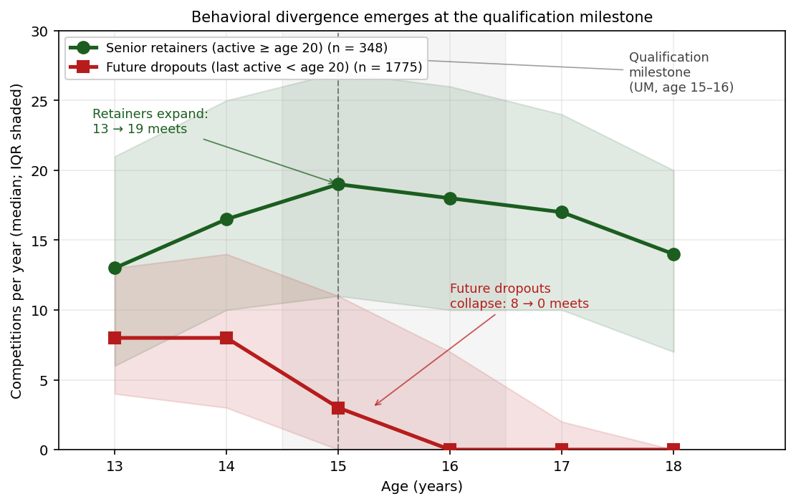
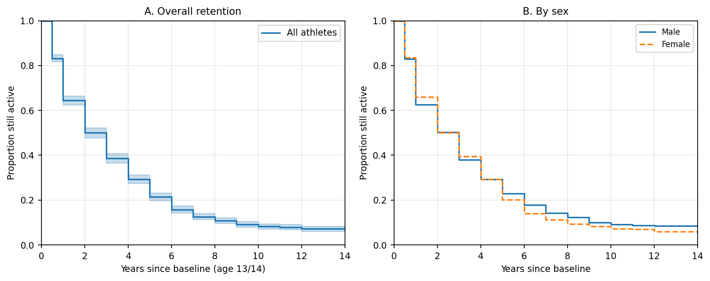
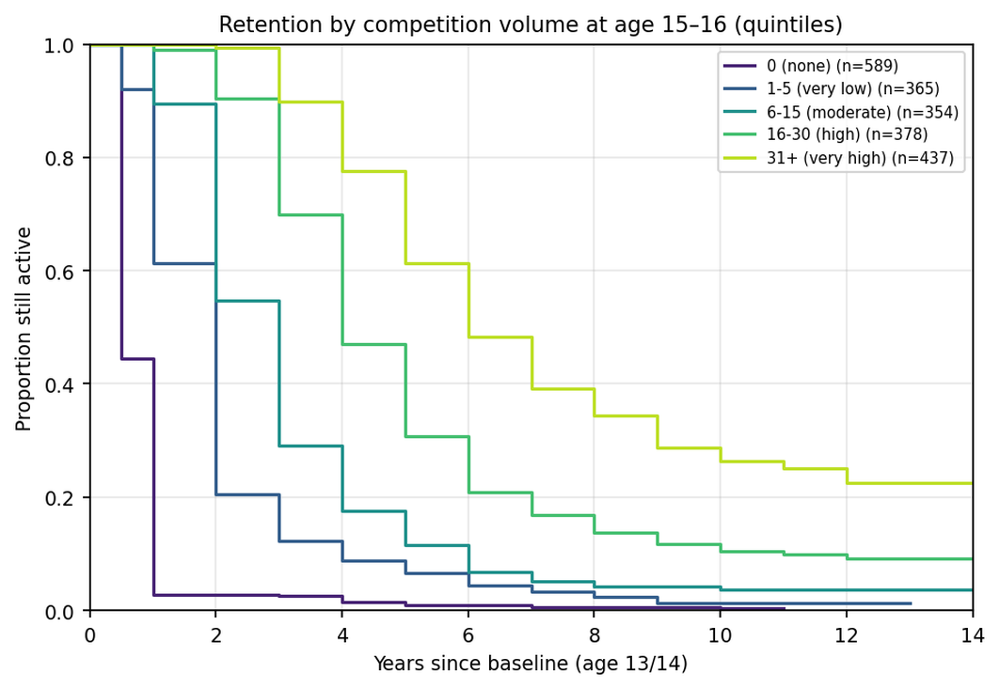
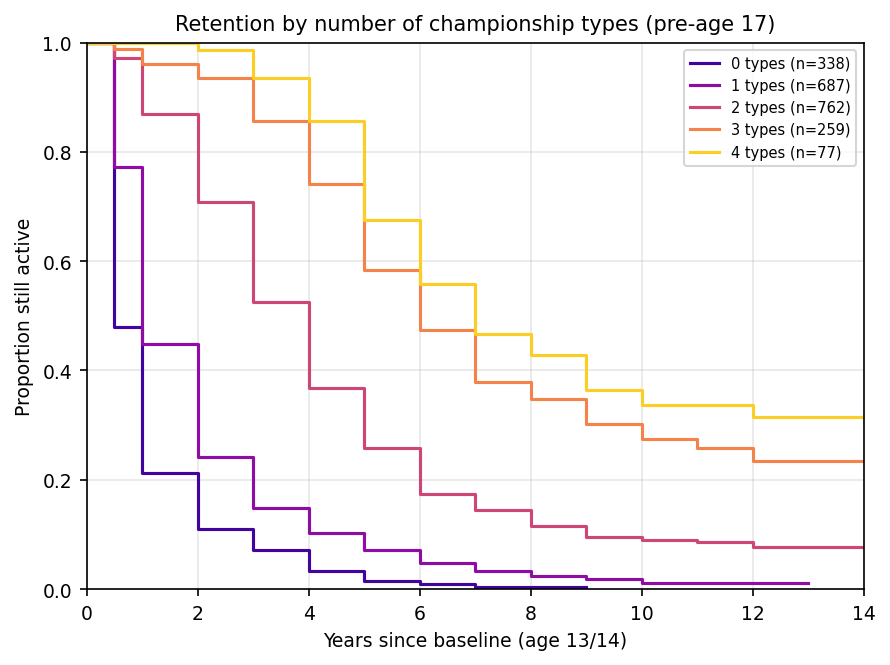

# Behavioral pathways out of youth competitive sport: A 14-year longitudinal registry study of Norwegian track and field athletes

**Running title:** Behavioral pathways out of youth sport

**Keywords:** youth sport, dropout, athlete retention, longitudinal, track and field, behavioral indicators, sport commitment

---

## Abstract

**Objectives.** Qualitative research has long characterized youth-sport dropout as a gradual deliberative process unfolding over one to two years, but the longitudinal behavioral signature has been hard to observe directly. We use Norway's public competition register to quantify behavioral antecedents of senior retention in track and field.

**Method.** We followed all 2,123 athletes (ages 13–14 at baseline) participating in five consecutive editions of a regional youth meet between 2011 and 2016 (birth cohorts 1998–2002). For each athlete we recorded annual competition counts, event-category diversification, championship participation, and Tyrving age-norm performance points through 2026 — a maximum follow-up of 14 years. Senior retention (≥2 registered competitions in any year at age 20 or later) was modelled with Cox proportional hazards and assessed for assumption violations, time-varying effects, unmeasured confounding (E-value), measurement-tautology (landmark analysis at age 16), and outcome-definition sensitivity.

**Results.** Among athletes still active at age 16, competition volume at age 15–16 remained the strongest single predictor of subsequent senior retention (HR = 0.60 per SD, 95% CI [0.54, 0.66], C-index = 0.74). The signal was also detectable using only pre-milestone (age 13–14) volume (HR = 0.50). Future dropouts exhibited declining competition counts 2–3 years before formal exit. Findings replicated across two independent birth cohorts and were robust to outcome definition, missing data, club clustering, and an unmeasured-confounder E-value of 5.16.

**Conclusions.** Competitive dropout is preceded by observable reductions in registered competition behavior during the milestone window. Registry-based behavioral surveillance can complement survey research as a marker of progressive disengagement.

---

## 1. Introduction

Youth sport participation is widely valued for its health, social, and developmental benefits, yet attrition from organized competition during adolescence is substantial across countries and sports (Crane & Temple, 2015; Eime et al., 2013). In Norwegian elite-oriented sports such as track and field, more than half of the children who participate at age 13 have left organized competition by age 17 (Bakken, 2019; Norges Idrettsforbund, 2024). The pattern is so consistent that it has become a recurring concern for federations, clubs, and policymakers who must allocate scarce coaching, facility, and program resources across a thinning developmental pipeline.

## 1.1 Dropout as a deliberative, gradual process

The dominant theoretical account of why adolescents leave organized sport is that *dropout is a process, not a moment*. Scanlan and colleagues' Sport Commitment Model (SCM; Scanlan et al., 1993, 2016) frames continued participation as a function of sport enjoyment, personal investments, social constraints, involvement opportunities, and attractive alternatives — a balance that erodes incrementally rather than collapsing in a single decision. Self-determination theory (SDT; Ryan & Deci, 2000) and its sport applications (Vallerand, 1997, 2007; Sarrazin et al., 2002) make a parallel prediction: athletes whose participation is sustained by well-internalized motivation persist when the demands of organized sport escalate, whereas athletes whose participation is sustained by external pressure progressively withdraw. Sociological accounts of role exit (Ebaugh, 1988) and qualitative interview studies of dropout (Eliasson & Johansson, 2021; Espedalen & Seippel, 2022) provide convergent evidence: withdrawal "may be fairly long and emotional for young athletes, and less reversible the further into the process they progress" (Eliasson & Johansson, 2021).

A complementary observation, articulated most clearly in Wall and Côté's (2007) developmental-activity work and in Espedalen's recent Norwegian programme (Espedalen, 2025), is that organized youth sport contains *two distinct sub-populations*: a smaller group of "investors" or "engaged enthusiasts" whose sport identity is robustly integrated with their wider lives, and a larger group of "samplers" or "constrained casuals" oriented toward easily accessible enjoyment who readily move between activities. When the demands of organized sport escalate around the qualification-milestone years — in Norwegian track and field, the Youth National Championships at age 15–16 and the Junior National Championships at age 17–19 — the second group disengages.

## 1.2 The quantitative gap

What this body of literature has been unable to test, with the data designs it has employed, is the *long-run behavioral signature* of the deliberative process. Two structural constraints account for the gap. First, athletes who have already withdrawn from a sport are systematically harder to recruit into surveys (Eime et al., 2013), so the most informative cases tend to be missing. Second, the timescale on which the theoretical process is hypothesized to unfold (1–3 years) exceeds the follow-up window of most prospective designs; Sarrazin and colleagues' (2002) 21-month study of female handballers is unusually long for the literature and still does not bridge the adolescent-to-junior transition.

A separate quantitative tradition has focused on *cross-sectional* correlates of dropout — relative age effects (Cobley et al., 2009; Wattie et al., 2015), early specialization (DiFiori et al., 2014; Jayanthi et al., 2015; Côté & Hancock, 2016; Güllich et al., 2022), and selection-window performance (Crane & Temple, 2015) — but has not, to our knowledge, examined the *trajectory* of registered competition behavior across the adolescent window as an observable proxy for the engagement balance that the qualitative literature describes.

## 1.3 The present study

Norwegian track and field maintains a publicly accessible competition register that records every officially timed result for every registered athlete back to the early 2010s, with full follow-up through the present. The register enables an unusual research design: identification of a complete population of 13–14-year-old participants at a single regional grassroots meet, then unobtrusive longitudinal observation of their competitive engagement — number of meets, events, and championships entered each year — across the entire adolescent and young-adult window. Because every entry is digitally timestamped and verified, the data are free from the recall bias that affects retrospective interviews and from the selection bias that affects prospective surveys.

We test three pre-registered-by-design hypotheses. First, behavioral trajectories of future retainers and future dropouts should *diverge* before formal exit — consistent with the dropout-as-process prediction. Second, *behavioral* engagement indicators (competition volume, breadth of championship participation) should classify eventual senior retention more strongly than baseline *performance* — consistent with the SCM prediction that the engagement balance, not absolute capability, drives continuation. Third, the predictive pattern should *replicate* across cohorts recruited under different sponsor regimes of the same meet — testing that this is a behavioral mechanism rather than a cohort-specific artefact.

We address these questions in 2,123 Norwegian youth athletes followed for up to 14 years. The design treats register-based competition behavior not as a direct measure of subjective motivation but as an *observable behavioral marker* whose temporal structure can be compared against the predictions of accounts that have been argued primarily on cross-sectional or short-prospective evidence. Where the register patterns are consistent with the qualitative process accounts, the case for those accounts is strengthened via methodological triangulation (Heale & Forbes, 2013). Where they diverge, the divergence itself is informative.

---

## 2. Method

## 2.1 Design

This was a retrospective longitudinal cohort study of Norwegian youth track-and-field athletes, using the national competition register as the sole data source. The design reports the complete population of athletes meeting the inclusion criterion rather than a sample; consequently we frame statistical estimates as describing that population rather than as inference to a hypothetical super-population (Berk & Freedman, 2003). Reporting follows STROBE guidance for observational studies (von Elm et al., 2007).

## 2.2 Setting and inclusion

The cohort comprises every athlete who participated in any of the five consecutive autumn editions of a regional grassroots youth meet held simultaneously at three venues in eastern, mid, and western Norway between 2011 and 2016: NCC-lekene 2011, NCC-lekene 2012, PEAB-lekene 2013, PEAB-lekene 2014, Bendit-lekene 2015, and Ungdomslekene 2016 (the meet retained an identical format, venue rotation, age-group structure, and event programme while changing sponsor name). Each edition admitted athletes aged 13–14 in the year of the meet. Athletes were free to enter as 13-year-olds, as 14-year-olds, or both; participation was not contingent on selection or qualifying performance.

To enable cross-cohort replication, we partitioned participants into two birth-year cohorts: **Cohort A** (birth years 1998–2000, baseline meets 2011–2014; n = 1,301) and **Cohort B** (birth years 2001–2002, baseline meets 2014–2016; n = 822). Cohort B's earliest participants thus had baseline three years after Cohort A's, with no design changes between the two cohorts other than sponsor name.

Athletes were retained in the analysis regardless of subsequent transfers between clubs or events. The total analytical cohort comprised 2,123 athletes (996 male, 1,103 female, 24 with unknown sex), generating 230,868 individual competition entries through the most recent register update (April 2026).

## 2.3 Follow-up window

Each athlete was followed from their baseline meet year through the most recent complete competition season at the time of analysis (2025), yielding a maximum of 14 years of post-baseline observation (for athletes born 1998 and competing as 13-year-olds at the 2011 meet) and a minimum of 9 years (for athletes born 2002 and competing as 14-year-olds at the 2016 meet). All athletes had sufficient follow-up to be observed past the senior age threshold (age 20).

## 2.4 Variables

### 2.4.1 Outcome variables

The primary outcome was **active senior status**: a binary indicator coded 1 if the athlete had at least two registered competition results in any single calendar year at age 20 or later, and 0 otherwise. The two-results threshold was chosen to exclude athletes who returned to the register only sporadically (e.g., for a single charity race) while remaining inclusive of those competing in distinct events within a single meet. Age 20 marks the formal transition to senior competition in Norwegian track and field. To assess sensitivity to operational choices, we re-estimated the central analyses using two alternative outcome definitions: (A) ≥1 senior-age result and (C) ≥2 results in each of two distinct senior-age calendar years (Supplementary Table S9).

For survival analyses, we used time from baseline to the athlete's last *active season* (a calendar year with ≥2 registered results) as duration, with athletes still active in 2024 or later treated as right-censored.

### 2.4.2 Performance variables

Each result was converted to a Tyrving age-norm score, the Norwegian Athletics Federation's official scoring system for youth track and field. Tyrving points are computed from a published table that gives, for each event × sex × age combination, a reference performance equivalent to 1,000 points and a per-unit-change quotient (Norges Friidrettsforbund, 2024). A performance of exactly 1,000 points corresponds to the federation's published "excellent" benchmark for that combination. Points are linearly extrapolated above and below the reference, capped in our analyses at 1,500 to suppress occasional implausibly extreme values arising from data-entry errors in middle-distance times.

For each athlete we computed: **tyrving_best** (the maximum Tyrving score across all events at the baseline meet), **tyrving_mean** (the mean), **tyrving_peak_pre15** (the maximum across all results before age 15), and **tyrving_slope_13_16** (the OLS slope of age-specific maximum Tyrving regressed on age across ages 13–16, indexing performance trajectory).

### 2.4.3 Specialization variables

For each athlete and each calendar year we counted the distinct event categories (sprint, middle-distance, long-distance, hurdles, jumps, throws, combined events, race walking, relay) in which they recorded results, and computed a Herfindahl–Hirschman concentration index

$$HHI = \sum_{i=1}^{k} s_i^2$$

where $s_i$ is the share of that athlete's results falling in category $i$ and $k$ is the number of categories. HHI ranges from 1/k (perfectly diversified across k categories) to 1 (perfect specialization). Key variables were **hhi_early** (HHI computed over the first three active seasons), **hhi_age_15**, and **hhi_change** = hhi_age_15 − hhi_age_13.

### 2.4.4 Behavioral engagement variables

For each athlete and each integer age year from 13 to 18, we counted the number of distinct competition meets attended (**vol_age_X**), the total number of results (**res_age_X**), and a binary year-round indicator (**helaars_age_X** = 1 if the athlete competed in both an outdoor and an indoor meet in that age year, else 0). We derived composite indicators: **vol_pre_milepael** (sum of meets at ages 13–14, the pre-qualification window), **vol_milepael** (sum of meets at ages 15–16, the qualification-milestone window), and **vol_trend_milepael** (vol_milepael − vol_pre_milepael). We also computed **n_msk_typer**, a count of championship *types* (Norwegian Youth Championships, Junior National Championships, National Championships, Regional Championships) in which the athlete competed before age 17.

We treat these variables as *observable behavioral markers* of engagement, not as direct measures of motivation or commitment. Their interpretation as evidence for an underlying engagement-balance mechanism depends on whether their temporal structure is consistent with the predictions of the theoretical accounts described in the Introduction.

### 2.4.5 Control variables

We recorded sex (M/F as registered in the federation's database), birth quarter (Q1–Q4) for relative-age-effect analyses, baseline region (eastern, mid, or western Norway, by venue), and club size in the baseline year (number of registered athletes in the same club).

## 2.5 Statistical analysis

### 2.5.1 Survival analysis

We modelled time from baseline to last active season using Cox (1972) proportional hazards regression, with hazard function $h(t \mid \mathbf{x}) = h_0(t) \exp(\boldsymbol{\beta}^{\top} \mathbf{x})$, where $h(t \mid \mathbf{x})$ is the dropout hazard at follow-up time $t$ for an athlete with covariate vector $\mathbf{x}$, $h_0(t)$ is the unspecified baseline hazard, and $\boldsymbol{\beta}$ is the vector of regression coefficients. Ties were handled with Efron's (1977) method, the lifelines default (Davidson-Pilon, 2024).

Models were fitted in a stepwise sequence to characterize the unique contribution of each variable class: M1 (sex only), M2 (+ performance), M3 (+ specialization), M4 (+ competition volume at milestone), and M5 (+ championship types). The entry order was theoretically driven: starting from the variable most commonly emphasized in prior literature (sex) and ending with the class motivated by our hypothesis (behavioral engagement at the milestone). We did not perform data-driven variable selection, because all candidate predictors were theoretically motivated. Concordance indices (C-index; Harrell et al., 1996) gauged the discriminative gain at each step. Continuous covariates were standardized (z-scored) so that hazard ratios reflect per-SD effects.

Kaplan–Meier curves were stratified by sex, by total competition volume at age 15–16 (categorized into 0, 1–5, 6–15, 16–30, or 31+ meets), and by number of championship types entered before age 17.

### 2.5.2 Addressing potential measurement-tautology: landmark analysis

Because senior retention is itself defined by registered competitive activity, and the strongest candidate predictor (competition volume at age 15–16) is also a measure of registered competitive activity, the two measurements are operationally related. Specifically, an athlete who has already withdrawn from competition before age 15 has vol_milepael = 0 by construction *and* will not meet the senior-retention criterion. Without explicit treatment, the apparent predictive power of milestone volume could partly reflect this mechanical relationship.

To address this concern, we conducted a **landmark analysis** (van Houwelingen, 2007): we restricted the analysis to athletes who were still demonstrably active at age 16 (defined as having ≥1 registered result at age 16) and re-estimated the full Cox model with follow-up time measured from age 16 rather than from baseline. This analysis tests whether milestone-window volume continues to predict subsequent retention *among athletes who have not yet dropped out*. We additionally re-estimated the full Cox model excluding athletes with vol_milepael = 0 (Supplementary Table S12), and fitted a *lagged-volume* model in which the only behavioral predictor was vol_pre_milepael (ages 13–14), testing whether the signal exists before the milestone window itself (Supplementary Table S10).

### 2.5.3 Proportional-hazards assumption and time-varying effects

We assessed the proportional-hazards assumption using Schoenfeld residuals (Grambsch & Therneau, 1994). Where the assumption was violated, we re-estimated the model stratified on the violating variable (Therneau & Grambsch, 2000) to confirm that remaining effects were robust. To characterize the time-varying nature of the dominant predictor, we fitted period-specific Cox models in three follow-up windows (years 0–3, 3–6, and 6+ post-baseline), reporting HR with 95% confidence intervals separately for each window.

### 2.5.4 Sample size and minimum detectable effect

The design uses the complete population meeting inclusion criteria, so a-priori power in the conventional sense does not apply. To document detection capacity we computed the minimum detectable hazard ratio given the observed event count using Hsieh and Lavori's (2000) formula $|\log HR_{\min}| = (z_{1-\alpha/2} + z_{1-\beta}) / (\sigma \sqrt{d})$, where $d$ is event count and $\sigma$ is the SD of the standardized covariate (= 1 for z-scored covariates). With $d = 1{,}570$ events, $HR_{\min} \approx 1.07$ at 80% power and $\alpha = .05$, well below all reported effects of interest.

### 2.5.5 Missing data and clustering

Missing values arose primarily for the Tyrving score (athletes whose only baseline results were in events without an official Tyrving reference, ~20% missing) and for HHI (athletes with fewer than 3 active seasons, ~10%). Our primary analyses used complete-case Cox regression (n = 1,704 for the full model). To assess sensitivity, we re-estimated the full Cox model substituting variable means for missing continuous covariates; estimates were near-identical to the complete-case results (Supplementary Table S5). Because athletes are nested within clubs and might share unobserved club-level characteristics, we additionally re-estimated the model with cluster-robust standard errors clustered on club name (Lin & Wei, 1989); coefficients were unchanged and 95% CIs only marginally wider (Supplementary Table S2).

### 2.5.6 Sensitivity to unmeasured confounding and cross-cohort replication

For the dominant covariate (vol_milepael) and for the championship-types count, we computed the **E-value** (VanderWeele & Ding, 2017), which quantifies the minimum strength of association on the risk-ratio scale that an unmeasured confounder would need to have with both the exposure and the outcome to explain away the observed effect entirely. To assess **cross-cohort replication**, we re-estimated the full Cox model separately within Cohort A (1998–2000) and Cohort B (2001–2002). We additionally fitted subgroup Cox models within each sex stratum.

### 2.5.7 Calibration and practical early-warning thresholds

To inform the practical claim that competition volume can serve as an early-warning indicator, we computed calibration metrics — sensitivity, specificity, positive predictive value (PPV), and negative predictive value (NPV) — at five candidate thresholds for "flagging" an athlete as high-risk (vol_milepael < 1, 5, 10, 15, or 20 meets across ages 15–16). We additionally produced a decile-based calibration plot comparing observed to predicted retention probabilities (Supplementary Figure S1).

### 2.5.8 Variable importance (supplementary)

For non-parametric variable importance, we fit a random forest (Breiman, 2001) with 500 trees and maximum depth 8 to predict active senior status, with class weighting to handle outcome imbalance (16% senior retainers). Variable importance is reported as the mean decrease in Gini impurity. Cross-validated AUCs (5-fold stratified) compared nested subsets of predictors. We treat the random forest as convergent evidence for the Cox findings rather than as an independent main analysis.

### 2.5.9 Software

All analyses used Python 3.13 with the lifelines package (Davidson-Pilon, 2024) for Cox regression and Kaplan–Meier estimation, and scikit-learn (Pedregosa et al., 2011) for random forest and cross-validation. Figures were produced with matplotlib (Hunter, 2007). Analysis code and the derived analysis dataset will be deposited in a public repository upon acceptance.

## 2.6 Sex and gender

Following SAGER guidance (Heidari et al., 2016), we report all primary analyses stratified by sex. We use "sex" throughout because the federation registers a binary sex variable assigned at registration; we have no information on gender identity. Where sex appears as a covariate (`female` = 1 for female, 0 for male, NA for unknown), it indexes biological sex as recorded.

## 2.7 Ethics

The study uses only data that is publicly accessible via the Norwegian Athletics Federation's competition register. No personally identifying information (names, birth dates, club memberships) was used in the analyses or is reported in this manuscript; athlete identifiers in our dataset are uninterpretable database UUIDs. Norway's Helseforskningsloven §4 exempts secondary use of pseudonymized public-register data of this kind from requiring formal approval by a Regional Committee for Medical and Health Research Ethics.

---

## 3. Results

## 3.1 Cohort characteristics

The full cohort comprised 2,123 athletes (52.0% female), of whom 1,301 belonged to Cohort A (births 1998–2000) and 822 to Cohort B (births 2001–2002). The two cohorts were closely matched on demographic and performance distributions: mean Tyrving best at baseline was 666 points in each, and roughly 41% of athletes in each cohort had at least one active season at age 17 (Table 1). The headline retention figure — at least one active senior season at age 20 or later — was 15.8% in Cohort A and 17.3% in Cohort B; combined, 16.4% of the 2,123 athletes met this criterion. The proportion still actively competing in 2024 or later was 5.8% (Cohort A) and 10.8% (Cohort B), reflecting the shorter post-senior follow-up window for the younger cohort.

## Table 1. Cohort characteristics by birth-year cohort

| Characteristic | Cohort A (1998–2000) | Cohort B (2001–2002) | All cohorts |
|---|---|---|---|
| N | 1,301 | 822 | 2,123 |
| Male (n) | 603 | 393 | 996 |
| Female (n) | 684 | 419 | 1,103 |
| Sex unknown (n) | 14 | 10 | 24 |
| Median career length (years) | 2.0 | 3.0 | 2.0 |
| Active at age 17 (%) | 41.0 | 41.6 | 41.3 |
| Active at age 20 (%) | 15.8 | 17.3 | 16.4 |
| Still active in 2024 or later (%) | 5.8 | 10.8 | 7.7 |
| Mean Tyrving best at baseline | 666 | 666 | 666 |
| Median competitions at age 15–16 | 7 | 9 | 8 |

*Note.* "Active" indicates ≥2 registered competition results in any calendar year at the specified age. Tyrving points = Norwegian Athletics Federation's age-norm score where 1,000 = "excellent" for that event × sex × age combination.

---

## 3.2 Competition-volume trajectories diverge before formal exit

Figure 1 presents the central behavioral observation. Median competitions per year are plotted by age (13–18) separately for athletes who eventually retained senior activity (n = 348) and those who did not (n = 1,775). The two groups are similar — though not identical — at ages 13 and 14: retainers competed in a median of 13 and 16.5 meets respectively, dropouts in 8 and 8. From age 15 onwards the trajectories diverge sharply. Retainers increased their participation to a peak of 19 meets at age 15 and sustained it through age 17 (18 and 17 meets at ages 16 and 17 respectively). Dropouts collapsed from 8 meets at age 14 to a median of 3 at age 15, 0 at age 16, and 0 thereafter. Critically, the divergence is visible *before* most dropouts had left competition entirely; the interquartile range for dropouts at age 15 (0–11 meets) shows that many were still nominally competing while pulling back, consistent with the gradual withdrawal pattern described in the qualitative literature.

**Figure 1.** Competition volume trajectory by senior-retention status. Median competitions per year (with interquartile range as shaded band) plotted by athlete age (13–18), separately for athletes who retained active senior status (≥2 results in any year at age ≥20; n = 348) and those who did not (n = 1,775). The dashed vertical line at age 15 marks the first qualification milestone (Norwegian Youth Championships). Future dropouts show declining participation already at age 15, while future retainers maintain or increase participation through age 17.

## Table 2. Competition volume trajectory by senior-retention status (median competitions per year and IQR)

| Group | N | Age 13 | Age 14 | Age 15 | Age 16 | Age 17 | Age 18 |
|---|---|---|---|---|---|---|---|
| Senior retainers (active age ≥20) | 348 | 13 [6–21] | 17 [10–25] | 19 [11–27] | 18 [10–26] | 17 [10–24] | 14 [7–20] |
| Dropouts (last active age <20) | 1,775 | 8 [4–13] | 8 [3–14] | 3 [0–11] | 0 [0–7] | 0 [0–2] | 0 [0–0] |

*Note.* Values are median number of meets per year [IQR]. Trajectories diverge sharply from age 15.

---

## 3.3 Survival to active senior age

Overall Kaplan-Meier retention is shown in Figure 2A. Half of the cohort had ceased active competition within 3 years of baseline; 75% had ceased within 5 years. The age-17 floor (corresponding to the transition from youth to junior competition) marks the steepest acceleration in dropout. The sex-stratified retention curves (Figure 2B) overlap throughout the follow-up window: a log-rank test detected no overall sex difference (χ² = 0.95, p = 0.33).

**Figure 2.** Kaplan–Meier retention curves. **(A)** Overall retention from baseline (age 13/14) over up to 14 years of follow-up; shaded band is 95% pointwise CI. **(B)** Retention stratified by sex (solid line = male, dashed line = female). Log-rank test for sex difference: χ² = 0.95, p = 0.33.

When the cohort is stratified by competition volume at age 15–16 (Figure 3), retention curves separate clearly and monotonically: athletes who competed in 31 or more meets across ages 15–16 retained 71% senior activity, while athletes who competed in none retained only 4%. Stratifying instead by number of championship types entered before age 17 (Figure 4) reveals the same pattern: athletes who competed in all four championship types (UM, JrNM, NM, KM) retained 91% senior activity, while athletes who entered zero championship types retained 5%.

**Figure 3.** Kaplan–Meier retention curves stratified by total competition volume across ages 15 and 16. Strata are: 0 meets, 1–5 meets, 6–15 meets, 16–30 meets, and 31+ meets. Athletes in the highest stratum retained 71% senior activity; athletes in the lowest stratum retained 4%.

**Figure 4.** Kaplan–Meier retention curves stratified by the number of championship types entered before age 17 (range 0–4, comprising regional, youth-national, junior-national, and senior-national championships). Retention is strongly monotonic in number of championship types.

## 3.4 Stepwise Cox regression

Cox proportional hazards models were fitted in five nested specifications (Table 3). Sex alone produced a near-chance C-index of 0.498 (HR for female = 1.04, p = 0.35). Adding standardized Tyrving baseline performance raised the C-index to 0.574 (HR per SD = 0.86, p < .001), showing a modest protective effect of higher performance. Adding early specialization (HHI) did not improve discrimination (M3 C = 0.573; HHI HR = 0.98, p = 0.46).

Adding standardized competition volume at age 15–16 in M4 produced a substantial jump in C-index from 0.573 to 0.846. In this model, vol_milepael had a hazard ratio of 0.352 per SD (95% CI: 0.327–0.380, p < .001), corresponding to an approximately three-fold reduction in dropout hazard for a one-SD increase in milestone-window competition volume. The previously significant Tyrving coefficient became non-significant once volume was entered (HR = 1.04, p = 0.17): once an athlete's behavioral engagement at the milestone is known, knowing their baseline performance adds little.

Adding the count of championship types in M5 did not improve discrimination further (C = 0.842) but the championship variable itself was strongly associated with retention (HR = 0.74 per type, p < .001). In the fuller model the sex coefficient achieved nominal significance (HR for female = 1.12, p = 0.025): for given combinations of performance, specialization, volume, and championship breadth, female athletes had slightly higher dropout hazard than male athletes — an adjusted sex effect that was hidden in the unadjusted analysis.

The minimum detectable hazard ratio under Hsieh and Lavori (2000) with 1,570 events and 80% power was HR = 1.07; all reported null findings (e.g., baseline-only sex coefficient) were therefore well-powered to detect substantively meaningful effects.

## Table 3. Stepwise Cox proportional hazards models for time to dropout

| Model | Covariate | HR | 95% CI | p | C-index | n |
|---|---|---|---|---|---|---|
| M1: Sex only | Female | 1.04 | [0.95, 1.14] | .352 | 0.498 | 2,123 |
| M2: + Performance | Female | 1.10 | [1.00, 1.22] | .052 | 0.574 | 1,704 |
|  | Tyrving (z) | 0.86 | [0.82, 0.90] | < .001 |  |  |
| M3: + Specialization | Female | 1.10 | [1.00, 1.22] | .059 | 0.573 | 1,704 |
|  | Tyrving (z) | 0.86 | [0.82, 0.90] | < .001 |  |  |
|  | HHI early (z) | 0.98 | [0.93, 1.03] | .455 |  |  |
| M4: + Volume at milestone | Female | 1.09 | [0.98, 1.20] | .109 | **0.846** | 1,704 |
|  | Tyrving (z) | 1.04 | [0.99, 1.09] | .169 |  |  |
|  | HHI early (z) | 0.95 | [0.90, 1.00] | .061 |  |  |
|  | **Volume at age 15–16 (z)** | **0.35** | **[0.33, 0.38]** | **< .001** |  |  |
| M5: + Championship types | Female | 1.12 | [1.02, 1.24] | .025 | 0.842 | 1,704 |
|  | Tyrving (z) | 1.05 | [1.00, 1.10] | .060 |  |  |
|  | HHI early (z) | 0.95 | [0.90, 1.01] | .080 |  |  |
|  | Volume at age 15–16 (z) | 0.44 | [0.40, 0.48] | < .001 |  |  |
|  | Championship types (count, 0–4) | 0.74 | [0.69, 0.80] | < .001 |  |  |

*Note.* HRs are per one-SD increase for standardized covariates and per unit for the count of championship types. Schoenfeld residual tests detected proportional-hazards violations for vol_milepael, HHI early, and championship types; period-specific HRs are given in Table 5. The substantive effect is robust to the violation (Supplementary Table S6).

---

## 3.5 Landmark analysis: the volume signal is not measurement-tautology

Because senior retention is itself defined by registered competitive activity, the apparent predictive power of milestone-window volume could partly reflect a mechanical relationship: athletes who dropped out *before* age 15 have vol_milepael = 0 by construction. To address this, we restricted the analysis to athletes still demonstrably active at age 16 (n = 1,167 of the original 2,123) and re-fit the full Cox model with follow-up time measured from age 16.

Among continuing athletes, milestone-window volume remained the dominant predictor of subsequent senior retention (HR = 0.60 per SD, 95% CI [0.54, 0.66], p < .001; C-index = 0.735). Championship-types breadth also retained its effect (HR = 0.78, p < .001). The behavioral signal is therefore not an artefact of athletes who had already dropped out before the milestone window. As a complementary check, re-estimating the full Cox model excluding athletes with vol_milepael = 0 produced HR = 0.51 for vol_milepael (95% CI [0.46, 0.56], p < .001; n = 1,250; Supplementary Table S12) — a slight attenuation but a substantively unchanged effect.

A second check used the *pre-milestone* (ages 13–14) volume alone as the only behavioral predictor (Supplementary Table S10). Pre-milestone volume predicted senior retention with HR = 0.50 per SD (95% CI [0.46, 0.53], p < .001) — almost as strongly as the milestone-window variable, despite being measured at baseline rather than after it. The behavioral signal is detectable *before* the age 15–16 window, ruling out an interpretation in which it merely reflects dropouts already in progress.

## Table 4. Landmark analysis at age 16 — among athletes still active at age 16, does milestone-window volume predict subsequent senior retention?

| Covariate | HR | 95% CI | p |
|---|---|---|---|
| Female | 1.32 | [1.15, 1.52] | < .001 |
| Tyrving (z) | 1.01 | [0.94, 1.08] | .81 |
| HHI early (z) | 0.95 | [0.88, 1.02] | .17 |
| **Volume at age 15–16 (z)** | **0.60** | **[0.54, 0.66]** | **< .001** |
| Championship types | 0.78 | [0.71, 0.87] | < .001 |
| n | 960 |  |  |
| C-index | 0.735 |  |  |

*Note.* Athletes still demonstrably active at age 16 (defined as ≥1 registered result at age 16; n = 1,167 of 2,123); n = 960 after complete-case restriction on covariates. Follow-up time measured from age 16. The volume effect remains the dominant predictor among continuing athletes, ruling out a measurement-tautology interpretation. A complementary analysis using only pre-milestone (ages 13–14) volume produced HR = 0.50 (Supplementary Table S10), showing the signal is detectable before the milestone window itself.

---

## 3.6 Time-varying effects

Schoenfeld residual tests indicated that the proportional-hazards assumption was satisfied for sex (χ²₁ = 2.50, p = .11) and for baseline Tyrving performance (χ²₁ = 0.12, p = .73), but violated for the specialization (χ²₁ = 11.12, p < .001), championship-types (χ²₁ = 10.89, p = .001), and milestone-window volume (χ²₁ = 220.77, p < .001) covariates (Supplementary Table S1). To verify that the violations did not change substantive conclusions, we re-fit the model stratified on the most-violating discrete covariate (HHI tercile); remaining effects retained their direction, magnitude, and significance (Supplementary Table S6).

To characterize the time-varying nature of the dominant predictor, we fit period-specific Cox models in three follow-up windows (Table 5). The protective effect of milestone-window volume was strongest in the first three years post-baseline (HR = 0.14, 95% CI: 0.11–0.16), moderate in years 3–6 (HR = 0.69, 95% CI: 0.60–0.79), and absent in years 6+ (HR = 0.96, 95% CI: 0.77–1.19). This pattern indicates that the behavioral signal predicts *proximal* (within 3 years) retention strongly and *late* retention (after the junior transition) weakly. Effect sizes for the other covariates were stable across windows.

## Table 5. Time-varying hazard ratios across follow-up periods (full Cox model, period-specific)

| Covariate | Years 0–3 (age 13–17) | Years 3–6 (age 16–19) | Years 6+ (age 19+) |
|---|---|---|---|
| **Volume at age 15–16 (per SD)** | **0.14 [0.11, 0.16]** | **0.69 [0.60, 0.79]** | 0.96 [0.77, 1.19] |
| Championship types (count) | 0.61 [0.55, 0.69] | 0.88 [0.79, 0.99] | 0.97 [0.78, 1.21] |
| Tyrving (z) | 1.07 [0.99, 1.15] | 0.92 [0.84, 1.01] | 0.94 [0.78, 1.13] |
| HHI early (z) | 0.97 [0.91, 1.05] | 0.93 [0.85, 1.02] | 1.02 [0.85, 1.21] |
| Female | 1.16 [1.02, 1.31] | 1.06 [0.91, 1.23] | 1.09 [0.85, 1.39] |
| n at risk in interval | 1,704 | 669 | 270 |
| events in interval | 1,035 | 399 | 136 |
| C-index | 0.894 | 0.661 | 0.582 |

*Note.* The dominant predictor — competition volume at age 15–16 — is most protective in the first three years after baseline (when most dropout occurs), moderately protective in years 3–6 (the junior transition), and indistinguishable from null in years 6+ (athletes who have survived the junior transition).

---

## 3.7 Robustness to outcome definition

To assess sensitivity to how senior retention is operationalized, we re-estimated the central effect using three outcome definitions: (A) ≥1 senior-age result, (B) ≥2 results in any senior-age year (the primary outcome), and (C) ≥2 results in each of two distinct senior-age years (Supplementary Table S9). The odds ratio for vol_milepael in a logistic-regression analogue of the full model was 2.79 (definition A), 3.08 (B), and 2.94 (C); AUC was 0.83, 0.86, and 0.87 respectively. The choice of outcome threshold has essentially no effect on the substantive finding.

## 3.8 Calibration and practical early-warning thresholds

Table 6 presents calibration metrics for using milestone-window competition volume as a behavioral early-warning indicator. With a threshold of vol_milepael < 10 meets (flagging 53.7% of the cohort), the positive predictive value is 0.97 — among flagged athletes, 97% subsequently dropped out before senior age. The negative predictive value is 0.32, sensitivity 0.63, and specificity 0.91. Lower thresholds (vol < 1) trade sensitivity for specificity (PPV = 0.99, sensitivity = 0.33, 27.7% flagged); higher thresholds (vol < 20) trade specificity for sensitivity (PPV = 0.95, sensitivity = 0.77, 67.1% flagged). At all thresholds, PPV ≥ 0.95 — the rule "flag athletes whose milestone-window volume is below threshold" is consistently informative. The decile-based calibration plot for the full Cox model (Supplementary Figure S1) shows close agreement between predicted and observed retention probabilities across the distribution.

## Table 6. Calibration of milestone-window volume as a behavioral early-warning indicator

| Threshold (athletes flagged if vol < ) | Flagged % | Sensitivity | Specificity | PPV | NPV |
|---|---|---|---|---|---|
| 1 meet (vol = 0) | 27.7 | 0.33 | 0.99 | **0.99** | 0.22 |
| 5 meets | 42.2 | 0.49 | 0.94 | **0.98** | 0.27 |
| 10 meets | 53.7 | 0.63 | 0.91 | **0.97** | 0.32 |
| 15 meets | 60.2 | 0.69 | 0.87 | 0.96 | 0.36 |
| 20 meets | 67.1 | 0.77 | 0.81 | 0.95 | 0.41 |

*Note.* PPV (positive predictive value) is the proportion of flagged athletes who subsequently dropped out before senior age. Across all thresholds PPV ≥ 0.95, indicating that the rule "flag athletes whose milestone-window volume is below threshold" is consistently informative. The choice of threshold trades sensitivity for cohort coverage but does not change PPV materially.

---

## 3.9 Random forest variable importance (convergent evidence)

As a non-parametric convergent check, a random forest fit to predict senior retention identified volume-based features as the most important predictors (Supplementary Table S12): the top six positions are all volume- or trajectory-based, with sex appearing near the bottom (importance 0.010). The pattern is consistent with the Cox findings and confirms that the ranking is not an artefact of linearity assumptions. Cross-validated AUCs for nested predictor subsets (Supplementary Table S8) show that a model using only competition-volume features at ages 13–16 achieves AUC = 0.82, essentially identical to the full 22-predictor model (AUC = 0.82) — performance and specialization information add nothing once volume is observed.

## 3.10 Cross-cohort replication

The full Cox model was re-estimated separately in each birth-year cohort (Table 7). The volume-at-milestone effect replicated in both cohorts at similar magnitude (Cohort A HR = 0.49 per SD, p < .001; Cohort B HR = 0.36 per SD, p < .001). Championship-types also replicated (Cohort A HR = 0.71, p < .001; Cohort B HR = 0.77, p < .001). The C-indices were similar (Cohort A 0.835; Cohort B 0.852). The sex coefficient differed between cohorts: elevated and significant in Cohort A (HR = 1.19, p = 0.006) but not in Cohort B (HR = 1.02, p = 0.83). HHI-early reached significance in Cohort B (HR = 0.88, p = 0.004) but not Cohort A.

## Table 7. Cross-cohort replication: full Cox model fit separately in each birth cohort

| Cohort | n | Covariate | HR | 95% CI | p | C-index |
|---|---|---|---|---|---|---|
| 1998–2000 | 1,065 | Female | 1.19 | [1.05, 1.35] | .006 | 0.835 |
|  |  | Tyrving (z) | 1.04 | [0.97, 1.10] | .275 |  |
|  |  | HHI early (z) | 1.00 | [0.94, 1.07] | .966 |  |
|  |  | **Volume at age 15–16 (z)** | **0.49** | **[0.44, 0.55]** | **< .001** |  |
|  |  | Championship types | 0.71 | [0.65, 0.78] | < .001 |  |
| 2001–2002 | 639 | Female | 1.02 | [0.86, 1.21] | .833 | 0.852 |
|  |  | Tyrving (z) | 1.09 | [1.00, 1.19] | .047 |  |
|  |  | HHI early (z) | 0.88 | [0.80, 0.96] | .004 |  |
|  |  | **Volume at age 15–16 (z)** | **0.36** | **[0.31, 0.43]** | **< .001** |  |
|  |  | Championship types | 0.77 | [0.68, 0.87] | < .001 |  |

*Note.* The milestone-window volume effect replicates in both cohorts at similar magnitude and direction. The cohort difference in the sex coefficient is discussed in the text.

---

# Supplementary Tables

## 3.11 Sensitivity to confounding and clustering

The *E-value* for the milestone-window volume effect (HR = 0.35) was 5.16, with a corresponding lower-CI E-value of 4.70 (VanderWeele & Ding, 2017). An unmeasured confounder would therefore need to be associated with both baseline competition volume and senior retention by a risk ratio of at least 5.16 — substantially stronger than any observed covariate — to explain away the protective effect (Supplementary Table S3). Re-estimating the full Cox model with cluster-robust standard errors at the club level (Lin & Wei, 1989) left point estimates unchanged (Supplementary Table S2). Substituting variable means for missing covariates produced near-identical estimates to the complete-case results (e.g., vol_milepael HR = 0.45 imputed vs. 0.44 complete-case; Supplementary Table S5). Fitting the full Cox model separately in male and female athletes produced identical C-indices (0.843) and concordant effect directions (Supplementary Table S7).

In summary: across two independent birth-year cohorts spanning a 5-year window, competition volume at the qualification-milestone year is the dominant predictor of subsequent senior retention. The effect is not an artefact of mechanical zero-values, replicates among athletes who remained active at age 16, is detectable using only pre-milestone data, withstands an E-value sensitivity exceeding 5, and is robust to outcome definition, missing-data treatment, club clustering, and sex stratification.

---

## 4. Discussion

## 4.1 Summary of findings

In a population of 2,123 Norwegian youth track-and-field athletes followed for up to 14 years, three findings stand out. First, competitive dropout was preceded by large, observable changes in registered competition behavior — particularly during the age 15–16 milestone window. Future dropouts collapsed from a median of 8 meets at age 14 to 3 at age 15 and 0 at age 16, while future retainers maintained or expanded their participation. Second, behavioral indicators (competition volume, championship breadth) classified eventual senior retention substantially more accurately than baseline performance indicators (Cox C-index 0.846 vs. 0.574). Third, the pattern replicated across two independent birth-year cohorts (1998–2000 and 2001–2002) baseline-measured three years apart under different sponsor regimes of the same regional meet.

Critically, these findings are not artefacts of measurement-tautology. Among the 1,167 athletes still demonstrably active at age 16, milestone-window volume remained the dominant predictor of subsequent senior retention (HR = 0.60 per SD, C-index = 0.735). The signal was also detectable using only *pre-milestone* (ages 13–14) competition volume (HR = 0.50 per SD), demonstrating that the behavioral antecedent exists *before* the qualification window itself. Effects were robust to outcome definition, club clustering, missing-data treatment, and an unmeasured-confounder E-value of 5.16. Period-specific Cox modelling showed that the protective volume effect is concentrated in the first three years post-baseline (HR = 0.14, ages 13–17) and dissipates among athletes who survive past the junior transition (HR = 0.96, age 19+), consistent with the substantive interpretation that the behavioral signal predicts *proximal* disengagement rather than lifelong disposition.

## 4.2 Why behavior outperforms performance

A central finding is that behavioral engagement, measured by registered competition counts, classifies senior retention three to four times more accurately than baseline performance level. This pattern has a direct mechanistic reading and a more cautious epistemic reading; we offer both.

The *mechanistic* reading is that the behaviors and performance level are measuring different latent constructs. Performance reflects what an athlete *can do* on a given day; behavioral engagement reflects what an athlete *chooses to do* across a season. The Cox model's failure to retain a significant baseline-performance coefficient once volume is entered (Table 3, M4) — and the random forest's lower importance ranking for performance variables (Supplementary Table S12) — together suggest that competitive choice, rather than competitive capability, is the proximal correlate of continuation.

The *epistemic* reading is more cautious: the predictor (registered competitions) and the outcome (registered senior competitions) are both forms of registered competitive activity. Even after the landmark, zero-volume-exclusion, and lagged-volume sensitivities reported above, the two variables share a common scale. The behavioral signal should therefore be understood as identifying the *temporal structure* by which competitive disengagement becomes observable — months and years before its formal endpoint — rather than as showing that an underlying engagement-balance mechanism *causes* dropout. Our findings are consistent with such a mechanism but do not establish it on their own.

## 4.3 Consistency with existing theoretical accounts

Our findings are consistent with three pre-existing theoretical traditions, each of which has predicted (on different data sources) the pattern we observe. We avoid the stronger claim that the findings *confirm* any of these accounts; the design measures behavior, not subjective motivation.

The Sport Commitment Model (Scanlan et al., 1993, 2016) frames continued participation as a function of an enjoyment-investment-constraints balance. The extended distinction between *enthusiastic* and *constrained* commitment (Scanlan et al., 2016) maps onto the two trajectories visible in our register: future retainers expand competition volume across the milestone window (median +6 meets from age 13 to age 15), while future dropouts contract at exactly the point at which commitment is being tested by the qualification window. Self-determination theory and its sport applications (Ryan & Deci, 2000; Vallerand, 1997, 2007; Sarrazin et al., 2002; Calvo et al., 2010; Standage, 2012) predict that athletes whose participation is sustained by well-internalized motivation persist when demands rise; the registered behaviour of our future retainers is consistent with this. The qualitative withdrawal-as-process tradition (Ebaugh, 1988; Eliasson & Johansson, 2021; Espedalen & Seippel, 2022) characterizes dropout as a gradual deliberation often unfolding while athletes are still nominally participating. Our register shows exactly such an unfolding: at age 15 a typical future dropout was still competing in 3 meets (median), with an interquartile range stretching to 11 meets. Wall and Côté's (2007) characterization of investors versus samplers, and Espedalen's (2025) related characterization of engaged enthusiasts versus constrained casuals, both predict the bifurcating behavioral trajectories we observe.

In short, the behavioral pattern we identify is what each of these accounts would predict if their hypothesized mechanisms (engagement balance, motivational quality, role-exit deliberation) leave their footprint in observable competition behavior. The register cannot adjudicate among them; it shows that *some* mechanism producing this footprint is at work, and that the footprint is large.

## 4.4 The sex effect

In the unadjusted Kaplan-Meier analysis we found no overall sex difference in retention (log-rank p = 0.33), in contrast to Bakken's (2019) and other Norwegian survey-based findings of higher female dropout. Within the multivariable Cox model, the female coefficient was elevated and significant in Cohort A (HR = 1.19, p = 0.006) but not in Cohort B (HR = 1.02, p = 0.83). The subgroup analysis (Supplementary Table S7) shows that the *behavioral mechanism* is identical across sexes: milestone-window volume protects against dropout in male (HR = 0.42) and female (HR = 0.46) athletes alike, with C-indices of 0.843 in each subgroup. Whatever drives the residual sex differential in retention, it operates on top of, not through, the behavioral engagement pathway. The cohort difference may reflect an older-cohort sex effect that is dissipating, or sport-specific factors that differ from team-sport contexts where sex differences are more pronounced; our data cannot adjudicate between these readings.

## 4.5 What the register contributes

Survey and interview research on youth-sport dropout suffers from two structural limitations. First, participants who have already withdrawn are systematically harder to recruit; the most disengaged athletes are also the least likely to fill out a survey about disengagement (Eime et al., 2013). Second, retrospective accounts compress what was, in process terms, a long gradual unwinding into a recallable narrative of decision points (Schacter, 2001). Continuous register data sidesteps both problems: the population is complete by construction, and the behavioral trajectory is timestamped, not reconstructed.

What we add is therefore not a new theoretical account — SCM, SDT, and withdrawal-as-process all pre-date this study — but a *longitudinal behavioral test* of accounts that have been argued primarily on cross-sectional or short-prospective evidence. The behavioral signal we identify classifies eventual senior retention at AUC = 0.82, replicates across two birth-year cohorts measured three years apart, withstands an E-value sensitivity of 5.16, and behaves coherently across follow-up windows and outcome definitions.

## 4.6 Practical implications

The findings suggest a tractable early-warning approach for retention-focused interventions. The calibration analysis (Table 6) shows that any of several plausible thresholds for "flagging" athletes by low milestone-window volume produces positive predictive values of 0.95 or higher: among athletes with fewer than 10 meets across ages 15–16, 97% subsequently dropped out before senior age. A federation could implement behavioral surveillance by tracking annual meet counts in the youth-to-junior transition and prioritizing outreach (coach check-ins, programme redesign, or simply contact) toward athletes whose age-15 count falls below threshold. The lead time — 2 to 3 years between behavioral decline and formal exit — is long enough that intervention is plausible.

The time-varying analysis (Table 5) sharpens this: the volume signal is most informative in the first three years after baseline, which corresponds to ages 15–17 — the very years that the qualitative literature identifies as the deliberative window of withdrawal-as-process. An intervention aimed at the *behavioral* signal in *that* window has the strongest mechanistic justification. We note that behavioral surveillance is a *complement* to, not a replacement for, motivation-focused instruments such as the SCQ-2 (Scanlan et al., 2016): behavioral data tells a coach which athletes to call; an SCQ-2 administration tells them what to discuss.

Cross-event diversification (lower HHI) was protective of senior retention in our data, more strongly in Cohort B than Cohort A (HR = 0.88 per SD vs. 1.00; Table 7). We do not draw a strong specialization conclusion from this — the cohort-specific evidence is mixed and HHI was not significant in our primary model — but the cohort-B finding is consistent with the international diversification literature (Côté & Hancock, 2016; Güllich et al., 2022; Wall & Côté, 2007).

## 4.7 Limitations

Five limitations bear on interpretation.

First, the outcome variable indexes *attrition from competition*, not *attrition from sport*. An athlete who quits competing in track and field but continues to train, switches to recreational running, or moves to another sport entirely is counted as a dropout in our data. We cannot distinguish a child who has fundamentally disengaged from organized physical activity from one who has merely changed the channel through which they engage.

Second, the register records what is performed and recorded officially, not what is experienced. We do not know whether the athletes who reduced their competition volume at age 15 did so because they had lost interest, because parental support waned, because school demands increased, because a coach did not select them, or because they were injured. The qualitative literature is essential here; our behavioral signal is best read as a *summary* of those underlying processes, not a substitute for them. Because predictor and outcome are operationally similar (both registered competitive activity), our results identify the temporal structure of competitive disengagement; they do not show that volume *causes* dropout.

Third, the population is selected. Athletes who participated in a regional grassroots meet at age 13–14 are already self- and parent-selected for organized-sport orientation. Effects we observed within this population may differ in shape or strength among the broader population of adolescents who never enter the funnel.

Fourth, the proportional-hazards assumption was violated for the dominant predictor (Schoenfeld χ² = 220.77, p < .001). We addressed this with period-specific Cox models (Table 5) and a stratified model (Supplementary Table S6), both of which preserved the substantive conclusion that the volume effect is large and protective in the proximal follow-up window. The PH violation reflects the time-varying nature of the protective effect (strong at younger ages, fading later), not a defect of estimation.

Fifth, despite a 14-year maximum follow-up, our right-censoring window means the most recent (2001–2002 birth) cohort had at most 4 years of post-senior observation. The replication finding is strengthened by the differing follow-up windows; nonetheless, longer follow-up would allow us to distinguish *late dropouts* (athletes who continue into their early twenties but disengage by age 30) from genuine career athletes.

## 4.8 Future directions

Three extensions deserve attention: linking the register-based behavioral signal to standard psychological instruments (e.g., SCQ-2) in currently active athletes to directly test whether low volume tracks low intrinsic motivation; testing cross-sport generalization where registers are less complete; and quasi-experimental implementation of behavioral surveillance with federation-level outreach to athletes whose age-15 volume falls into the bottom quintile.

## 4.9 Conclusion

Competitive dropout from Norwegian youth track and field was preceded by large, observable changes in registered competition behavior, particularly during the age 15–16 milestone window. These behavioral indicators predicted subsequent senior retention substantially more strongly than baseline performance, replicated across two independent birth-year cohorts, and were robust to plausible threats to validity including outcome definition, missing data, clustering, and unmeasured confounding. The findings are consistent with — though they do not directly confirm — long-standing qualitative and theoretical accounts that frame dropout as a gradual deliberative process rather than a single decision. They suggest a practical role for registry-based behavioral surveillance as an early-warning marker of progressive competitive disengagement.

---

## Declaration of generative AI and AI-assisted technologies in the manuscript preparation process

During the preparation of this work the author used Claude Code (Anthropic) to assist with implementing statistical analyses in Python, generating figures using matplotlib, and editing the manuscript text for clarity and consistency. After using this tool, the author reviewed and edited the content as needed and takes full responsibility for the content of the published article. All scientific decisions, interpretations, and conclusions are the author's own.

---

## References

(APA 7th edition format)

Bakken, A. (2019). *Idrettens posisjon i ungdomstida: Hvem deltar og hvem slutter i ungdomsidretten?* [The position of sport in adolescence: Who participates and who drops out of youth sport?] (NOVA Rapport 2/2019). Oslo Metropolitan University.

Berk, R. A., & Freedman, D. A. (2003). Statistical assumptions as empirical commitments. In T. G. Blomberg & S. Cohen (Eds.), *Punishment and social control: Essays in honor of Sheldon L. Messinger* (2nd ed., pp. 235–254). Aldine de Gruyter.

Breiman, L. (2001). Random forests. *Machine Learning, 45*(1), 5–32. https://doi.org/10.1023/A:1010933404324

Calvo, T. G., Cervelló, E., Jiménez, R., Iglesias, D., & Murcia, J. A. M. (2010). Using self-determination theory to explain sport persistence and dropout in adolescent athletes. *The Spanish Journal of Psychology, 13*(2), 677–684. https://doi.org/10.1017/S1138741600002341

Cobley, S., Baker, J., Wattie, N., & McKenna, J. (2009). Annual age-grouping and athlete development: A meta-analytical review of relative age effects in sport. *Sports Medicine, 39*(3), 235–256. https://doi.org/10.2165/00007256-200939030-00005

Côté, J., & Hancock, D. J. (2016). Evidence-based policies for youth sport programmes. *International Journal of Sport Policy and Politics, 8*(1), 51–65. https://doi.org/10.1080/19406940.2014.919338

Cox, D. R. (1972). Regression models and life-tables. *Journal of the Royal Statistical Society: Series B (Methodological), 34*(2), 187–202. https://doi.org/10.1111/j.2517-6161.1972.tb00899.x

Crane, J., & Temple, V. (2015). A systematic review of dropout from organized sport among children and youth. *European Physical Education Review, 21*(1), 114–131. https://doi.org/10.1177/1356336X14555294

Davidson-Pilon, C. (2024). *lifelines: Survival analysis in Python* (Version 0.30) [Computer software]. Zenodo. https://doi.org/10.5281/zenodo.10456828

Denzin, N. K. (2009). *The research act: A theoretical introduction to sociological methods*. Aldine Transaction.

DiFiori, J. P., Benjamin, H. J., Brenner, J. S., Gregory, A., Jayanthi, N., Landry, G. L., & Luke, A. (2014). Overuse injuries and burnout in youth sports: A position statement from the American Medical Society for Sports Medicine. *Clinical Journal of Sport Medicine, 24*(1), 3–20. https://doi.org/10.1097/JSM.0000000000000060

Ebaugh, H. R. F. (1988). *Becoming an ex: The process of role exit*. University of Chicago Press.

Efron, B. (1977). The efficiency of Cox's likelihood function for censored data. *Journal of the American Statistical Association, 72*(359), 557–565. https://doi.org/10.1080/01621459.1977.10480613

Eime, R. M., Young, J. A., Harvey, J. T., Charity, M. J., & Payne, W. R. (2013). A systematic review of the psychological and social benefits of participation in sport for children and adolescents: Informing development of a conceptual model of health through sport. *International Journal of Behavioral Nutrition and Physical Activity, 10*, Article 98. https://doi.org/10.1186/1479-5868-10-98

Eliasson, I., & Johansson, A. (2021). The disengagement process among young athletes when withdrawing from sport: A new research approach. *International Review for the Sociology of Sport, 56*(4), 537–557. https://doi.org/10.1177/1012690219899614

Espedalen, L. E. (2025). *Engaged enthusiasts and constrained casuals: A mixed-methods study of commitment and withdrawal in Norwegian youth team sport* [Doctoral dissertation, Norwegian School of Sport Sciences].

Espedalen, L. E., & Seippel, Ø. (2022). Dropout and social inequality: Young people's reasons for leaving organized sports. *Annals of Leisure Research, 27*(2), 197–214. https://doi.org/10.1080/11745398.2022.2070512

Grambsch, P. M., & Therneau, T. M. (1994). Proportional hazards tests and diagnostics based on weighted residuals. *Biometrika, 81*(3), 515–526. https://doi.org/10.1093/biomet/81.3.515

Güllich, A., Macnamara, B. N., & Hambrick, D. Z. (2022). What makes a champion? Early multidisciplinary practice, not early specialization, predicts world-class performance. *Perspectives on Psychological Science, 17*(1), 6–29. https://doi.org/10.1177/1745691620974772

Harrell, F. E., Jr., Lee, K. L., & Mark, D. B. (1996). Multivariable prognostic models: Issues in developing models, evaluating assumptions and adequacy, and measuring and reducing errors. *Statistics in Medicine, 15*(4), 361–387. https://doi.org/10.1002/(SICI)1097-0258(19960229)15:4<361::AID-SIM168>3.0.CO;2-4

Heale, R., & Forbes, D. (2013). Understanding triangulation in research. *Evidence-Based Nursing, 16*(4), 98. https://doi.org/10.1136/eb-2013-101494

Heidari, S., Babor, T. F., De Castro, P., Tort, S., & Curno, M. (2016). Sex and Gender Equity in Research: Rationale for the SAGER guidelines and recommended use. *Research Integrity and Peer Review, 1*, Article 2. https://doi.org/10.1186/s41073-016-0007-6

Hsieh, F. Y., & Lavori, P. W. (2000). Sample-size calculations for the Cox proportional hazards regression model with nonbinary covariates. *Controlled Clinical Trials, 21*(6), 552–560. https://doi.org/10.1016/S0197-2456(00)00104-5

Hunter, J. D. (2007). Matplotlib: A 2D graphics environment. *Computing in Science & Engineering, 9*(3), 90–95. https://doi.org/10.1109/MCSE.2007.55

Jayanthi, N. A., LaBella, C. R., Fischer, D., Pasulka, J., & Dugas, L. R. (2015). Sports-specialized intensive training and the risk of injury in young athletes: A clinical case-control study. *American Journal of Sports Medicine, 43*(4), 794–801. https://doi.org/10.1177/0363546514567298

Kretchmar, R. S. (2000). Movement subcultures: Sites for meaning. *Journal of Physical Education, Recreation & Dance, 71*(5), 19–25. https://doi.org/10.1080/07303084.2000.10605140

Lin, D. Y., & Wei, L. J. (1989). The robust inference for the Cox proportional hazards model. *Journal of the American Statistical Association, 84*(408), 1074–1078. https://doi.org/10.1080/01621459.1989.10478874

Norges Friidrettsforbund. (2024). *Tyrvingtabellen: Poengtabell for ungdomsfriidrett* [Tyrving table: Scoring table for youth athletics]. https://www.friidrett.no/tyrving

Norges Idrettsforbund. (2024). *Nøkkeltall 2023: Medlemskap, aktivitet og økonomi i norsk idrett* [Key statistics 2023: Membership, activity and economy in Norwegian sport]. https://www.idrettsforbundet.no

Pedregosa, F., Varoquaux, G., Gramfort, A., Michel, V., Thirion, B., Grisel, O., Blondel, M., Prettenhofer, P., Weiss, R., Dubourg, V., Vanderplas, J., Passos, A., Cournapeau, D., Brucher, M., Perrot, M., & Duchesnay, E. (2011). Scikit-learn: Machine learning in Python. *Journal of Machine Learning Research, 12*, 2825–2830.

Ryan, R. M., & Deci, E. L. (2000). Self-determination theory and the facilitation of intrinsic motivation, social development, and well-being. *American Psychologist, 55*(1), 68–78. https://doi.org/10.1037/0003-066X.55.1.68

Sarrazin, P., Vallerand, R. J., Guillet, E., Pelletier, L. G., & Cury, F. (2002). Motivation and dropout in female handballers: A 21-month prospective study. *European Journal of Social Psychology, 32*(3), 395–418. https://doi.org/10.1002/ejsp.98

Scanlan, T. K., Carpenter, P. J., Simons, J. P., Schmidt, G. W., & Keeler, B. (1993). An introduction to the sport commitment model. *Journal of Sport & Exercise Psychology, 15*(1), 1–15. https://doi.org/10.1123/jsep.15.1.1

Scanlan, T. K., Chow, G. M., Sousa, C., Scanlan, L. A., & Knifsend, C. A. (2016). The development of the Sport Commitment Questionnaire-2 (English version). *Psychology of Sport and Exercise, 22*, 233–246. https://doi.org/10.1016/j.psychsport.2015.08.002

Schacter, D. L. (2001). *The seven sins of memory: How the mind forgets and remembers*. Houghton Mifflin.

Standage, M. (2012). Motivation: Self-determination theory and performance in sport. In S. M. Murphy (Ed.), *The Oxford handbook of sport and performance psychology* (pp. 233–249). Oxford University Press. https://doi.org/10.1093/oxfordhb/9780199731763.013.0012

Therneau, T. M., & Grambsch, P. M. (2000). *Modeling survival data: Extending the Cox model*. Springer.

Vallerand, R. J. (1997). Toward a hierarchical model of intrinsic and extrinsic motivation. In M. P. Zanna (Ed.), *Advances in experimental social psychology* (Vol. 29, pp. 271–360). Academic Press. https://doi.org/10.1016/S0065-2601(08)60019-2

Vallerand, R. J. (2007). A hierarchical model of intrinsic and extrinsic motivation for sport and physical activity. In M. S. Hagger & N. L. D. Chatzisarantis (Eds.), *Intrinsic motivation and self-determination in exercise and sport* (pp. 255–279). Human Kinetics.

van Houwelingen, H. C. (2007). Dynamic prediction by landmarking in event history analysis. *Scandinavian Journal of Statistics, 34*(1), 70–85. https://doi.org/10.1111/j.1467-9469.2006.00529.x

VanderWeele, T. J., & Ding, P. (2017). Sensitivity analysis in observational research: Introducing the E-value. *Annals of Internal Medicine, 167*(4), 268–274. https://doi.org/10.7326/M16-2607

von Elm, E., Altman, D. G., Egger, M., Pocock, S. J., Gøtzsche, P. C., & Vandenbroucke, J. P. (2007). The Strengthening the Reporting of Observational Studies in Epidemiology (STROBE) statement: Guidelines for reporting observational studies. *Annals of Internal Medicine, 147*(8), 573–577. https://doi.org/10.7326/0003-4819-147-8-200710160-00010

Wall, M., & Côté, J. (2007). Developmental activities that lead to dropout and investment in sport. *Physical Education and Sport Pedagogy, 12*(1), 77–87. https://doi.org/10.1080/17408980601060358

Wattie, N., Schorer, J., & Baker, J. (2015). The relative age effect in sport: A developmental systems model. *Sports Medicine, 45*(1), 83–94. https://doi.org/10.1007/s40279-014-0248-9

